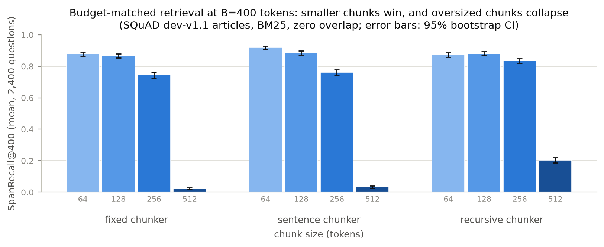
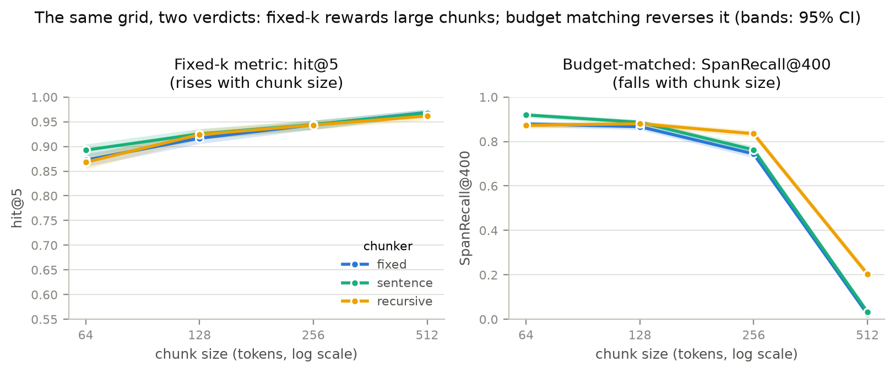
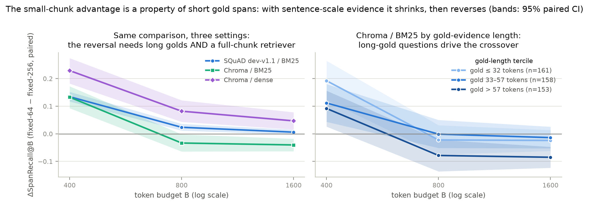
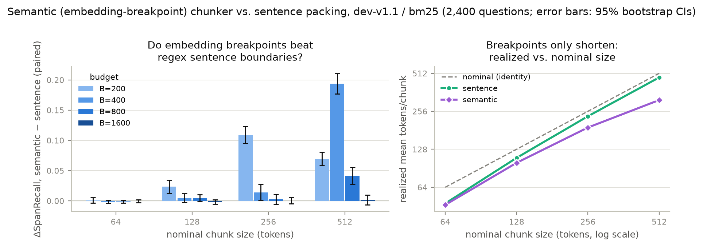
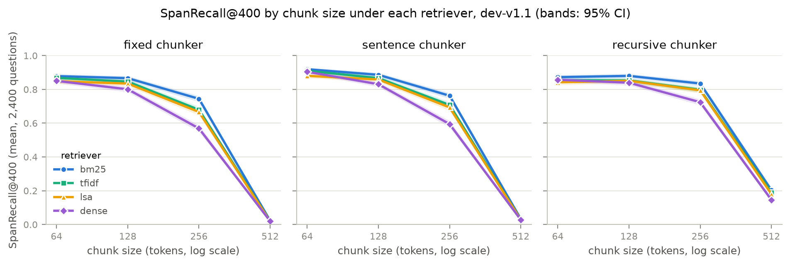

# genai-lab

Hands-on experiments with current Gen AI techniques — RAG, agents, evals, fine-tuning and whatever's moving the field this week

One flagship research project at a time, worked daily until it would survive a
demanding referee: **71 numbered findings**, **497 tests**, and **50 committed
figures** across two studies so far — every number regenerable from committed
per-item results, everything measured on 4 CPU cores.

**Jump to:** [Latest](#latest-from-the-lab) ·
[Current flagship](#current-flagship--slm-judge-audit) ·
[Judge leaderboard](#the-judge-leaderboard) ·
[Completed: RAG chunking](#completed-flagship--rag-chunking-bench) ·
[How the lab works](#how-the-lab-works)

<!-- latest-start -->
## Latest from the lab

<!-- auto-generated from research/NOTES.md by scripts/sync_latest.py; do not hand-edit -->

**2026-08-29 — Day 12: the 7B closes the Qwen rubric line — the lever stops paying at the top (findings 44–45)**

- Finding 44 — the arc closes at five points, λ plateaus, and the coherent-movement deviation peaks at 3B.
- Finding 45 — at the family's top, prompt-side debiasing re-signs a balanced bias and buys nothing at all.

[Full entry →](slm-judge-audit/research/NOTES.md#2026-08-29--day-12-the-7b-closes-the-qwen-rubric-line--the-lever-stops-paying-at-the-top-findings-4445)
<!-- latest-end -->

## Current flagship — `slm-judge-audit`

**[`slm-judge-audit`](slm-judge-audit/)** — a white-box reliability audit of
small open-weight LLMs as pairwise judges. Every judgment is read out as verdict
log-odds at a single token position, so each item's swap pair decomposes exactly
into an order-invariant preference and a position-bias term — which turns
position bias, debiasing gains, and calibration into things you can measure
rather than assume. Findings 1–45 live in the
[project README](slm-judge-audit/README.md#results-at-a-glance); the
day-by-day log is
[`slm-judge-audit/research/NOTES.md`](slm-judge-audit/research/NOTES.md).

*The headline figure: debiased (symmetrized) accuracy of small open-weight
judges is **not monotone in scale** — Qwen2.5 dips into a valley at 1.5B before
climbing — and the raw accuracy most audits report hides it. Regenerated from
committed per-judgment results.*

### The judge leaderboard

Seven judges, one benchmark: the same 600 stratified
[RewardBench](https://arxiv.org/abs/2403.13787) items, both presentation
orders, Q4_K_M quantization, minimal rubric. *Sym acc* is accuracy after
two-call debiasing (symmetrization); *rubric flip* is the fraction of debiased
verdicts that change when only the rubric wording changes; *bias > signal* is
the share of items where position bias outweighs the content signal.

| judge | sym acc (95% CI) | raw acc | rubric flip | median bias b | bias > signal | beats fitted length floor (0.575)? |
|---|---|---|---|---|---|---|
| **Qwen2.5-7B** | **0.837 [0.807, 0.867]** | 0.781 | 0.068 | +0.23 | 26.8% | ✅ largest margin, every category |
| Qwen2.5-3B | 0.742 [0.707, 0.777] | 0.617 | 0.102 | −5.55 | 62.0% | ✅ |
| Llama-3.1-8B | 0.723 [0.688, 0.758] | 0.682 | — | −0.59 | 33.5% | ✅ |
| Llama-3.2-3B | 0.652 [0.613, 0.690] | 0.507 | — | +2.34 | 96.7% | ✅ |
| Qwen2.5-0.5B | 0.568 [0.528, 0.608] | 0.501 | 0.303 | +3.65 | 99.8% | ❌ |
| Llama-3.2-1B | 0.555 [0.517, 0.595] | 0.520 | 0.432 | −0.34 | 81.7% | ❌ |
| Qwen2.5-1.5B | 0.502 [0.462, 0.542] | 0.549 | 0.190 | +0.83 | 70.2% | ❌ |
| *random floor* | 0.500 | 0.500 | | | | |
| *pick-the-longer floor* | 0.425 | | | | | |

Full table with per-order accuracies, compliance, and flip rates:
[`master_table__minimal.md`](slm-judge-audit/results/summary/master_table__minimal.md).

### Six results a practitioner should know

1. **Debiased judge quality is not monotone in scale — and at the top,
   family beats scale.** Qwen2.5 runs 0.568 → 0.502 → 0.742 → 0.837 from
   0.5B to 7B (a 1.5B valley where the emergent preference is a *verbosity*
   preference RewardBench punishes); Llama-3.1-8B is statistically
   indistinguishable from Qwen2.5-3B at 2.7× the parameters.
2. **Flip-rate "consistency" is anti-informative at both ends.** The most
   position-saturated judges post the *lowest* order-flip rates (0.002,
   0.033) and the two *best* judges post the highest (0.732, 0.665) — a
   content-following verdict changes letter whenever the responses swap
   seats.
3. **Position bias beats the content signal** on 62–99.8% of items for five
   of seven judges; only Qwen2.5-7B and Llama-3.1-8B are signal-dominant —
   and the two families reverse bias *direction* with scale in opposite
   senses.
4. **The assumption behind cheap debiasing is false.** Position bias is
   never an additive constant, and the share of the symmetrization gain a
   fitted one-call correction recovers *falls* as judges improve: 68% at
   0.5B → 47% at 3B → ~25% at 7B/8B.
5. **Most small judges don't beat a length heuristic.** Against a fitted
   one-parameter length baseline, only both 3Bs, the 7B and the 8B come out
   ahead — and Llama's below-chance hole on adversarial Chat Hard persists
   to 8B (0.522 vs Qwen-7B's 0.696 on identical items).
6. **The verdict is rubric-fragile exactly where the signal is small — and
   a two-parameter model predicts it.** Rewording the rubric (same items,
   same orders) flips 30% / 43% / 19% / 10% / 7% of debiased verdicts
   across the five judges measured — ordered by preference strength, not
   size, with a fitted Φ(−λ|s|/σ) reproducing each judge's flip profile. At
   7B the prompt-side lever stops paying entirely: it pushes a balanced
   bias through zero into the opposite lean while every accuracy metric
   sits still. The symmetrized verdict never moves at any scale.

<table>
<tr>
<td width="50%">

*Rubric fragility is predictable: observed flip rates per \|s\| quartile
(points) against each judge's fitted Φ(−λ\|s\|/σ) curve (lines), five
judges.*

</td>
<td width="50%">

*Raw single-order verdicts (red) are overconfident for every judge;
symmetrization (blue) repairs calibration only at the smallest scales —
post-debiasing calibration is a family property.*

</td>
</tr>
<tr>
<td width="50%">

*Does the judge add signal beyond response length? Every judge has some,
but below 3B none beats a one-parameter length baseline.*

</td>
<td width="50%">

*Per-subset symmetrized accuracy for all seven judges against each
subset's length floor — the category texture behind every headline
number.*

</td>
</tr>
</table>

<b>More committed figures</b> (click to expand)

<table>
<tr>
<td width="50%">

*Item-paired log-odds across rubrics, five judges: preference (left) and
position bias (right) against the rubric-invariant identity line.*

</td>
<td width="50%">

*Position bias is never an additive constant (left), and one-call
corrections recover ever less of the symmetrization gain as judges
improve (right).*

</td>
</tr>
<tr>
<td width="50%">

*Infrastructure finding: the deficit scheduler keeps a partial grid a
stratified sample at every prefix (blue), where the naive order reads
whole subsets in sequence (red).*

</td>
<td width="50%">

Per-judge anatomy — accuracy, compliance, and the s/b decomposition for
each of the seven judges — lives in
[`slm-judge-audit/results/figures/`](slm-judge-audit/results/figures/)
(21 additional figures), each embedded with commentary in the
[project README](slm-judge-audit/README.md).

</td>
</tr>
</table>

## Completed flagship — `rag-chunking-bench`

**[`rag-chunking-bench`](rag-chunking-bench/)** — a token-budget-controlled
benchmark of chunking strategies for RAG retrieval, with span-level metrics and
paired bootstrap confidence intervals. Closed 2026-07-16 at **26 findings, 365
tests, and a byte-level reproduction audit**; day-by-day log in
[`rag-chunking-bench/research/NOTES.md`](rag-chunking-bench/research/NOTES.md).

*Once the retrieved-token budget is held constant, smaller chunks win in every
chunker family — regenerated from committed per-question results.*

### Four results a practitioner should know

1. **Fixed-k evaluation reverses the ranking.** hit@5 rises with chunk size
   (0.873 → 0.969) while budget-matched SpanRecall@400 *falls*
   (0.879 → 0.023) — the token-budget confound in standard chunking
   comparisons is real and large. Budget-matched, 64-token chunks beat
   256-token ones by +0.134 [+0.117, +0.152] SpanRecall.
2. **The winning chunk size is set by gold-evidence length.** The
   small-chunk advantage inverts at generous budgets on sentence-scale
   golds — the crossover is gold-length-driven, requires a full-chunk-reading
   retriever, and survives every drop-one-corpus jackknife.
3. **The popular semantic (embedding-breakpoint) chunker's wins are chunk-size
   drift.** At matched *realized* size it gains nothing anywhere and keeps a
   real long-gold penalty; matched mean size alone is an uncontrolled
   comparison (realized-size dispersion × the stop rule manufactures ±0.5
   recall deltas).
4. **None of it is a retriever artifact.** Size ordering, reversal, and the
   sentence-alignment edge hold under BM25, TF-IDF, LSA, and dense MiniLM —
   and the chunking effect outweighs the retriever effect several times over
   at small sizes.

<table>
<tr>
<td width="50%">

*The same 12 runs scored two ways: classic fixed-k rewards larger chunks
(left); holding retrieved tokens constant reverses the ordering (right).*

</td>
<td width="50%">

*The small-chunk edge crosses zero as budgets grow on long-gold corpora —
the winning chunk size is set by gold-evidence length.*

</td>
</tr>
<tr>
<td width="50%">

*The semantic chunker's apparent wins appear exactly where its realized
chunk size drifts from nominal (right panel) — not from better
boundaries.*

</td>
<td width="50%">

*Chunk size moves recall far more than retriever choice: the lexical
lines are nearly parallel, and the window-limited dense encoder degrades
to prefix retrieval past its context window.*

</td>
</tr>
</table>

Full tables, all 26 findings (four retriever families, two datasets, three
sampling seeds, both budget-boundary rules, two token units), and an honest
[Limitations](rag-chunking-bench/README.md#limitations) section live in the
[project README](rag-chunking-bench/README.md).

## How the lab works

- **One flagship at a time, worked daily.** [ROADMAP.md](ROADMAP.md) holds the
  current project's phase plan, the rationale for choosing it, and the backlog
  of future studies; each project's `research/NOTES.md` is the dated lab log —
  hypotheses, registered predictions, dead ends, and next steps.
- **Statistics or it didn't happen.** Paired bootstrap CIs on every
  comparison, fixed seeds, pinned dataset revisions with SHA256 verification,
  trivial floors alongside every model result, and pre-registered predictions
  checked against outcomes in the log.
- **Reproducible by construction.** Pinned requirements and lockfiles, run
  scripts for every grid, committed per-item raw results, and figures that
  regenerate from committed data (`rag-chunking-bench` closed with a
  byte-level clean-environment reproduction audit; `slm-judge-audit` gets the
  same treatment at close).
- **Honest about scale.** Everything runs on 4 CPU cores and 16 GB RAM —
  models are audited in the Q4_K_M quantization people actually deploy at
  this scale, and what the hardware can't test is written down in
  Limitations rather than extrapolated.

## Repository map

| Path | What it is |
|---|---|
| [`slm-judge-audit/`](slm-judge-audit/) | **Current flagship** — white-box reliability audit of small LLM judges (findings 1–45, 132 tests) |
| [`rag-chunking-bench/`](rag-chunking-bench/) | **Completed flagship** — budget-controlled RAG chunking benchmark (26 findings, 365 tests, reproduction-audited) |
| [`ROADMAP.md`](ROADMAP.md) | Flagship phase plans, project rationale, and the research backlog |
| [`scripts/`](scripts/) | Lab automation (README digest sync) |
| [`CHANGELOG.md`](CHANGELOG.md) | Release-level history |
