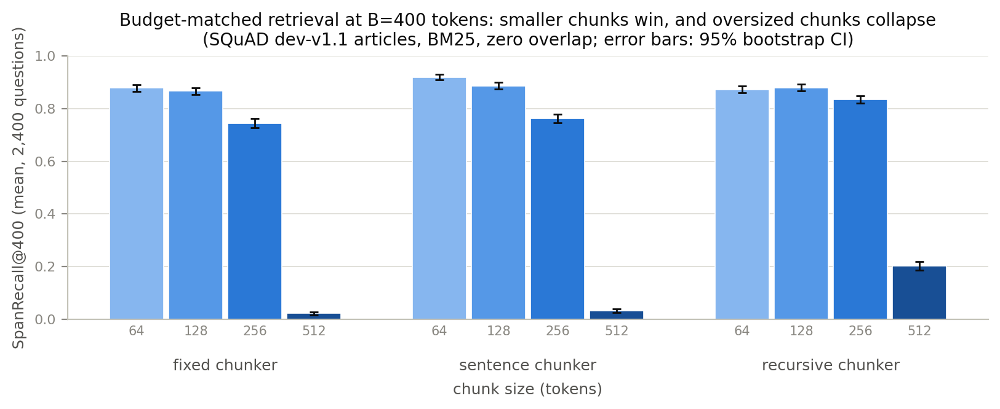
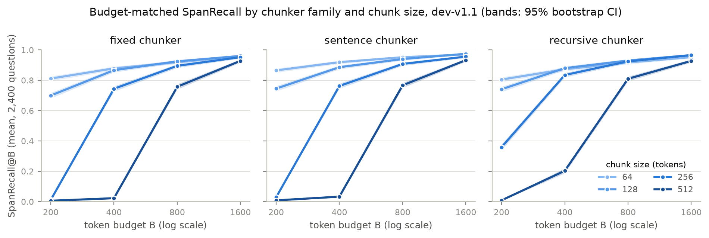
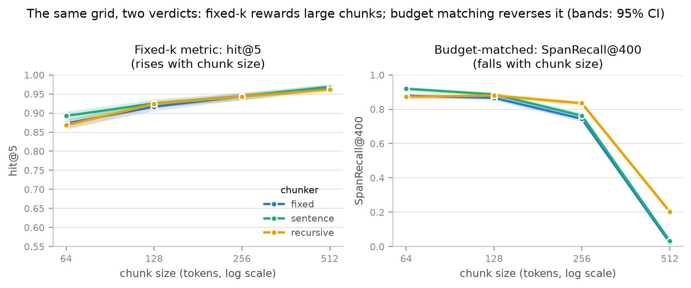
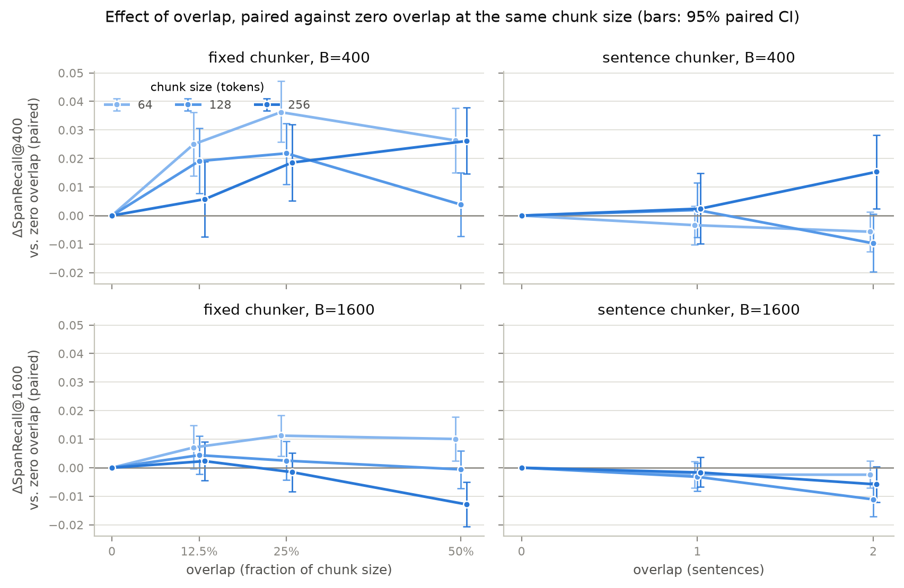
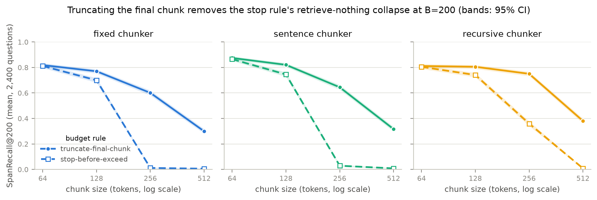

# rag-chunking-bench

**How much does chunking actually matter for RAG retrieval — once you control
for the retrieved-token budget?**



*Headline result: at a fixed 400-token retrieval budget, smaller chunks win in
every chunker family and chunks larger than the budget collapse to ~0.
Regenerated from committed raw results with
`python -m experiments.make_hero_figure`.*

## Abstract

Chunking is the highest-leverage, least-principled design decision in
retrieval-augmented generation: every production stack picks a chunk size and
overlap, usually by folklore. Published comparisons of chunking strategies
almost always vary chunk size while holding top-*k* fixed — which confounds
chunking quality with the sheer number of tokens handed to the generator
(500-token chunks at k=5 retrieve five times the text of 100-token chunks at
k=5, and the generator's context budget pays for it). This project benchmarks
structural and semantic chunking strategies under a **budget-matched
protocol**: retrievers are compared at equal retrieved-token budgets using
span-level (token-overlap) metrics against gold evidence spans, with paired
bootstrap confidence intervals over questions. The goal is a defensible
answer to "which chunking decisions survive budget control, and by how much,"
at a scale (CPU, open data) that anyone can reproduce.

## Motivation

Three observations from the literature motivate the design:

1. **Rank-based metrics hide the cost of chunk size.** Recall@k improves with
   larger chunks partly because each retrieved unit simply contains more
   text. Smith & Troynikov (2024) introduced token-level precision/recall/IoU
   against gold excerpts, which this project adopts — and extends by making
   the *retrieved-token budget* (not k) the controlled variable.
2. **Chunking papers rarely quantify uncertainty.** Recent comparisons
   (Merola & Singh, 2025; Duarte et al., 2024) report point estimates on a
   single configuration. Here every comparison is paired per-question with
   bootstrap confidence intervals, so "strategy A beats strategy B" comes
   with an interval, not just a mean.
3. **The generator's context is the scarce resource.** "Lost in the Middle"
   (Liu et al., 2023) showed long, padded contexts actively hurt; a chunking
   strategy that wins only by retrieving more tokens is not a win. Budget
   matching makes that failure mode visible.

## Method

### Evaluation protocol

For a question *q* over a document collection, the gold evidence is a set of
character spans *G* in the source documents. A chunker segments each document
into chunks with exact character offsets; a retriever ranks chunks for *q*;
retrieved chunks are accumulated in rank order until the token budget *B* is
exhausted (the first chunk that would exceed *B* stops accumulation). With
*C* = the set of retrieved tokens and *G* = gold-span tokens:

- **SpanRecall@B**  = |C ∩ G| / |G|
- **SpanPrecision@B** = |C ∩ G| / |C|
- **SpanIoU@B**   = |C ∩ G| / |C ∪ G|

Two accounting rules make the comparison fair. The budget charges *prompt*
tokens — each retrieved chunk costs its own token count, duplicates included,
because that is what a generator would be handed — while scoring uses the
*union* of retrieved tokens, so redundant overlap spends budget without
earning recall. And when a dataset annotates several alternative gold spans
for one question (SQuAD's multiple annotations), each metric takes the max
over alternatives, the standard max-over-answers convention; corpora whose
references are jointly required score against their union through the same
code path.

Metrics are computed per question and aggregated with means and 95% paired
bootstrap confidence intervals (fixed seed). Budgets sweep
B ∈ {200, 400, 800, 1600} tokens; classic hit@k is also reported for
comparability with prior work.

Token counting uses a deterministic regex word/punctuation tokenizer
(`src/tokenization.py`) shared by chunkers, budget accounting, and metrics —
the unit only needs to be consistent, not identical to any model's BPE. The
`Tokenizer` protocol allows a BPE tokenizer to be slotted in as a robustness
check.

### Chunking strategies (`src/chunkers.py`)

All chunkers emit chunks with exact document offsets
(`document[start:end] == chunk.text`), the invariant that makes span-level
scoring exact rather than fuzzy-matched.

| Strategy | Description | Knobs |
|---|---|---|
| `FixedTokenChunker` | sliding token window | size, overlap |
| `SentenceChunker` | greedy packing of whole sentences under a token budget | max_tokens, sentence overlap |
| `RecursiveCharacterChunker` | paragraph > line > space separator hierarchy with greedy merge (LangChain semantics, offset-preserving) | max_tokens |
| semantic chunkers | embedding-similarity breakpoints (phase 2) | — |

### Retrievers

BM25 (lexical, implemented from scratch in `src/retrievers.py` and tested
against a hand-computed example), TF-IDF cosine (sparse), and LSA (low-rank
dense, TruncatedSVD over TF-IDF). BEIR (Thakur et al., 2021) established BM25
as a robust zero-shot baseline; the chunking effect is measured holding each
retriever fixed, and retriever × chunker interaction is itself a studied
variable. A neural dense retriever (a small sentence-transformer running on
CPU) is planned for phase 2 to cover the lexical-vs-dense axis.

### Datasets

- **SQuAD-derived long documents** (`src/data.py`): Wikipedia articles
  reconstructed by concatenating each article's paragraphs, with answer spans
  remapped into article coordinates and verified verbatim at load time.
  dev-v1.1 yields 48 documents (2.7k–16.8k tokens, median 6.2k) and 10,533
  answerable questions after deduplication. Raw JSON is fetched from pinned
  URLs with SHA256 checks (`python -m src.data`).
- **Chroma chunking-evaluation corpora** (Smith & Troynikov, 2024): five
  heterogeneous corpora (state-of-the-union, Wikitexts, chat logs, finance,
  PubMed) with question/gold-excerpt pairs; queries are LLM-generated, which
  is recorded as a provenance caveat.

## Experiments

Every number below comes from runs checked into `results/raw/` (per-question
scores, gzipped JSON, with config + git commit embedded) and is regenerable:

```bash
python -m experiments.run_grid                # baseline: 12 configs, ~25 s on 4 CPU cores
python -m experiments.run_grid --budget-rule truncate   # budget-rule ablation
python -m experiments.run_grid --chunkers fixed --sizes 64 --overlaps 8 16 32   # overlap ablation (see NOTES)
python -m experiments.summarize               # baseline tables incl. paired CIs -> results/summary_*.md
python -m experiments.summarize_ablations     # overlap + budget-rule tables -> results/summary_*_ablations.md
python -m experiments.make_figures            # figures -> results/figures/
python -m experiments.make_hero_figure        # headline figure -> assets/
```

### Baseline grid (phase 2, first slice)

Setup: SQuAD dev-v1.1 as 48 reconstructed articles; 2,400 questions
(50/article, seeded sampling); BM25; chunkers {fixed, sentence, recursive} ×
sizes {64, 128, 256, 512} tokens, no overlap; budgets B ∈ {200, 400, 800,
1600}; stop-before-exceed budget rule. 95% CIs are paired bootstrap over
questions (10,000 resamples). Full tables: [`results/summary_dev-v1.1_bm25.md`](results/summary_dev-v1.1_bm25.md).

**SpanRecall@B (mean over 2,400 questions)**

| config | B=200 | B=400 | B=800 | B=1600 |
|---|---|---|---|---|
| fixed-64 | 0.812 | 0.879 | 0.919 | 0.958 |
| fixed-128 | 0.700 | 0.867 | 0.925 | 0.961 |
| fixed-256 | 0.012 | 0.744 | 0.895 | 0.952 |
| fixed-512 | 0.006 | 0.023 | 0.757 | 0.928 |
| sentence-64 | **0.865** | **0.919** | **0.952** | 0.971 |
| sentence-128 | 0.745 | 0.886 | 0.940 | **0.975** |
| sentence-256 | 0.029 | 0.763 | 0.908 | 0.956 |
| sentence-512 | 0.008 | 0.033 | 0.767 | 0.933 |
| recursive-64 | 0.805 | 0.873 | 0.917 | 0.953 |
| recursive-128 | 0.741 | 0.880 | 0.930 | 0.966 |
| recursive-256 | 0.359 | 0.835 | 0.925 | 0.966 |
| recursive-512 | 0.009 | 0.203 | 0.810 | 0.928 |



*Budget curves per chunker family. Under budget matching, smaller chunks
dominate at every budget: 64-token chunks are never worse than larger ones,
and configs whose chunks exceed the budget collapse to ~0 (stop-before-exceed
retrieves nothing — see finding 4). CI bands are barely visible at n=2,400.*

### Findings so far

**1. Under budget matching, smaller chunks win — significantly.** At B=400,
fixed-64 beats the fixed-256 baseline by **+0.134 [+0.117, +0.152]**
SpanRecall; fixed-128 by +0.122 [+0.107, +0.138]. The advantage shrinks as
the budget grows (+0.024 [+0.012, +0.036] at B=800; n.s. at B=1600) but
never reverses: with a finite context budget, many small high-precision
pieces beat few large diluted ones on this corpus.

**2. Fixed-k evaluation reverses that ranking — the confound is real and
large.** hit@5 *increases* monotonically with chunk size (fixed: 0.873 →
0.917 → 0.944 → 0.969 for 64 → 512), simply because a bigger retrieved unit
contains more text; budget-matched SpanRecall@400 moves the opposite way
(0.879 → 0.023). A fixed-k comparison would conclude "use 512-token chunks";
a budget-matched one concludes the reverse at practical budgets. This is the
central methodological claim of the project, now measured:



*The same 12 runs scored two ways. Left: classic fixed-k hit rate rewards
larger chunks. Right: holding retrieved tokens constant instead of k, the
ordering reverses.*

**3. Sentence alignment gives a consistent, modest, significant edge at
matched size.** Paired same-size comparisons of sentence vs. fixed at B=400:
+0.041 [+0.029, +0.052] at size 64, +0.020 [+0.008, +0.031] at 128, +0.018
[+0.004, +0.033] at 256, +0.010 [+0.003, +0.017] at 512 — all significant,
all small relative to the size effect. Respecting sentence boundaries helps;
it does not rescue an oversized chunk.

**4. "Matched nominal size" is itself confounded by chunk under-filling.**
The recursive chunker's apparent wins at larger sizes (e.g. +0.348 [+0.329,
+0.367] over fixed-256 at B=200) trace to its realized chunks being smaller
than nominal (mean 189 tokens at size 256, vs. 250 for the fixed chunker —
see the chunk-statistics table in the summary). Its effective operating
point is simply further down the size axis, where recall is higher. Chunking
comparisons should report realized chunk-size distributions, not just the
configured maximum.

**5. Stop-before-exceed makes size > budget configs retrieve nothing** —
utilization is ~0 when the smallest chunk exceeds B (e.g. fixed-512 at
B≤400), which reads as SpanRecall ≈ 0. This is a protocol artifact worth
keeping visible rather than hiding: it is exactly the deployment failure of
pairing a large-chunk index with a small context window. The
truncate-final-chunk robustness check below confirms the size ordering is
not an artifact of this rule.

A note on the other span metrics: on SQuAD, gold answers average ~3 tokens,
so SpanPrecision@B is dominated by 1/|retrieved| and is nearly identical
across configs at a given budget (see summary tables). Recall is the
informative span metric here; precision/IoU become discriminative on corpora
with long gold references (Chroma corpora, phase 2).

### Overlap ablation: overlap is boundary repair, not free recall

Setup: fixed chunker at sizes {64, 128, 256} × overlap {12.5%, 25%, 50% of
chunk size}; sentence chunker at sizes {64, 128, 256} × overlap {1, 2}
sentences; BM25; stop rule; same 2,400 questions. Every configuration is
compared *paired* against the same chunker and size at zero overlap, so the
only manipulated variable is overlap. Under this protocol overlap has to earn
back its cost: the budget charges every retrieved chunk in full (duplicated
text included) while scoring counts each gold token once. Full tables:
[`results/summary_dev-v1.1_bm25_ablations.md`](results/summary_dev-v1.1_bm25_ablations.md).



*Paired ΔSpanRecall vs. zero overlap (positive = overlap helps). Left column:
fixed windows gain significantly at practical budgets, with the gain fading —
and at 50% overlap reversing — as the budget grows. Right column: sentence
packing gets little to nothing from overlap and pays for it at loose budgets.*

**6. Overlap helps precisely where chunk boundaries do damage — and is pure
cost where they don't.** For fixed windows, moderate (~25%) overlap is a
significant win at tight budgets: at B=400 it gains **+0.036 [+0.026,
+0.047]** / +0.022 [+0.011, +0.032] / +0.019 [+0.005, +0.032] SpanRecall for
sizes 64 / 128 / 256, and fixed-64 gains +0.046 [+0.033, +0.059] at B=200.
The gain shrinks monotonically with budget, and heavy overlap eventually
inverts: fixed-256 at 50% overlap is
**−0.013 [−0.021, −0.005]** at B=1600, and its hit@5 also drops significantly
(−0.014) as near-duplicates crowd the top ranks. For the sentence chunker the
picture is null-to-negative at practical budgets (2-sentence overlap:
−0.011 [−0.019, −0.004] at B≥800 for size 128), with only isolated small
positives at each size's tightest non-degenerate budget. The mechanism reads clearly: fixed windows
cut sentences and evidence spans mid-stream, and overlap repairs those cuts;
sentence packing rarely makes them, so duplication just spends budget.
Consistent with that, sentence-64 at *zero* overlap is statistically
indistinguishable from fixed-64 at 25% overlap (+0.007 [−0.004, +0.019] at
B=200) — boundary-aware packing achieves what overlap buys, without paying
for it in index size or retrieved duplicates. Practical reading: if you use
fixed windows with a tight context budget, ~25% overlap is worth it; if you
chunk on sentence boundaries, skip overlap entirely.

### Budget-rule robustness: the size effect is not a stop-rule artifact

Setup: the 12 baseline configurations rerun with the truncate-final-chunk
rule — the chunk that straddles the budget is cut, token-aligned, to exactly
fill it, so utilization is 1.00 everywhere and the stop rule's
retrieve-nothing cells become meaningful measurements. Rankings are identical
on both sides; only boundary handling differs.



*SpanRecall@200 under both budget rules. Truncation (solid) removes the
collapse of large-chunk configs under stop-before-exceed (dashed), but recall
still falls monotonically with chunk size in every family.*

**7. Small chunks still win when every config spends its full budget.**
Truncation can only add tokens, so its per-question effect is mechanically
non-negative; it is large exactly in the artifact cells (fixed-256 at B=200:
+0.589) and ≤ +0.075 everywhere else. The finding that matters: under
truncate at B=200, fixed recall is 0.819 / 0.770 / 0.601 / 0.299 for sizes
64 / 128 / 256 / 512 — fixed-64 beats fixed-256 by **+0.218 [+0.198,
+0.239]** and fixed-512 by +0.519 [+0.497, +0.541], all with full budget
utilization. The sentence-over-fixed edge also survives the rule change
(+0.040 [+0.029, +0.051] at size 64, B=400). Both headline effects are
properties of chunking, not of the budget-boundary convention. The residual
size penalty under truncation has a clean interpretation: a large top-ranked
chunk enters the prompt as a prefix, and evidence sitting past the cut is
lost — which is also what happens when production stacks truncate contexts.

## Status

- [x] Phase 1 (harness): offset-preserving chunkers + tokenization
- [x] Phase 1 (harness): SQuAD loader with verified spans, span metrics,
      budget-matched accumulation, paired bootstrap, BM25 (134 tests)
- [x] Phase 1 (harness): deterministic resumable grid runner, summarizer
      with paired CIs, figure generation (150 tests)
- [x] Phase 2: baseline size grid on dev-v1.1 with BM25 (12 configs — tables
      and figures above)
- [x] Phase 2: overlap ablation (15 configs, paired vs zero overlap) and
      truncate-final-chunk robustness check (12 configs) — findings 6–7
- [ ] Phase 2: TF-IDF/LSA + dense (MiniLM) retrievers, Chroma corpora loader
- [ ] Phase 3: further ablations, error analysis, multi-seed sampling,
      tokenizer (BPE) robustness
- [ ] Phase 4: full writeup

Day-by-day research log: [`research/NOTES.md`](research/NOTES.md).

## Limitations

- CPU-only environment: neural retrieval is limited to small
  sentence-transformer models; findings may not transfer to large dense
  retrievers or cross-encoder rerankers.
- Results so far are one retriever (BM25) on one dataset (SQuAD dev-v1.1
  articles) with one sampling seed; the grid protocol supports more of each,
  and retriever × chunker interaction is explicitly untested until TF-IDF /
  LSA / dense runs land.
- SQuAD gold answers are short spans inside single paragraphs, which makes
  SpanPrecision/IoU nearly uninformative here (see Experiments note) and may
  favor small chunks more than corpora with long, multi-sentence evidence
  would.
- The stop-before-exceed budget rule zeroes configs whose chunks exceed the
  budget; the truncate-final-chunk rerun (finding 7) shows the size ordering
  is robust to this choice, and the budget-utilization table makes the
  affected cells explicit in both protocols.
- The regex tokenizer approximates BPE token counts; budget conclusions are
  in "word-token" units (a tiktoken BPE robustness check is planned).
- Chroma corpora queries are LLM-generated (dataset provenance, not ours);
  SQuAD questions are human-written but crowd-sourced over single paragraphs.

## References

- Nandan Thakur, Nils Reimers, Andreas Rücklé, Abhishek Srivastava, Iryna
  Gurevych. *BEIR: A Heterogeneous Benchmark for Zero-shot Evaluation of
  Information Retrieval Models.* NeurIPS Datasets & Benchmarks 2021.
  [arXiv:2104.08663](https://arxiv.org/abs/2104.08663)
- Brandon Smith, Anton Troynikov. *Evaluating Chunking Strategies for
  Retrieval.* Chroma Technical Report, July 2024.
  [research.trychroma.com/evaluating-chunking](https://research.trychroma.com/evaluating-chunking)
- Nelson F. Liu, Kevin Lin, John Hewitt, Ashwin Paranjape, Michele
  Bevilacqua, Fabio Petroni, Percy Liang. *Lost in the Middle: How Language
  Models Use Long Contexts.* TACL 2024.
  [arXiv:2307.03172](https://arxiv.org/abs/2307.03172)
- André V. Duarte, João Marques, Miguel Graça, Miguel Freire, Lei Li, Arlindo
  L. Oliveira. *LumberChunker: Long-Form Narrative Document Segmentation.*
  Findings of EMNLP 2024.
  [arXiv:2406.17526](https://arxiv.org/abs/2406.17526)
- Carlo Merola, Jaspinder Singh. *Reconstructing Context: Evaluating Advanced
  Chunking Strategies for Retrieval-Augmented Generation.* 2nd Workshop on
  Knowledge-Enhanced Information Retrieval, ECIR 2025.
  [arXiv:2504.19754](https://arxiv.org/abs/2504.19754)
- Pranav Rajpurkar, Jian Zhang, Konstantin Lopyrev, Percy Liang. *SQuAD:
  100,000+ Questions for Machine Comprehension of Text.* EMNLP 2016.
  [arXiv:1606.05250](https://arxiv.org/abs/1606.05250)

## Reproducing

```bash
pip install -r requirements.txt
python -m pytest tests/ -q          # 163 tests
python -m src.data                  # fetch SQuAD (pinned URLs + SHA256)
python -m experiments.run_grid      # rerun the grid (results are resumable)
python -m experiments.summarize
python -m experiments.summarize_ablations
python -m experiments.make_figures
python -m experiments.make_hero_figure
```

Or with [uv](https://docs.astral.sh/uv/) (lockfile committed):

```bash
uv sync --locked
uv run pytest tests/ -q
```

Python 3.11. Runs are deterministic end-to-end (seeded sampling,
deterministic retrievers with index tie-breaks, fixed bootstrap seeds), so
the tables and figures above reproduce bit-for-bit.
