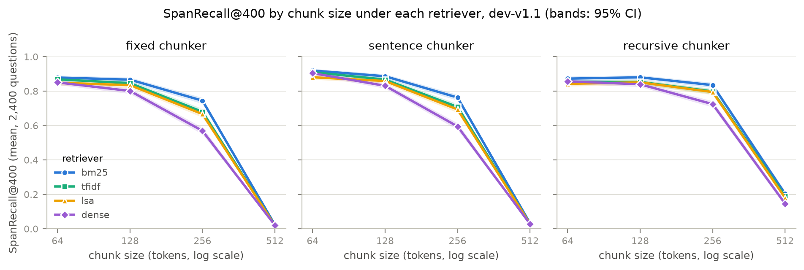
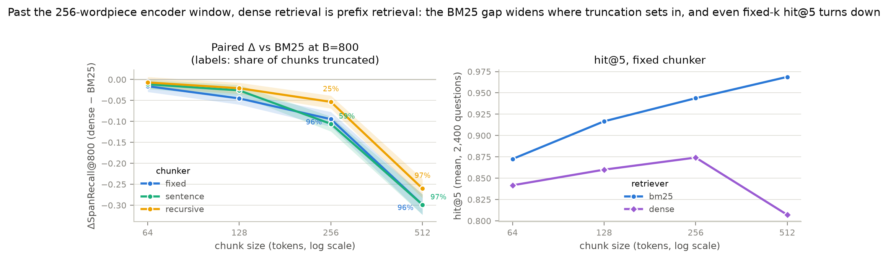
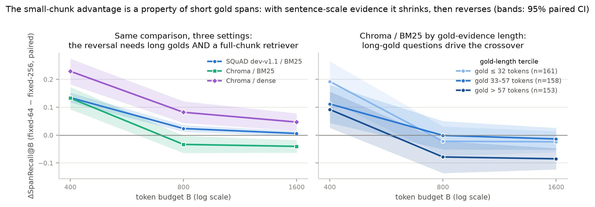
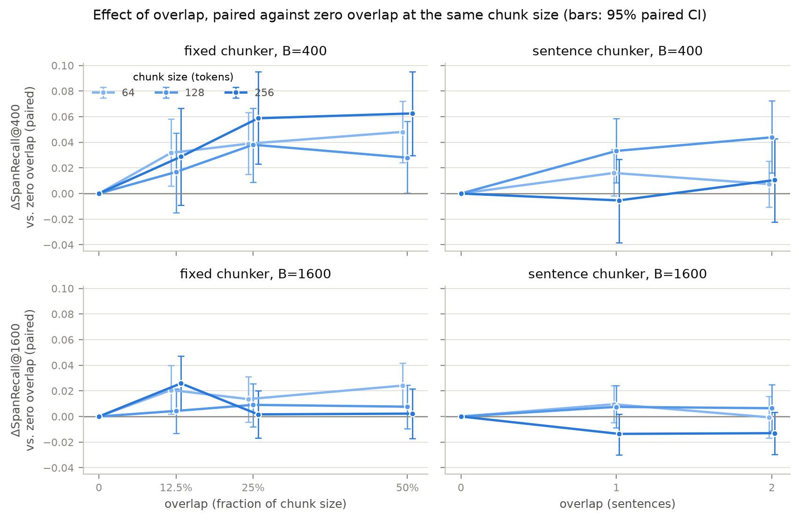
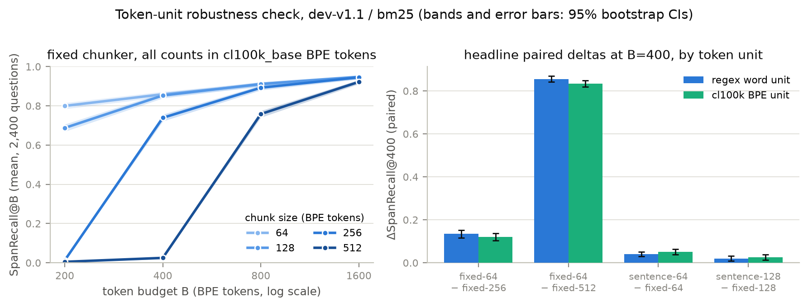
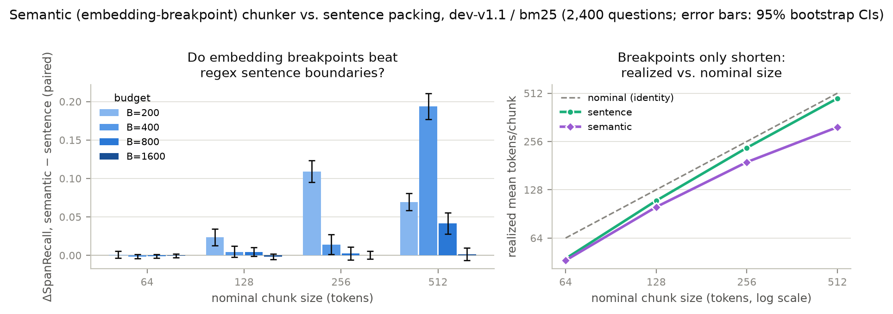
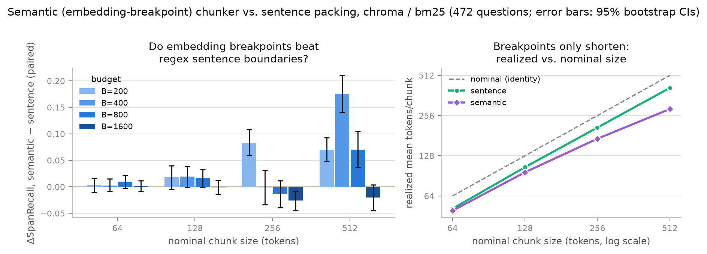
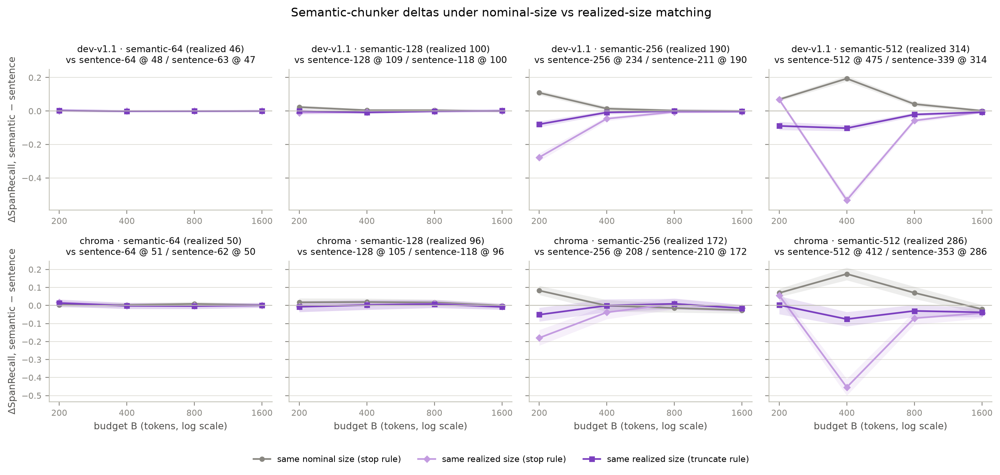
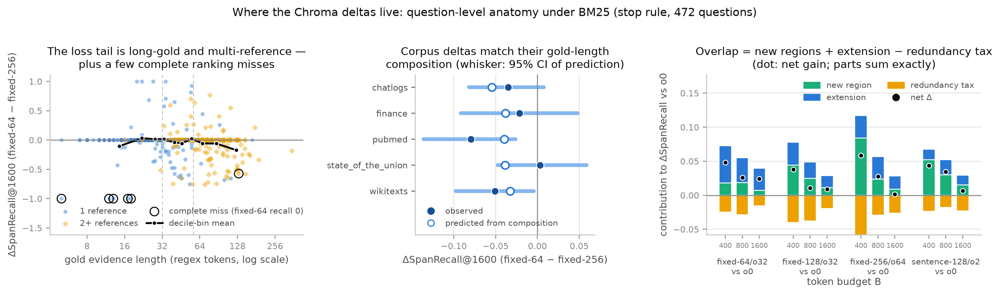

# rag-chunking-bench

**How much does chunking actually matter for RAG retrieval — once you control
for the retrieved-token budget?**


*Headline result: at a fixed 400-token retrieval budget, smaller chunks win in
every chunker family and chunks larger than the budget collapse to ~0.
Regenerated from committed raw results with
`python -m experiments.make_hero_figure`. This holds on SQuAD's ~3-token gold
answers; findings 13–15 measure where the claim's boundary lies when gold
evidence is sentence-scale.*

## Abstract

Chunking is the highest-leverage, least-principled design decision in
retrieval-augmented generation: every production stack picks a chunk size and
overlap, usually by folklore. Published comparisons of chunking strategies
almost always vary chunk size while holding top-*k* fixed — which confounds
chunking quality with the sheer number of tokens handed to the generator
(500-token chunks at k=5 retrieve five times the text of 100-token chunks at
k=5, and the generator's context budget pays for it). This project benchmarks
structural and semantic chunking strategies under a **budget-matched
protocol**: retrievers are compared at equal retrieved-token budgets using
span-level (token-overlap) metrics against gold evidence spans, with paired
bootstrap confidence intervals over questions. The goal is a defensible
answer to "which chunking decisions survive budget control, and by how much,"
at a scale (CPU, open data) that anyone can reproduce. The experimental
program — 26 findings across baselines, five robustness axes, and a closing
error analysis — is complete. Headline results: fixed-k evaluation and
budget-matched evaluation rank chunk sizes in opposite orders (finding 2);
under budget matching the winning chunk size is set by the length of the
gold evidence — smallest chunks dominate on short-answer SQuAD at every
budget, but with sentence-scale evidence the advantage inverts at generous
budgets (findings 13–14); the effects replicate across four retriever
families, three sampling seeds, both budget-boundary rules, and two token
units (regex word vs. cl100k_base BPE); the popular percentile *semantic*
chunker, once budget-matched and compared at matched *realized* size, shows
no boundary-quality gain over cheap regex sentence packing anywhere — its
apparent wins are chunk-size drift, and on long-gold corpora it retains a
measurable penalty (findings 20–22); and the matched-size protocol itself
turns out to need care, because realized-size *dispersion* interacts with
the budget rule strongly enough to manufacture ±0.5 recall deltas at
matched means (finding 23). A question-level error analysis closes the
loop: apparent per-corpus differences are entirely gold-length composition,
the residual loss tail splits into two identifiable mechanisms, and every
overlap gain decomposes exactly into new-region placement plus coverage
extension minus a redundancy tax (findings 24–26).

## The 26 findings at a glance

One line per finding; each link lands on the section with the full setup,
tables, and paired bootstrap CIs. If you only read three: **2** (the
fixed-k confound), **14** (chunk size should match evidence length), and
**23** (why "matched chunk size" comparisons need care).

| # | Claim | Section |
|---|---|---|
| 1 | Under budget matching, smaller chunks win at every budget on SQuAD's short golds | [Baseline](#baseline-findings-the-size-effect-and-the-fixed-k-confound) |
| 2 | Fixed-k evaluation reverses that ranking — the retrieved-token confound is real and large | [Baseline](#baseline-findings-the-size-effect-and-the-fixed-k-confound) |
| 3 | Sentence alignment adds a modest, significant edge at matched size | [Baseline](#baseline-findings-the-size-effect-and-the-fixed-k-confound) |
| 4 | Nominal chunk size is confounded by under-filling — report realized sizes | [Baseline](#baseline-findings-the-size-effect-and-the-fixed-k-confound) |
| 5 | Stop-before-exceed zeroes any config whose chunks exceed the budget — a protocol artifact kept visible | [Baseline](#baseline-findings-the-size-effect-and-the-fixed-k-confound) |
| 6 | Overlap is boundary repair: fixed windows gain at tight budgets, sentence packing just pays | [Overlap ablation](#overlap-ablation-overlap-is-boundary-repair-not-free-recall) |
| 7 | Small chunks still win when every config spends its full budget | [Budget-rule robustness](#budget-rule-robustness-the-size-effect-is-not-a-stop-rule-artifact) |
| 8 | Every chunking effect transfers to TF-IDF and LSA — and chunking moves recall more than retriever choice | [Retriever robustness](#retriever-robustness-the-chunking-effects-are-not-bm25-artifacts) |
| 9 | BM25 ≥ TF-IDF ≥ LSA nearly everywhere, and the retriever gap grows with chunk size | [Retriever robustness](#retriever-robustness-the-chunking-effects-are-not-bm25-artifacts) |
| 10 | Every headline claim replicates under three independent question samples | [Seed robustness](#sampling-seed-robustness-the-headline-effects-do-not-ride-on-the-draw) |
| 11 | The chunking effects are retriever-family-independent — dense MiniLM included | [Dense retrieval](#dense-retrieval-the-effects-transfer-and-the-encoder-window-becomes-a-mechanism) |
| 12 | Past the encoder window, dense retrieval is prefix retrieval — even hit@5 turns down | [Dense retrieval](#dense-retrieval-the-effects-transfer-and-the-encoder-window-becomes-a-mechanism) |
| 13 | With sentence-scale golds, the small-chunk advantage inverts at generous budgets | [Long-reference corpora](#long-reference-corpora-gold-evidence-length-sets-where-smaller-stops-winning) |
| 14 | The inversion is gold-length-driven: match chunk size to evidence length | [Long-reference corpora](#long-reference-corpora-gold-evidence-length-sets-where-smaller-stops-winning) |
| 15 | The inversion requires a retriever that reads whole chunks; precision finally discriminates | [Long-reference corpora](#long-reference-corpora-gold-evidence-length-sets-where-smaller-stops-winning) |
| 16 | On long golds, overlap's gains persist across budgets — and reach sentence packing | [Overlap on long golds](#overlap-on-long-gold-corpora-boundary-repair-becomes-evidence-stitching) |
| 17 | Boundary repair is not the whole story: where golds outgrow the window, overlap becomes evidence stitching | [Overlap on long golds](#overlap-on-long-gold-corpora-boundary-repair-becomes-evidence-stitching) |
| 18 | The crossover survives the budget rule and every drop-one corpus; much of the tight-budget small-chunk edge was the stop rule | [Crossover robustness](#crossover-robustness-the-inversion-survives-the-budget-rule-and-every-corpus) |
| 19 | Every headline claim is unit-invariant under cl100k_base BPE accounting | [Tokenizer robustness](#tokenizer-unit-robustness-the-claims-survive-real-bpe-accounting) |
| 20 | The semantic chunker's matched-nominal wins are realized-size drift, not boundary quality | [Semantic chunking](#semantic-chunking-embedding-breakpoints-buy-size-drift-not-boundary-quality) |
| 21 | The drift account passes falsification: the "advantage" flips sign on long golds at generous budgets | [Semantic chunking](#semantic-chunking-embedding-breakpoints-buy-size-drift-not-boundary-quality) |
| 22 | At matched realized size the semantic chunker gains nothing anywhere, and its long-gold penalty survives | [Matched realized size](#matched-realized-size-the-semantic-wins-vanish-and-matched-means-prove-insufficient) |
| 23 | Matched mean ≠ matched distribution: the stop rule turns residual dispersion into ±0.5 deltas | [Matched realized size](#matched-realized-size-the-semantic-wins-vanish-and-matched-means-prove-insufficient) |
| 24 | Per-corpus differences are gold-length composition, not domain | [Error analysis](#error-analysis-which-questions-move-the-deltas) |
| 25 | The loss tail is two mechanisms: partial coverage on long multi-reference golds, plus rare complete ranking misses on short golds | [Error analysis](#error-analysis-which-questions-move-the-deltas) |
| 26 | Overlap = placement + extension − a redundancy tax; stitching is budget-limited | [Error analysis](#error-analysis-which-questions-move-the-deltas) |

## Motivation

Three observations from the literature motivate the design:

1. **Rank-based metrics hide the cost of chunk size.** Recall@k improves with
   larger chunks partly because each retrieved unit simply contains more
   text. Smith & Troynikov (2024) introduced token-level precision/recall/IoU
   against gold excerpts, which this project adopts — and extends by making
   the *retrieved-token budget* (not k) the controlled variable.
2. **Chunking papers rarely quantify uncertainty.** Recent comparisons
   (Merola & Singh, 2025; Duarte et al., 2024) report point estimates on a
   single configuration. Here every comparison is paired per-question with
   bootstrap confidence intervals, so "strategy A beats strategy B" comes
   with an interval, not just a mean.
3. **The generator's context is the scarce resource.** "Lost in the Middle"
   (Liu et al., 2023) showed long, padded contexts actively hurt; a chunking
   strategy that wins only by retrieving more tokens is not a win. Budget
   matching makes that failure mode visible.

## Method

### Evaluation protocol

For a question *q* over a document collection, the gold evidence is a set of
character spans *G* in the source documents. A chunker segments each document
into chunks with exact character offsets; a retriever ranks chunks for *q*;
retrieved chunks are accumulated in rank order until the token budget *B* is
exhausted (the first chunk that would exceed *B* stops accumulation). With
*C* = the set of retrieved tokens and *G* = gold-span tokens:

- **SpanRecall@B**  = |C ∩ G| / |G|
- **SpanPrecision@B** = |C ∩ G| / |C|
- **SpanIoU@B**   = |C ∩ G| / |C ∪ G|

Two accounting rules make the comparison fair. The budget charges *prompt*
tokens — each retrieved chunk costs its own token count, duplicates included,
because that is what a generator would be handed — while scoring uses the
*union* of retrieved tokens, so redundant overlap spends budget without
earning recall. And when a dataset annotates several alternative gold spans
for one question (SQuAD's multiple annotations), each metric takes the max
over alternatives, the standard max-over-answers convention; corpora whose
references are jointly required score against their union through the same
code path.

Metrics are computed per question and aggregated with means and 95% paired
bootstrap confidence intervals (fixed seed). Budgets sweep
B ∈ {200, 400, 800, 1600} tokens; classic hit@k is also reported for
comparability with prior work.

Token counting uses a deterministic regex word/punctuation tokenizer
(`src/tokenization.py`) shared by chunkers, budget accounting, and metrics —
the unit only needs to be consistent, not identical to any model's BPE. The
`Tokenizer` protocol allows a BPE tokenizer to be slotted in as a robustness
check; `TiktokenTokenizer` (cl100k_base) is that check, and finding 19
verifies the headline claims are unit-invariant.

### Chunking strategies (`src/chunkers.py`)

All chunkers emit chunks with exact document offsets
(`document[start:end] == chunk.text`), the invariant that makes span-level
scoring exact rather than fuzzy-matched.

| Strategy | Description | Knobs |
|---|---|---|
| `FixedTokenChunker` | sliding token window | size, overlap |
| `SentenceChunker` | greedy packing of whole sentences under a token budget | max_tokens, sentence overlap |
| `RecursiveCharacterChunker` | paragraph > line > space separator hierarchy with greedy merge (LangChain semantics, offset-preserving) | max_tokens |
| `SemanticChunker` | embedding-breakpoint segmentation: sentences whose adjacent MiniLM-embedding cosine distance exceeds a per-document percentile threshold start a new segment; packing never crosses a breakpoint (the percentile chunker popularized by Kamradt and shipped in LangChain; Chroma's ClusterSemanticChunker is the clustering cousin) | max_tokens, percentile |

`SemanticChunker` keeps the same hard guarantees as the structural family —
exact offsets, token-window fallback so the budget is never exceeded — but
its boundaries depend on float32 inference, so like the dense retriever's
scores they are deterministic per environment rather than bit-portable
across torch/BLAS builds; each run records the encoder identity plus
segmentation exposure (breakpoint rate, prefix-embedded sentences) in
`chunker_stats`. Because breakpoints can only shorten chunks, a semantic
configuration operates below its nominal size — the finding-4 confound —
so its comparison table reports realized sizes side by side.

### Retrievers

Three deterministic lexical/low-rank retrievers in `src/retrievers.py`,
sharing one retrieval tokenizer so they differ only in scoring: BM25
(implemented from scratch, tested against a hand-computed example), TF-IDF
cosine (scikit-learn, likewise hand-verified), and LSA (TruncatedSVD over
TF-IDF, ARPACK solver with fixed seed; the latent rank is capped per
document at min(64, n_chunks − 1, n_terms − 1), and runs record where that
cap actually binds). BEIR (Thakur et al., 2021) established BM25 as a robust
zero-shot baseline; the chunking effect is measured holding each retriever
fixed, and retriever × chunker interaction is itself a studied variable (see
the cross-retriever results below).

A fourth, neural retriever covers the lexical-vs-dense axis: cosine
similarity over `all-MiniLM-L6-v2` sentence embeddings (`src/dense.py`;
Reimers & Gurevych 2019, MiniLM distillation by Wang et al. 2020; 22M
parameters, runs on CPU). Two honesty notes baked into the harness: the
encoder reads at most 256 wordpieces, so longer chunks are scored by their
prefix — every dense run records how many chunks that truncation touched —
and dense scores are deterministic per environment but, unlike the lexical
retrievers, not bit-portable across torch/BLAS builds (versions are recorded
in each result file).

### Datasets

- **SQuAD-derived long documents** (`src/data.py`): Wikipedia articles
  reconstructed by concatenating each article's paragraphs, with answer spans
  remapped into article coordinates and verified verbatim at load time.
  dev-v1.1 yields 48 documents (2.7k–16.8k tokens, median 6.2k) and 10,533
  answerable questions after deduplication. Raw JSON is fetched from pinned
  URLs with SHA256 checks (`python -m src.data`).
- **Chroma chunking-evaluation corpora** (Smith & Troynikov, 2024): five
  heterogeneous single-file corpora (state-of-the-union, Wikitexts, chat
  logs, finance, PubMed; 7.9k–145k tokens) with 472 questions whose gold
  evidence is given as exact character spans. All 790 references verified
  verbatim against the pinned corpus files at load time (none needed
  remapping). Unlike SQuAD's ~3-token answers, references are sentence-scale
  (median ~28 tokens) and 40% of questions require several jointly — the
  regime where SpanPrecision/IoU become informative and where gold-evidence
  length can moderate the size effect (findings 13–15). Queries are
  LLM-generated, which is recorded as a provenance caveat.

## Experiments

Every number below comes from runs checked into `results/raw/` (per-question
scores, gzipped JSON, with config + git commit embedded) and is regenerable:

```bash
python -m experiments.run_grid                # baseline: 12 configs, ~25 s on 4 CPU cores
python -m experiments.run_grid --retrievers tfidf lsa   # cross-retriever grid (~90 s)
python -m experiments.run_grid --retrievers dense       # dense grid (~9 min CPU; needs the "dense" group)
python -m experiments.run_grid --budget-rule truncate   # budget-rule ablation
python -m experiments.run_grid --chunkers fixed --sizes 64 --overlaps 8 16 32   # overlap ablation (see NOTES)
python -m experiments.run_grid --seed 1       # independent question sample (multi-seed check)
python -m experiments.run_grid --dataset chroma --per-doc-cap 150 --retrievers bm25 tfidf lsa dense
                                              # long-reference corpora, all four retrievers (~7 min)
python -m experiments.summarize               # baseline tables incl. paired CIs -> results/summary_*.md
python -m experiments.summarize_ablations     # overlap + budget-rule tables -> results/summary_*_ablations.md
python -m experiments.summarize_retrievers    # retriever x chunker tables -> results/summary_*_retrievers.md
python -m experiments.summarize_seeds         # per-seed robustness tables -> results/summary_*_seeds.md
python -m experiments.summarize_chroma        # per-corpus + gold-length moderation -> results/summary_chroma_*_moderation.md
python -m experiments.summarize_errors        # composition test, loss taxonomy, overlap decomposition -> results/summary_chroma_*_errors.md
python -m experiments.make_figures            # figures -> results/figures/
python -m experiments.make_hero_figure        # headline figure -> assets/
```

### Baseline grid (phase 2, first slice)

Setup: SQuAD dev-v1.1 as 48 reconstructed articles; 2,400 questions
(50/article, seeded sampling); BM25; chunkers {fixed, sentence, recursive} ×
sizes {64, 128, 256, 512} tokens, no overlap; budgets B ∈ {200, 400, 800,
1600}; stop-before-exceed budget rule. 95% CIs are paired bootstrap over
questions (10,000 resamples). Full tables: [`results/summary_dev-v1.1_bm25.md`](results/summary_dev-v1.1_bm25.md).

**SpanRecall@B (mean over 2,400 questions)**

| config | B=200 | B=400 | B=800 | B=1600 |
|---|---|---|---|---|
| fixed-64 | 0.812 | 0.879 | 0.919 | 0.958 |
| fixed-128 | 0.700 | 0.867 | 0.925 | 0.961 |
| fixed-256 | 0.012 | 0.744 | 0.895 | 0.952 |
| fixed-512 | 0.006 | 0.023 | 0.757 | 0.928 |
| sentence-64 | **0.865** | **0.919** | **0.952** | 0.971 |
| sentence-128 | 0.745 | 0.886 | 0.940 | **0.975** |
| sentence-256 | 0.029 | 0.763 | 0.908 | 0.956 |
| sentence-512 | 0.008 | 0.033 | 0.767 | 0.933 |
| recursive-64 | 0.805 | 0.873 | 0.917 | 0.953 |
| recursive-128 | 0.741 | 0.880 | 0.930 | 0.966 |
| recursive-256 | 0.359 | 0.835 | 0.925 | 0.966 |
| recursive-512 | 0.009 | 0.203 | 0.810 | 0.928 |


*Budget curves per chunker family. Under budget matching, smaller chunks
dominate at every budget: 64-token chunks are never worse than larger ones,
and configs whose chunks exceed the budget collapse to ~0 (stop-before-exceed
retrieves nothing — see finding 4). CI bands are barely visible at n=2,400.*

### Baseline findings: the size effect and the fixed-k confound

**1. Under budget matching, smaller chunks win — significantly.** At B=400,
fixed-64 beats the fixed-256 baseline by **+0.134 [+0.117, +0.152]**
SpanRecall; fixed-128 by +0.122 [+0.107, +0.138]. The advantage shrinks as
the budget grows (+0.024 [+0.012, +0.036] at B=800; n.s. at B=1600) but
never reverses: with a finite context budget, many small high-precision
pieces beat few large diluted ones on this corpus. (Findings 13–15 show this
is a property of SQuAD's short gold spans, not of retrieval: with
sentence-scale gold evidence the advantage inverts at generous budgets.)

**2. Fixed-k evaluation reverses that ranking — the confound is real and
large.** hit@5 *increases* monotonically with chunk size (fixed: 0.873 →
0.917 → 0.944 → 0.969 for 64 → 512), simply because a bigger retrieved unit
contains more text; budget-matched SpanRecall@400 moves the opposite way
(0.879 → 0.023). A fixed-k comparison would conclude "use 512-token chunks";
a budget-matched one concludes the reverse at practical budgets. This is the
central methodological claim of the project, now measured:


*The same 12 runs scored two ways. Left: classic fixed-k hit rate rewards
larger chunks. Right: holding retrieved tokens constant instead of k, the
ordering reverses.*

**3. Sentence alignment gives a consistent, modest, significant edge at
matched size.** Paired same-size comparisons of sentence vs. fixed at B=400:
+0.041 [+0.029, +0.052] at size 64, +0.020 [+0.008, +0.031] at 128, +0.018
[+0.004, +0.033] at 256, +0.010 [+0.003, +0.017] at 512 — all significant,
all small relative to the size effect. Respecting sentence boundaries helps;
it does not rescue an oversized chunk.

**4. "Matched nominal size" is itself confounded by chunk under-filling.**
The recursive chunker's apparent wins at larger sizes (e.g. +0.348 [+0.329,
+0.367] over fixed-256 at B=200) trace to its realized chunks being smaller
than nominal (mean 189 tokens at size 256, vs. 250 for the fixed chunker —
see the chunk-statistics table in the summary). Its effective operating
point is simply further down the size axis, where recall is higher. Chunking
comparisons should report realized chunk-size distributions, not just the
configured maximum.

**5. Stop-before-exceed makes size > budget configs retrieve nothing** —
utilization is ~0 when the smallest chunk exceeds B (e.g. fixed-512 at
B≤400), which reads as SpanRecall ≈ 0. This is a protocol artifact worth
keeping visible rather than hiding: it is exactly the deployment failure of
pairing a large-chunk index with a small context window. The
truncate-final-chunk robustness check below confirms the size ordering is
not an artifact of this rule.

A note on the other span metrics: on SQuAD, gold answers average ~3 tokens,
so SpanPrecision@B is dominated by 1/|retrieved| and is nearly identical
across configs at a given budget (see summary tables). Recall is the
informative span metric here; precision/IoU become discriminative on the
long-reference Chroma corpora (finding 15).

### Overlap ablation: overlap is boundary repair, not free recall

Setup: fixed chunker at sizes {64, 128, 256} × overlap {12.5%, 25%, 50% of
chunk size}; sentence chunker at sizes {64, 128, 256} × overlap {1, 2}
sentences; BM25; stop rule; same 2,400 questions. Every configuration is
compared *paired* against the same chunker and size at zero overlap, so the
only manipulated variable is overlap. Under this protocol overlap has to earn
back its cost: the budget charges every retrieved chunk in full (duplicated
text included) while scoring counts each gold token once. Full tables:
[`results/summary_dev-v1.1_bm25_ablations.md`](results/summary_dev-v1.1_bm25_ablations.md).


*Paired ΔSpanRecall vs. zero overlap (positive = overlap helps). Left column:
fixed windows gain significantly at practical budgets, with the gain fading —
and at 50% overlap reversing — as the budget grows. Right column: sentence
packing gets little to nothing from overlap and pays for it at loose budgets.*

**6. Overlap helps precisely where chunk boundaries do damage — and is pure
cost where they don't.** For fixed windows, moderate (~25%) overlap is a
significant win at tight budgets: at B=400 it gains **+0.036 [+0.026,
+0.047]** / +0.022 [+0.011, +0.032] / +0.019 [+0.005, +0.032] SpanRecall for
sizes 64 / 128 / 256, and fixed-64 gains +0.046 [+0.033, +0.059] at B=200.
The gain shrinks monotonically with budget, and heavy overlap eventually
inverts: fixed-256 at 50% overlap is
**−0.013 [−0.021, −0.005]** at B=1600, and its hit@5 also drops significantly
(−0.014) as near-duplicates crowd the top ranks. For the sentence chunker the
picture is null-to-negative at practical budgets (2-sentence overlap:
−0.011 [−0.019, −0.004] at B≥800 for size 128), with only isolated small
positives at each size's tightest non-degenerate budget. The mechanism reads clearly: fixed windows
cut sentences and evidence spans mid-stream, and overlap repairs those cuts;
sentence packing rarely makes them, so duplication just spends budget.
Consistent with that, sentence-64 at *zero* overlap is statistically
indistinguishable from fixed-64 at 25% overlap (+0.007 [−0.004, +0.019] at
B=200; the ablation summary generates this cross-family control at every
size) — boundary-aware packing achieves what overlap buys, without paying
for it in index size or retrieved duplicates. This control holds on SQuAD
at every size and budget; finding 17 shows the regime where it breaks. Practical reading: if you use
fixed windows with a tight context budget, ~25% overlap is worth it; if you
chunk on sentence boundaries, skip overlap entirely — advice findings 16–17
amend for corpora whose gold evidence outgrows the chunk, and finding 26
prices mechanism by mechanism (placement + extension − a redundancy tax).

### Budget-rule robustness: the size effect is not a stop-rule artifact

Setup: the 12 baseline configurations rerun with the truncate-final-chunk
rule — the chunk that straddles the budget is cut, token-aligned, to exactly
fill it, so utilization is 1.00 everywhere and the stop rule's
retrieve-nothing cells become meaningful measurements. Rankings are identical
on both sides; only boundary handling differs.


*SpanRecall@200 under both budget rules. Truncation (solid) removes the
collapse of large-chunk configs under stop-before-exceed (dashed), but recall
still falls monotonically with chunk size in every family.*

**7. Small chunks still win when every config spends its full budget.**
Truncation can only add tokens, so its per-question effect is mechanically
non-negative; it is large exactly in the artifact cells (fixed-256 at B=200:
+0.589) and ≤ +0.075 everywhere else. The finding that matters: under
truncate at B=200, fixed recall is 0.819 / 0.770 / 0.601 / 0.299 for sizes
64 / 128 / 256 / 512 — fixed-64 beats fixed-256 by **+0.218 [+0.198,
+0.239]** and fixed-512 by +0.519 [+0.497, +0.541], all with full budget
utilization. The sentence-over-fixed edge also survives the rule change
(+0.040 [+0.029, +0.051] at size 64, B=400). Both headline effects are
properties of chunking, not of the budget-boundary convention. The residual
size penalty under truncation has a clean interpretation: a large top-ranked
chunk enters the prompt as a prefix, and evidence sitting past the cut is
lost — which is also what happens when production stacks truncate contexts.

### Retriever robustness: the chunking effects are not BM25 artifacts

Setup: the 12 baseline configurations rerun with TF-IDF cosine and LSA
(latent rank ≤ 64) in place of BM25 — same chunks, same questions, same
protocol, so every comparison below is paired per question. Full tables,
including LSA's realized per-document latent ranks:
[`results/summary_dev-v1.1_retrievers.md`](results/summary_dev-v1.1_retrievers.md).



*SpanRecall@400 vs. chunk size under each retriever. The three lexical lines
are nearly parallel in every chunker family: which retriever you pick moves
recall far less than which chunk size you pick. The dense line (added later;
findings 11–12) tracks them at small sizes and falls away exactly where
chunks outgrow its encoder window.*

**8. Every chunking finding transfers across retrievers — and the chunking
effect dominates the retriever effect.** Under budget matching, recall falls
with chunk size for all three retrievers (TF-IDF at B=400: 0.868 / 0.846 /
0.679 / 0.019 for fixed 64 → 512; LSA: 0.848 / 0.835 / 0.667 / 0.019). The
within-retriever size effect is at least as large as under BM25 — fixed-64
beats fixed-256 at B=400 by **+0.189 [+0.170, +0.208]** (TF-IDF) and +0.182
[+0.163, +0.201] (LSA) vs. +0.134 for BM25. The sentence-over-fixed edge at
matched size survives too (size 64, B=400: +0.042 [+0.030, +0.054] TF-IDF,
+0.032 [+0.019, +0.045] LSA), as does the fixed-k metric reversal (TF-IDF
hit@5 *rises* 0.859 → 0.937 for 64 → 512 while SpanRecall@400 falls
0.868 → 0.019). By contrast, the largest retriever gap at any matched
small-chunk configuration (size ≤ 128) is 0.053. At the operating points the
benchmark recommends anyway, chunking decisions move retrieval quality by
several times more than the choice among these retrievers.

**9. BM25 ≥ TF-IDF ≥ LSA nearly everywhere, and the retriever gap grows with
chunk size.** Paired per config × budget, TF-IDF trails BM25 significantly
in 43/48 cells and LSA in 45/48, with LSA's mean at or below TF-IDF's in
every cell. The interaction is systematic: at size 64 the BM25-over-TF-IDF
gap never exceeds 0.019, but at sizes 256–512 it reaches 0.065–0.077 — BM25's
tf saturation and length normalization earn their keep inside long chunks,
where raw-tf cosine dilutes. LSA's latent bottleneck never helps on this
corpus: it loses most exactly where the rank cap binds (size 64: k = 64
binds for 35/48 documents) and converges toward TF-IDF where the data bound
makes it (nearly) full-rank (size 512: all 48 documents data-bounded, median
rank 12). On within-document retrieval with human-written questions over the
document's own vocabulary, topical smoothing can only discard information.
Two practical readings: with small chunks, a simple lexical retriever is not
the bottleneck; and retriever comparisons run at large chunk sizes will
overstate retriever differences relative to a well-chunked deployment.

### Sampling-seed robustness: the headline effects do not ride on the draw

Every grid above samples 50 questions per document with one seed. To check
that no headline claim is an artifact of that one draw, the 12-config BM25
baseline grid was rerun under two more seeds — each an independent
50-per-document sample (2,400 fresh questions per seed). Paired deltas are
computed within each seed (across-seed pairing would be meaningless); full
tables: [`results/summary_dev-v1.1_bm25_seeds.md`](results/summary_dev-v1.1_bm25_seeds.md).

**10. Every headline claim replicates under every seed.** Per-config mean
SpanRecall@400 moves by at most 0.013 across seeds (median spread 0.008),
and each headline paired comparison stays significant with essentially the
same effect size under all three seeds:

| ΔSpanRecall@400 (paired, per seed) | seed 0 | seed 1 | seed 2 |
|---|---|---|---|
| fixed-64 − fixed-256 | **+0.134** | **+0.119** | **+0.123** |
| sentence-64 − fixed-64 | **+0.041** | **+0.049** | **+0.047** |
| sentence-128 − fixed-128 | **+0.020** | **+0.025** | **+0.024** |

(bold = 95% paired bootstrap CI excludes zero; full intervals in the linked
summary). The question-sampling seed is not a hidden degree of freedom in
any result reported here.

### Dense retrieval: the effects transfer, and the encoder window becomes a mechanism

Setup: the 12 baseline configurations rerun with the dense retriever —
cosine over `all-MiniLM-L6-v2` embeddings — same chunks, same questions,
every comparison paired per question (~9 min on 4 CPU cores for the grid).
MiniLM reads at most 256 wordpieces per input, and every run records its
truncation exposure: 0% of chunks at sizes 64–128 in every family, 25% / 59%
/ 96% at nominal size 256 for recursive / sentence / fixed (their realized
chunk lengths differ — finding 4's point, now with teeth), and 96–97%
everywhere at size 512. Full tables:
[`results/summary_dev-v1.1_retrievers.md`](results/summary_dev-v1.1_retrievers.md).



*Left: the dense−BM25 paired recall gap is flat and small while chunks fit
the encoder window (labels: share of chunks truncated) and dives where
truncation sets in. Right: dense is the only retriever whose fixed-k hit@5
curve turns DOWN at large sizes — big chunks stop helping even the metric
that structurally favors them, because the encoder never reads most of each
chunk.*

**11. The chunking effects are retriever-family-independent.** The
budget-matched size ordering (dense SpanRecall@400: 0.850 / 0.801 / 0.569 /
0.020 for fixed 64 → 512), the sentence-over-fixed edge at matched size
(+0.054 [+0.040, +0.068] at size 64, B=400), and the fixed-k metric reversal
all replicate under dense retrieval. The within-dense size effect (fixed-64
− fixed-256 at B=400: **+0.281 [+0.260, +0.302]**) is twice BM25's +0.134 —
finding 9's pattern that weaker retrievers degrade more inside big chunks,
continued past the lexical family. Chunking still dominates retriever
choice: at size 64 the dense-vs-BM25 gap never exceeds 0.050 at any budget,
five times smaller than the size effect. With well-sized chunks, MiniLM is
statistically indistinguishable from BM25 at generous budgets (fixed-64 at
B=1600: −0.008 [−0.018, +0.002]) — on a corpus whose questions lexically
overlap their sources, a regime that favors BM25 (see limitations).

**12. Past the encoder window, dense retrieval is prefix retrieval, and
both metrics show it.** The dense−BM25 gap at B=800 has two regimes: at
sizes 64–128 (nothing truncated) it stays within −0.005…−0.045, but at the
truncated sizes it jumps to −0.095 (fixed-256) and **−0.299** (fixed-512) —
2.6× the worst lexical-challenger gap anywhere in the benchmark (LSA's
−0.117). The recursive family, whose realized size-256 chunks mostly still
fit the window (25% truncated), loses only −0.053 at that cell — roughly
half the fixed-family gap — though exposure alone does not fully order the
mid-size cells (sentence-256 at 59% behaves like fixed-256 at 96%), so
realized-length distributions matter beyond the binary truncated/not.
Sharpest signature: dense hit@5 rises 0.842 → 0.874 through size 256, then
*falls* to 0.807 at 512 — the only retriever whose fixed-k curve is
non-monotone (BM25's rises to 0.969). Practical reading: chunk size must be
co-designed with the embedding model's window; past it, ranking quality
degrades even at the top of the list, and no budget can buy the discarded
text back.

### Long-reference corpora: gold-evidence length sets where "smaller" stops winning

Setup: the five Chroma evaluation corpora as five documents (7.9k–145k
tokens), all 472 questions (no sampling — the 150-per-document cap exceeds
every corpus's question count), same 12 chunking configurations, budgets,
and stop rule as the baseline grid, run under all four retrievers. Gold
references here are sentence-scale (median ~28 tokens, up to 349 total per
question) and 40% of questions require several jointly — the regime SQuAD
could not test, and the honest risk to finding 1 flagged when it was first
reported. Full tables:
[`results/summary_chroma_bm25.md`](results/summary_chroma_bm25.md) and
[`results/summary_chroma_bm25_moderation.md`](results/summary_chroma_bm25_moderation.md).



*Left: the same paired comparison (fixed-64 − fixed-256) that never reverses
on SQuAD crosses zero on Chroma between B=400 and B=800 under BM25 — but not
under the window-limited dense encoder, which never reads more than a prefix
of a 256-token chunk. Right: splitting the Chroma delta by gold-evidence
length shows the crossover concentrated in the questions with the longest
gold spans. B=200 is omitted: the baseline retrieves nothing there under the
stop rule (finding 5), so the delta would measure the artifact.*

**13. With sentence-scale gold evidence, the small-chunk advantage inverts
at generous budgets.** Under BM25, fixed-64 still beats fixed-256 at B=400
(**+0.133 [+0.093, +0.172]** SpanRecall), but by B=800 the sign flips
(**−0.033 [−0.064, −0.002]**) and stays flipped at B=1600 (**−0.040
[−0.063, −0.018]**) — the reversal finding 1 never showed on SQuAD at any
budget. The best Chroma configs at generous budgets are mid-sized:
sentence-256 tops SpanRecall@1600 (0.938, **+0.024 [+0.002, +0.047]** over
fixed-256, with fixed-64 at 0.874), while at B=200 small chunks still win
(sentence-64: 0.602 vs 0.030 for sentence-256). The per-corpus breakdown
shows the same shape in all five corpora — significantly positive at B=400
in 4/5, zero-crossing at B=800, significantly negative at B=1600 in 3/5,
never significantly positive past B=400 — so this is not one corpus's
quirk. The fixed-k reversal, meanwhile, replicates: hit@5 rises with size
(0.860 → 0.951 for fixed 64 → 512) exactly as on SQuAD.

**14. The inversion is driven by gold-evidence length — chunk size should be
matched to the evidence span, not minimized.** Splitting the same paired
delta by each question's total gold length (terciles: ≤32, 33–57, >57
tokens): at B=400 the small-chunk advantage falls from **+0.192** to
**+0.112** to **+0.092** across terciles; at B=1600 the short and mid
terciles are null (−0.024 [−0.062, +0.013], −0.014) while the long tercile
is significantly negative (**−0.085 [−0.123, −0.047]**). Questions needing
2+ references show the flip (−0.069 [−0.104, −0.035] at B=1600) where
single-reference questions do not (−0.022, n.s.). Mechanically: a 64-token
chunk cannot contain a 60-token evidence span plus its lexical context, so
covering long or multi-part evidence costs several retrievals that each pay
rank-quality risk, while a 256-token chunk amortizes them. Together with
findings 1 and 10 this gives the benchmark's most practical rule so far:
**the optimal chunk size scales with the length of the evidence a question
needs** — ~3-token answers favor the smallest chunks at every budget;
sentence-to-paragraph evidence favors 128–256-token chunks once the budget
is loose enough to afford them. (Finding 24 later sharpens the moderator
claim: corpus identity adds nothing detectable beyond gold-length
composition.)

**15. The inversion requires a retriever that can read the whole chunk —
and precision finally has something to say.** Under dense MiniLM retrieval
the crossover never happens: fixed-64 stays significantly ahead of
fixed-256 at every budget (+0.229 / **+0.082** / **+0.047** at B=400 / 800
/ 1600), because 99.5% of fixed-256 chunks exceed the encoder's
256-wordpiece window on these corpora — the retriever ranks prefixes
(finding 12), so large chunks never get to use their extra evidence. The
window mechanism caps the gold-length mechanism: co-designing chunk size
with the encoder window is not just a ranking concern but decides whether
longer-evidence questions are servable at all. Separately, the
long-reference regime makes the precision metrics informative for the first
time (on SQuAD they were pinned near 1/|retrieved|): SpanPrecision@200
peaks at mid-size boundary-aware configs (sentence-128: 0.193 vs 0.140 for
fixed-64), boundary-aware packing beats fixed windows at matched size more
strongly than on SQuAD (sentence-256 vs fixed-256 at B=400: **+0.083
[+0.042, +0.125]**, four times the SQuAD gap — cutting mid-sentence now
means cutting through the gold span itself), and precision decays
hyperbolically with budget everywhere (gold is fixed while retrieved tokens
grow), which is the quantitative face of "Lost in the Middle"'s warning
that padding budgets dilutes.

### Overlap on long-gold corpora: boundary repair becomes evidence stitching

Setup: the same overlap ablation as finding 6 — fixed {64, 128, 256} ×
overlap {12.5%, 25%, 50% of size}, sentence {64, 128, 256} × {1, 2}
sentences, each paired against its own zero-overlap control — rerun on the
Chroma corpora (BM25, stop rule, all 472 questions). Full tables, including
the generated cross-family control:
[`results/summary_chroma_bm25_ablations.md`](results/summary_chroma_bm25_ablations.md).



*Paired ΔSpanRecall vs. zero overlap on the Chroma corpora. Two contrasts
with the SQuAD figure above: the fixed-window gains no longer fade to zero
at B=1600 (top-left vs. bottom-left), and sentence packing at size 128 now
benefits significantly (right column) — with sentence-scale golds, evidence
straddles even sentence-pack boundaries.*

**16. With long gold evidence, overlap's gains persist across budgets — and
extend to sentence packing.** On SQuAD, overlap was a tight-budget
phenomenon: gains shrank monotonically with budget and 50% overlap at size
256 was significantly *negative* by B=1600 (finding 6). With sentence-scale
golds the same manipulation keeps paying: fixed-64 at 50% overlap gains
**+0.048 [+0.024, +0.072]** at B=400 and is still **+0.024 [+0.007,
+0.042]** ahead at B=1600; fixed-256 at 25% gains **+0.059 [+0.023,
+0.095]** at B=400, three times the corresponding SQuAD effect; and no
fixed-window overlap cell is significantly negative at any budget. The
cleanest sign flip is sentence packing at mid size: sentence-128 with
2-sentence overlap gains **+0.044 [+0.016, +0.073]** at B=400 and **+0.035
[+0.012, +0.057]** at B=800 — the same cells that were significantly
negative on SQuAD (−0.010, −0.011). The fixed-k view flips the other way:
on SQuAD overlap bought significant hit@5 at small sizes (+0.033 for
fixed-64 at 25%); on Chroma no overlap configuration improves hit@5 (all 15
deltas are ≤ +0.019 and n.s., one significantly negative). Overlap here is
not buying better rankings — it is buying more of each gold span once its
neighborhood is found.

**17. The cross-family control breaks where golds outgrow the window —
boundary repair is not the whole overlap story.** On SQuAD, sentence
packing at zero overlap matched or beat fixed windows at 25% overlap at
every size and budget (e.g. +0.007 [−0.004, +0.019] at size 64, B=200),
which is what licensed reading overlap as pure boundary repair (finding 6).
On Chroma the same control splits by size: at sizes 64 and 128, sentence-o0
is *point-negative in seven of eight cells and significantly worse in four*
(worst: **−0.053 [−0.081, −0.024]** at size 128, B=400), while at size 256
parity-or-better returns (**+0.030 [+0.016, +0.046]** at B=200, **+0.022
[+0.003, +0.042]** at B=1600). The regime is the one finding 14 identified:
median gold evidence is ~28 tokens and 40% of questions need several
references, so at window sizes 64–128 a gold span plus its context often
cannot fit inside any single chunk no matter where the boundaries fall.
Staggered duplicate windows then act as *evidence stitching* — each
retrieved offset window extends coverage around the strongest lexical match
— which boundary-aware packing cannot replicate at those sizes. Once the
window again dwarfs typical evidence (256), boundary awareness suffices and
the SQuAD picture returns. One caveat keeps this honest: sentence packing
under-fills its nominal budget (realized mean 51 vs. 64 tokens at nominal
64 here), so part of its small-size deficit is the realized-size penalty
that finding 13 charges to operating smaller. The practical rule of finding
6 survives with an amendment: with fixed windows, ~25% overlap; with
boundary-aware chunkers, add overlap only when the evidence you expect to
retrieve is longer than your chunks. (Finding 26 adds the budget clause:
that longer-than-chunk case pays only while the budget is tight.)

### Crossover robustness: the inversion survives the budget rule and every corpus

Setup: the 12 chroma baseline configurations rerun under truncate-final-chunk
(utilization 1.00 everywhere — tables in the
[ablation summary](results/summary_chroma_bm25_ablations.md)), plus a
drop-one-corpus jackknife of the pooled finding-13 delta (in the
[moderation summary](results/summary_chroma_bm25_moderation.md)) — the
corpus-level analogue of the SQuAD seed check, since chroma runs every
question and has no sampling seed to vary.

**18. The crossover is not a budget-rule artifact — but most of the
tight-budget small-chunk edge was.** Under truncate, fixed-64 − fixed-256
is **−0.041 [−0.071, −0.011]** at B=800 and **−0.047 [−0.069, −0.026]** at
B=1600: the inversion of finding 13, slightly larger. The other side of the
rule change is just as informative: at B=200 the small-chunk advantage
collapses from +0.590 (stop) to +0.171 (truncate), and at B=400 from
**+0.133** to +0.030 [−0.008, +0.067], no longer significant. Contrast
SQuAD (finding 7), where fixed-64 kept a **+0.218** edge at B=200 under
truncate: with ~3-token golds, small chunks genuinely retrieve better; with
sentence-scale golds, much of their tight-budget advantage was the stop
rule forbidding large chunks from retrieving anything. sentence-256 is the
best configuration at B≥800 under both rules (+0.068 [+0.039, +0.096] over
fixed-64 at B=800 under truncate). The jackknife says the corpus mix is not
doing the work either: the B=1600 inversion stays significant under all
five drop-one estimates (−0.030 to −0.049), while the B=800 estimate stays
negative in all five but grazes zero in four (upper CI bounds +0.000 to
+0.007) — dropping a corpus leaves only ~330–420 questions, so the earlier,
smaller crossover sits at the edge of what that sample can resolve. The
B=1600 cell is the one to cite.

### Tokenizer-unit robustness: the claims survive real BPE accounting

Every token-denominated quantity so far — chunk sizes, budgets, and the
token sets behind the span metrics — was counted by the deterministic regex
word tokenizer. Production stacks count in model BPE units, so the honest
worry is that some claim is an artifact of the ruler. Setup: the 12-config
BM25 baseline grid rerun with *everything* counted in cl100k_base tokens
(`TiktokenTokenizer`), same 2,400-question sample, paired deltas computed
within each unit; full tables:
[`results/summary_dev-v1.1_bm25_tokenizers.md`](results/summary_dev-v1.1_bm25_tokenizers.md).
On this corpus one regex token costs 1.083–1.105 cl100k tokens (per-config
conversion in the summary), so a nominal size or budget buys ~10% less text
under BPE — levels shift accordingly, and only within-unit comparisons are
claims.

**19. Every headline claim is unit-invariant.** All 16 headline paired
cells (size effect and sentence-vs-fixed at B ∈ {200–1600}) keep their
significance status under BPE accounting, every significant cell keeps its
sign, and magnitudes match closely:

| ΔSpanRecall@400 (paired, within unit) | regex word | cl100k_base BPE |
|---|---|---|
| fixed-64 − fixed-256 | **+0.134 [+0.117, +0.152]** | **+0.120 [+0.103, +0.138]** |
| fixed-64 − fixed-512 | **+0.856 [+0.842, +0.870]** | **+0.834 [+0.819, +0.849]** |
| sentence-64 − fixed-64 | **+0.041 [+0.029, +0.052]** | **+0.051 [+0.039, +0.063]** |
| sentence-128 − fixed-128 | **+0.020 [+0.008, +0.031]** | **+0.025 [+0.014, +0.037]** |

The finer structure transfers too: the fixed-k hit@5 metric still rises with
size while budget-matched SpanRecall falls (the finding-2 reversal), and the
adjacent-size step table replicates down to its non-significant wobble —
fixed-64 vs fixed-128 is a statistical tie at B ≥ 800 in *both* units.
Across all 60 generated cells, the only significance flips are five cells
within ±0.011 of zero — two marginally significant regex cells lose
significance under BPE (fixed-128 − fixed-256 at B=1600: +0.008 → +0.002;
sentence-512 vs fixed-512 at B=400) and three near-zero cells gain it.
Every effect of practical size (≥ 0.02) agrees in both sign and
significance, and sentence packing, if anything, looks slightly *better*
under BPE accounting.



*Left: the budget-matched size ordering, with chunk sizes, budgets, and
metrics all counted in cl100k_base BPE tokens — compare the regex-unit
curves in the baseline figure above. Right: headline paired deltas at B=400
computed within each unit; unit-robust claims keep their sign and keep
their 95% CI clear of zero in both bars.*

A methodological byproduct worth recording: BPE tokens carry their leading
whitespace, so they straddle exactly the sentence and separator boundaries
that boundary-respecting chunkers cut at. Wiring the unit in exposed two
containment-vs-overlap bugs in the recursive chunker (a single-word piece
cut after a separator contains no *complete* BPE token, so it was silently
dropped or trimmed past its first word) — both fixed by testing token
overlap instead, which is provably equivalent under the regex tokenizer.
Verified empirically: after the fix, re-running regex-unit configs
reproduces the committed per-question scores bit-for-bit, and all previous
figures regenerate bit-identically. Chunkers that respect text boundaries
inherit a one-token-per-chunk-edge ambiguity under BPE accounting (the
straddling token is scored by overlap but not charged by containment);
at the sizes studied here this is a ≤2% effect with no bearing on any
comparison, since it applies identically to both sides of every paired
delta.

### Semantic chunking: embedding breakpoints buy size drift, not boundary quality

The last chunker family the related work compares is semantic chunking —
segmenting where adjacent-sentence embedding similarity drops, on the
intuition that topically coherent chunks retrieve better (Smith &
Troynikov's ClusterSemanticChunker; the percentile-breakpoint chunker
popularized by Kamradt and shipped in LangChain). Setup: the percentile
variant (MiniLM embeddings, per-document 95th-percentile threshold —
the LangChain default) run on both datasets with BM25, sizes
{64, 128, 256, 512}, against sentence packing at matched nominal size.
This comparison is surgically clean: both sides pack the *same* regex
sentences under the *same* budget, and the semantic side differs only in
refusing to pack across a breakpoint — so the paired delta isolates the
breakpoints themselves. The threshold fires on ~5% of gaps by construction
(rates: 5.2% SQuAD, 5.0% Chroma), i.e. the chunker is genuinely semantic,
not degenerate. Full tables:
[`results/summary_dev-v1.1_bm25_semantic.md`](results/summary_dev-v1.1_bm25_semantic.md),
[`results/summary_chroma_bm25_semantic.md`](results/summary_chroma_bm25_semantic.md).

**20. At matched nominal size the semantic chunker "wins" — but the wins
are realized-size drift, the finding-4 confound at work.** Breakpoints can
only shorten chunks, and the shortfall grows with nominal size (SQuAD
realized means: 46 vs. 48 at nominal 64, 100 vs. 109 at 128, 190 vs. 234
at 256, 314 vs. 475 at 512). The paired deltas track that gap, not the
boundaries: on SQuAD at B=400, Δ(semantic − sentence) runs −0.001 → +0.005
→ **+0.014 [+0.001, +0.027]** → **+0.194 [+0.177, +0.211]** across nominal
64 → 512. The spectacular 512 cell is the stop-rule regime of finding 5:
sentence-512's realized 475-token chunks barely fit a 400-token budget
(recall 0.033) while semantic-512's realized 314-token chunks slip under
it (0.227) — operating further down the size axis, exactly like the
recursive chunker in finding 4. The control cell is nominal 64, where the
two families' realized sizes coincide (2.5% apart): there the delta is a
null at *every* budget on *both* datasets — on SQuAD within ±0.005 with
CIs to match (B=400: −0.001 [−0.004, +0.001]). Where breakpoints don't
move the size distribution, they don't move recall.

**21. The size-drift account survives its falsification test: on long
golds at generous budgets the "advantage" flips sign.** If semantic wins
by being effectively smaller, then in the regime where *larger* effective
chunks win — sentence-scale golds at generous budgets, finding 13 — it
should *lose*. It does: on Chroma, Δ(semantic − sentence) at nominal 256
is **−0.026 [−0.044, −0.009]** at B=1600 (and point-negative at B=800),
while the same configuration still "wins" **+0.083 [+0.059, +0.109]** at
the tight B=200 where smaller-realized fits and larger doesn't. Ranking
quality tells the same story: across the 24 hit@k cells, five are
significantly negative — including Chroma-256's hit@1 −0.036 [−0.068,
−0.004] and hit@5 −0.025 [−0.047, −0.006] — against a single positive
that grazes zero (SQuAD-128 hit@1 +0.012 [+0.001, +0.022]); breakpoints
do not systematically improve the ranked list. Across the 32 paired
span-recall cells, every
significant semantic gain sits where its realized size falls into a regime
the structural grids already showed is favorable, and every significant
loss where it falls out of one. Budget-matched and size-accounted, the
popular percentile chunker shows **no detectable boundary-quality effect
beyond cheap regex sentence packing** — an expensive way to buy a smaller
chunk size. This agrees with Qu et al. (2024, arXiv:2410.13070), who found
semantic chunking's gains too inconsistent to justify its cost across three
retrieval tasks; the budget-matched paired protocol here adds the
*mechanism* (realized-size drift) and a falsification test that the
size-drift account passes. The honest open question it leaves: a protocol
that matches *realized* (not nominal) size distributions would test
boundary quality directly, and the cluster variant and other thresholds
remain untested. (The next section runs exactly that protocol — findings
22–23.)



*SQuAD/BM25. Left: paired ΔSpanRecall (semantic − sentence) at matched
nominal size. Right: realized mean chunk size against nominal — the wins
on the left appear exactly where the purple curve pulls away from the
green, and vanish at nominal 64 where the two coincide.*



*The same comparison on Chroma's sentence-scale golds: the tight-budget
"wins" persist (size drift again), but at B=1600 / nominal 256 the delta
turns significantly negative — smaller-realized chunks are a liability
exactly where finding 13 says larger evidence needs larger chunks.*

### Matched realized size: the semantic wins vanish, and matched means prove insufficient

Finding 20 left a protocol on the table: if the semantic chunker's
matched-nominal wins are realized-size drift, compare it against sentence
packing at matched **realized** size and the wins should vanish.
`experiments/calibrate_matched.py` binary-searches the sentence
`max_tokens` whose corpus-wide realized mean equals each semantic run's
(exact, by a monotonicity argument in the module docstring; chunking only,
no retrieval). The calibration is sharp — relative gaps of 0.0–0.9%
across all eight cells, e.g. sentence-211 realizes 190.34 tokens on SQuAD
against semantic-256's 190.34 — and the calibrated grids ran under both
budget rules on both datasets. Full tables:
[`results/summary_dev-v1.1_bm25_matched.md`](results/summary_dev-v1.1_bm25_matched.md),
[`results/summary_chroma_bm25_matched.md`](results/summary_chroma_bm25_matched.md),
and the `_truncate` variants alongside them.

**22. At matched realized size the semantic chunker gains nothing anywhere
— and its long-gold penalty survives full size control.** The clean cells
are the ones no budget-boundary artifact can reach: ranking metrics, which
never consult a budget, and truncate-rule recall at budgets well above the
largest chunk. Both return the same verdict. All 24 realized-matched
hit@k cells are null but one graze (SQuAD-256 hit@5, +0.007 [+0.000,
+0.014]); no cell shows the ranking gain that would justify an embedding
pass over the corpus. Truncate-rule recall at B=1600 is null on SQuAD at
every size (|Δ| ≤ 0.007), and the per-question dispersion bootstrap
(std(semantic) − std(sentence), jointly resampled) finds no consistency
benefit either — closing the day-11 open question. The one thing that
does survive realized-size matching is the *negative* from finding 21: on
Chroma's sentence-scale golds at B=1600, semantic-512 loses to its
realized-matched partner under both budget rules (**−0.042 [−0.072,
−0.013]** stop, **−0.038 [−0.065, −0.011]** truncate). Breakpoints do not
merely fail to help long-gold retrieval — they measurably fragment it,
exactly as the finding-14 tercile mechanism predicts for evidence that
straddles a topic-shift boundary. The finding-21 verdict upgrades: the
percentile chunker buys a smaller chunk size, no boundary-quality gain
anywhere, and a real penalty precisely in the regime (long evidence,
generous budgets) where practitioners reach for semantic chunking.

**23. Matching the realized mean is not matching the realized
distribution — under stop-rule budgeting the residual dispersion
manufactures deltas up to ±0.5.** Calibration equalizes the mean (SQuAD:
314 tokens on both sides, 961 vs. 962 chunks) but not the shape: semantic-512
mixes breakpoint-shortened segments with budget-filled chunks (max 512),
while calibrated sentence-339 packs tightly under its cap (max 339). Under
stop-before-exceed, whichever side's top-ranked chunk exceeds the
remaining budget retrieves *nothing* — so at B=400 semantic-512 spends 77
tokens on average (0.34 chunks; two thirds of questions retrieve nothing)
against sentence-339's 321 (exactly 1.00 chunks), and the "size-controlled"
delta reads **−0.533 [−0.554, −0.511]**; at B=200 the artifact flips sign
(**+0.068**) because now the narrow distribution is the one that never
fits. The truncate rule deletes the boundary artifact (both sides spend
exactly B) and the swings collapse roughly five-fold, but a genuine
dispersion penalty remains at tight budgets: the wide distribution
concentrates the same budget into fewer distinct document regions (1.34
vs. 2.00 chunks at B=400) — **−0.103 [−0.120, −0.085]** on SQuAD, fading
monotonically to null by B=1600. The methodological rule this adds to
finding 4: *matched mean chunk size* is still not a controlled chunker
comparison. Compare realized **distributions**, or evaluate under a
truncate-style rule at budgets well above the largest chunk — otherwise
the budget boundary converts distribution shape into recall deltas of
either sign, large enough to dwarf every real effect in this benchmark.



*Δ(semantic − sentence) SpanRecall by budget under three pairings; rows:
SQuAD, Chroma; columns: nominal 64–512. Grey: same nominal size (stop) —
finding 20's drift-confounded comparison. Light purple: same realized mean,
still stop rule — the mean is controlled but the budget boundary turns the
remaining dispersion difference into ±0.5 swings (finding 23). Dark purple:
same realized mean under truncate — the artifact gone, a tight-budget
dispersion penalty fades to null everywhere except Chroma's
long-gold 512 cell, the surviving boundary-fragmentation effect
(finding 22). At nominal 64, where drift never existed, all three
pairings agree on zero.*

### Error analysis: which questions move the deltas

Setup: no new retrieval runs — every pooled Chroma/BM25 delta reported above
is re-attributed to question strata computed from the runs already on disk
plus gold statistics recomputed from the corpus text: corpus × gold-length
tercile cells with a formal composition test, a loss taxonomy of the
crossover comparison at B=1600, and an exact three-way decomposition of
every overlap gain by what its zero-overlap control did on the same
question. Full tables:
[`results/summary_chroma_bm25_errors.md`](results/summary_chroma_bm25_errors.md).



*Left: each question's fixed-64 − fixed-256 delta at B=1600 against its
gold-evidence length (dashed guides: tercile boundaries) — the loss tail is
long-gold and multi-reference, except for a handful of ringed complete
misses on short golds. Middle: observed per-corpus deltas (filled) against
what each corpus's gold-length composition alone predicts (open, whisker =
95% CI of the prediction) — every corpus lands inside its whisker. Right:
overlap gains decomposed into new-region finds + coverage extension −
redundancy tax; the dot is the net. B=200 is omitted from the right panel
for the stop-rule-artifact reason of finding 13's figure.*

**24. The per-corpus differences are gold-length composition, not domain.**
Within the long-gold tercile the B=1600 delta is negative in all five
corpora (significantly in three: pubmed **−0.123 [−0.206, −0.040]**,
wikitexts **−0.098**, chatlogs **−0.061**); within the short tercile it is
null in four of five. The composition test makes this precise: predicting
each corpus's delta by reweighting leave-one-corpus-out tercile means with
that corpus's own tercile mix leaves no significant residual anywhere —
state_of_the_union, the only corpus still positive at B=1600, has the
largest residual (+0.042 [−0.009, +0.098]), and pubmed, the most negative,
sits at −0.040 [−0.097, +0.014]. Chatlogs "behaves worst" simply because
50% of its questions fall in the long tercile versus 14% for
state_of_the_union. Domain identity — medical abstracts vs speeches vs chat
transcripts — adds nothing detectable beyond the length of the evidence to
be retrieved, which sharpens finding 14: the moderator *is* the gold
length.

**25. The loss tail is two failure modes, and the smaller one is a ranking
failure on short golds.** Of the 55/472 questions that lose ≥ 0.25
SpanRecall under fixed-64 at B=1600, 49 are partial-coverage losses
matching finding 14's mechanism question-by-question: median 75 gold
tokens, 63% multi-reference, and fixed-64 *does* rank a gold-bearing chunk
into its top five 80% of the time — the region is found, but 64-token
windows cover too little of it within the budget. The other 6 are complete
misses: fixed-64 retrieves zero gold tokens while fixed-256 scores a
perfect 1.000 — and these sit on *short*, single-reference golds (median 17
tokens; e.g. `finance:009`, a 5-token gold). Their hit@5 is 0.00 vs the
baseline's 1.00, so ~25 retrieved chunks never included the answer: a
64-token window around a short gold span carries too little of the
question's surrounding lexical context to outrank confusable text elsewhere
in a 23k–145k-token corpus. Chunk size sets not only how much a retrieval
*covers* (finding 14) but how much scoring evidence the ranker *sees* per
candidate — the lexical-ranker counterpart of finding 12's encoder-window
mechanism. The mirror stratum says the same thing: in the 22 wins ≥ +0.25,
it is fixed-256's ranking that fails (hit@5 0.41 vs fixed-64's 0.50).

**26. Overlap = placement + extension − a redundancy tax; stitching is
real but budget-limited.** Splitting each overlap gain by its
control's state on the same question decomposes it exactly, and the parts
are individually significant almost everywhere even when the net is null:
fixed-256/o64 at B=1600 is +0.002 [n.s.] = **+0.009** new-region
**+0.019** extension **−0.026** tax. The tax — questions the control
already answered perfectly, where duplicated tokens can only crowd useful
chunks out of the budget — is significant in every non-degenerate cell
(−0.015 to −0.058): under budget matching, overlap is never free, it must
out-earn this. The mix identifies the mechanism by regime. Large windows at
tight budgets gain mostly by *placement* (fixed-256/o64 at B=400: +0.084 of
the gross gain is new-region — with room for ~1.5 chunks, a 4×-denser grid
of candidate positions decides whether the one affordable chunk covers gold
at all); small windows persist by *extension* (fixed-64/o32 at B=1600:
+0.032 of the +0.024 net). And the moderation view puts a budget bound on
finding 17's stitching account: long-gold gains are real but transient —
significant at B=400 in three of four pairs (+0.049 / +0.060 / +0.062) and
gone by B=800 everywhere (fixed-64/o32 at B=1600: +0.003 n.s.) — while the
gains that *persist* to generous budgets sit in terciles whose golds fit
inside the window (fixed-64/o32, middle tercile: **+0.052 [+0.026,
+0.079]**; fixed-128/o32, short tercile: **+0.027**; both beyond-window
terciles null or point-negative) and in *single-reference* questions
(**+0.031** vs +0.014 n.s. multi-reference). Overlap stitches long
evidence only while the budget is too tight for plain adjacency to cover
it; what it durably buys is whole-span capture of golds no longer than the
window. Finding 16's practical rule gains a budget clause: overlap for
longer-than-chunk evidence helps at tight budgets, but what justifies it at
generous ones is evidence that fits *inside* the chunk.

## Status

- [x] Phase 1 (harness): offset-preserving chunkers + tokenization
- [x] Phase 1 (harness): SQuAD loader with verified spans, span metrics,
      budget-matched accumulation, paired bootstrap, BM25 (134 tests)
- [x] Phase 1 (harness): deterministic resumable grid runner, summarizer
      with paired CIs, figure generation (150 tests)
- [x] Phase 2: baseline size grid on dev-v1.1 with BM25 (12 configs — tables
      and figures above)
- [x] Phase 2: overlap ablation (15 configs, paired vs zero overlap) and
      truncate-final-chunk robustness check (12 configs) — findings 6–7
- [x] Phase 2: TF-IDF + LSA retrievers, cross-retriever grid (24 configs)
      and interaction analysis — findings 8–9 (193 tests)
- [x] Phase 3 (pulled forward): multi-seed robustness check (24 configs,
      seeds 1–2) — finding 10
- [x] Phase 2: dense MiniLM retriever with truncation-exposure
      instrumentation (12 configs) — findings 11–12 (213 tests)
- [x] Phase 2: Chroma corpora loader (790 references verified exact) and the
      long-reference grid, all four retrievers (48 configs) — findings 13–15
      (221 tests)
- [x] Phase 3: overlap ablation and truncate-rule check on Chroma (27
      configs), generated cross-family control, corpus jackknife — findings
      16–18 (225 tests)
- [x] Phase 3: cl100k_base BPE tokenizer unit (12 configs) with the
      unit-invariance analysis — finding 19 (243 tests)
- [x] Phase 3: semantic (embedding-breakpoint) chunker with
      segmentation-exposure stats, SQuAD + Chroma grids (8 configs) —
      findings 20–21 (327 tests)
- [x] Phase 3: matched-realized-size protocol — calibration script,
      calibrated sentence grids under both budget rules (24 configs),
      matched summary with dispersion bootstrap — findings 22–23 (347 tests)
- [x] Phase 3: per-corpus error analysis — corpus × tercile composition
      test, loss taxonomy, exact overlap decomposition (no new runs) —
      findings 24–26 (357 tests)
- [x] Phase 4: writeup coherence pass — findings-at-a-glance navigation
      table, cross-finding reconciliation (1↔13, 6/16–17↔26, 14↔24,
      20–21↔22–23), limitations sweep incl. deliberately-unrun ablations
- [ ] Phase 4: final reproduction audit — regenerate every summary table and
      figure from the committed raw results in a clean environment and
      verify them against the committed files — then release polish

Day-by-day research log: [`research/NOTES.md`](research/NOTES.md).

## Limitations

- CPU-only environment: neural retrieval is limited to small
  sentence-transformer models. MiniLM's 256-wordpiece window is itself part
  of what the dense results measure (finding 12 quantifies the exposure);
  large-window embedding models and cross-encoder rerankers may behave
  differently and are untested here.
- Results cover four retrievers (BM25, TF-IDF, LSA, dense MiniLM) on two
  datasets (SQuAD dev-v1.1 articles; the five Chroma corpora); the grid
  protocol supports more of each. The SQuAD BM25 baseline grid replicates
  under three independent sampling seeds (finding 10); the other SQuAD grids
  use seed 0, and their paired deltas ride on the same question samples
  whose stability the seed check established for BM25. Chroma grids use all
  472 questions, so sampling seeds do not apply there — but those questions
  span only five documents, and per-corpus n (56–144) makes the per-corpus
  intervals wide; findings 13–15 rest on the pooled and tercile analyses.
- SQuAD questions are written by crowdworkers looking at the passage, so
  their vocabulary overlaps the answer paragraph heavily — a regime that
  favors lexical retrievers. The dense-vs-BM25 *levels* here should not be
  read as a general verdict on dense retrieval (BEIR shows the ordering is
  corpus-dependent); the chunking *effects*, which are measured within each
  retriever, are the benchmark's claims.
- Retrieval here is within-document (each question is scored against its own
  article's chunks, the regime of long-document QA); LSA's rank cap is
  therefore bounded by per-document chunk counts, and cross-corpus retrieval
  could reward latent smoothing differently.
- SQuAD gold answers are short spans inside single paragraphs, which makes
  SpanPrecision/IoU nearly uninformative there and favors small chunks — a
  suspicion the Chroma grid has now measured rather than left as a caveat
  (findings 13–14): the small-chunk advantage inverts at generous budgets
  when gold evidence is sentence-scale. Both datasets' gold spans are still
  contiguous excerpts; evidence scattered across a whole document (multi-hop
  QA) is untested.
- The stop-before-exceed budget rule zeroes configs whose chunks exceed the
  budget; the truncate-final-chunk reruns show the SQuAD size ordering
  (finding 7) and the Chroma crossover (finding 18) are both robust to this
  choice — though on Chroma the *magnitude* of the tight-budget small-chunk
  advantage is rule-dependent (finding 18) — and the budget-utilization
  tables make the affected cells explicit in both protocols.
- The primary unit is regex word tokens; finding 19 shows the SQuAD/BM25
  headline claims are invariant under cl100k_base BPE accounting (one regex
  token ≈ 1.10 cl100k tokens on this corpus). The BPE rerun covers that one
  grid — the Chroma, dense, and overlap results remain word-token-unit
  measurements, with no mechanism identified by which the unit would affect
  them differently.
- The semantic-chunking verdict (findings 20–23) covers one variant (the
  percentile-breakpoint rule at the LangChain-default 95th percentile), one
  encoder (MiniLM, whose 256-wordpiece window prefix-embeds 2% of Chroma
  sentences — 181 of 9,046 — before breakpoints are even placed), and BM25
  retrieval. The matched-realized-size protocol (findings 22–23) is the fair
  test of boundary quality for this configuration, and it found none — plus
  a surviving long-gold penalty — but the clustering variant, other
  percentile thresholds, and larger encoders could still find boundaries
  that matter and remain untested (a `--percentile` sweep is one grid flag
  away). Semantic-chunker boundaries, like dense scores, are deterministic
  per environment but not bit-portable across torch/BLAS builds (encoder
  and library versions are recorded in every result file).
- The error analysis (findings 24–26) anatomizes the BM25/Chroma runs — the
  loss taxonomy at the B=1600 analysis budget with a ≥0.25 threshold, both
  choices stated in the summary — so the per-question anatomy of the other
  retrievers' deltas is uncharacterized, though their pooled effects match
  BM25's (findings 8, 11).
- Two ablations were deliberately left unrun, with reasons rather than
  results. (1) The overlap × truncate-rule cross: every overlap ablation
  (findings 6, 16–17, 26) uses the stop rule. Finding 26's exact
  decomposition identifies where overlap earns (new-region placement,
  coverage extension) and what it pays (the redundancy tax); rerunning under
  truncate would re-price the tax at the budget boundary but cannot change
  which mechanisms exist, and the main size-effect claims were already shown
  rule-robust (findings 7, 18). (2) A larger-window dense encoder: the
  window mechanism (findings 12, 15) is established by per-run truncation
  exposure, not by an encoder swap; swapping in a 512-wordpiece encoder
  would confound window length with model quality and scale, and larger
  encoders are impractical on this CPU budget anyway.
- Chroma corpora queries are LLM-generated (dataset provenance, not ours);
  SQuAD questions are human-written but crowd-sourced over single paragraphs.

## References

- Nandan Thakur, Nils Reimers, Andreas Rücklé, Abhishek Srivastava, Iryna
  Gurevych. *BEIR: A Heterogeneous Benchmark for Zero-shot Evaluation of
  Information Retrieval Models.* NeurIPS Datasets & Benchmarks 2021.
  [arXiv:2104.08663](https://arxiv.org/abs/2104.08663)
- Brandon Smith, Anton Troynikov. *Evaluating Chunking Strategies for
  Retrieval.* Chroma Technical Report, July 2024.
  [research.trychroma.com/evaluating-chunking](https://research.trychroma.com/evaluating-chunking)
- Nelson F. Liu, Kevin Lin, John Hewitt, Ashwin Paranjape, Michele
  Bevilacqua, Fabio Petroni, Percy Liang. *Lost in the Middle: How Language
  Models Use Long Contexts.* TACL 2024.
  [arXiv:2307.03172](https://arxiv.org/abs/2307.03172)
- André V. Duarte, João Marques, Miguel Graça, Miguel Freire, Lei Li, Arlindo
  L. Oliveira. *LumberChunker: Long-Form Narrative Document Segmentation.*
  Findings of EMNLP 2024.
  [arXiv:2406.17526](https://arxiv.org/abs/2406.17526)
- Carlo Merola, Jaspinder Singh. *Reconstructing Context: Evaluating Advanced
  Chunking Strategies for Retrieval-Augmented Generation.* 2nd Workshop on
  Knowledge-Enhanced Information Retrieval, ECIR 2025.
  [arXiv:2504.19754](https://arxiv.org/abs/2504.19754)
- Renyi Qu, Ruixuan Tu, Forrest Bao. *Is Semantic Chunking Worth the
  Computational Cost?* 2024.
  [arXiv:2410.13070](https://arxiv.org/abs/2410.13070)
- Greg Kamradt. *5 Levels of Text Splitting.* 2023 — origin of the
  percentile-breakpoint semantic chunker evaluated in findings 20–21
  (level 4), later shipped as LangChain's `SemanticChunker`.
  [github.com/FullStackRetrieval-com/RetrievalTutorials](https://github.com/FullStackRetrieval-com/RetrievalTutorials/blob/main/tutorials/LevelsOfTextSplitting/5_Levels_Of_Text_Splitting.ipynb)
- Pranav Rajpurkar, Jian Zhang, Konstantin Lopyrev, Percy Liang. *SQuAD:
  100,000+ Questions for Machine Comprehension of Text.* EMNLP 2016.
  [arXiv:1606.05250](https://arxiv.org/abs/1606.05250)
- Nils Reimers, Iryna Gurevych. *Sentence-BERT: Sentence Embeddings using
  Siamese BERT-Networks.* EMNLP 2019.
  [arXiv:1908.10084](https://arxiv.org/abs/1908.10084)
- Wenhui Wang, Furu Wei, Li Dong, Hangbo Bao, Nan Yang, Ming Zhou. *MiniLM:
  Deep Self-Attention Distillation for Task-Agnostic Compression of
  Pre-Trained Transformers.* NeurIPS 2020.
  [arXiv:2002.10957](https://arxiv.org/abs/2002.10957)

## Reproducing

```bash
pip install -r requirements.txt
python -m pytest tests/ -q          # 357 tests (dense tests skip without the dense stack)
python -m src.data                  # fetch SQuAD + Chroma corpora (pinned URLs + SHA256)
python -m experiments.run_grid      # rerun the grid (results are resumable)
python -m experiments.run_grid --tokenizer cl100k   # the BPE-unit grid (finding 19)
python -m experiments.run_grid --chunkers semantic --sizes 64 128 256 512  # finding 20 (needs the dense stack)
python -m experiments.summarize
python -m experiments.summarize_ablations
python -m experiments.summarize_retrievers
python -m experiments.summarize_seeds
python -m experiments.summarize_chroma
python -m experiments.summarize_tokenizers
python -m experiments.summarize_semantic
python -m experiments.summarize_errors
python -m experiments.make_figures
python -m experiments.make_hero_figure
```

Or with [uv](https://docs.astral.sh/uv/) (lockfile committed):

```bash
uv sync --locked
uv run pytest tests/ -q
uv sync --locked --group dense      # optional: CPU-only torch + sentence-transformers
uv run --group dense pytest tests/ -q   # includes the dense-retriever tests
```

Python 3.11. Lexical runs are deterministic end-to-end (seeded sampling,
deterministic retrievers with index tie-breaks, fixed bootstrap seeds), so
those tables and figures reproduce bit-for-bit on any machine. That includes
the BPE-unit grid: cl100k_base is a fixed published vocabulary (fetched and
cached by tiktoken on first use; the library version is recorded in every
result file). Dense runs
are deterministic on a fixed environment; across torch/BLAS builds,
floating-point differences can perturb near-tied rankings, which is why
every dense result file records the torch and sentence-transformers
versions that produced it.
