# slm-judge-audit

**A white-box reliability audit of small open-weight LLMs as pairwise judges:
position bias measured in log-odds, calibration, and value over trivial
baselines, with paired bootstrap confidence intervals.**

*Status: phase 2 (baselines & main grid) — harness complete (runner, analysis
core, floors, value-over-length probe, calibration, bias-structure test; 83
tests). Five full grids done on the same 600-item stratified sample × both
orders: Qwen2.5 0.5B/1.5B/3B and Llama-3.2 1B/3B — findings 1–23 below.
Headlines: debiased judge quality is non-monotone in scale (0.568 → 0.502 →
0.742 within the Qwen family — a 1.5B valley where the emergent preference is
a verbosity preference that RewardBench punishes, closing again at 3B);
flip-rate "consistency" is uninterpretable at every scale; both families
reverse bias *direction* with scale, in opposite senses; only the two 3B
judges beat a one-parameter length baseline, and whether a 3B judge survives
adversarial (LLMBar) pairs is decided by family — Llama-3.2-3B falls below
chance on Chat Hard while jumping to 0.889 on Chat; the additive-shift
hypothesis behind cheap debiasing is rejected at every scale — a fitted
one-call bias correction fully substitutes for symmetrization at 0.5B but
caps at about half the gain at 3B in both families; and post-debiasing
calibration is a family property (Llama calibrated at both sizes, Qwen only
at 0.5B). The 7B tier is next.*

## Abstract

Small open-weight models (0.5B–8B) are widely used as cheap judges: filtering
synthetic data, scoring RLAIF candidates, running large eval sweeps where a
frontier-judge call per comparison is unaffordable. Existing reliability
audits treat judges as API black boxes — they sample a verdict and count flips
under order swap. Local open-weight judges permit strictly more: the full
next-token distribution. This project audits small judges *white-box*: each
pairwise judgment is read out as the renormalized probability over the verdict
tokens {A, B} at a single position, giving a verdict **log-odds** per
(item, order). For every item the swap pair (z_chosen-first, z_rejected-first)
then decomposes *exactly* into an order-invariant preference component and a
position-bias component. On top of this decomposition the audit measures:
(1) how large position bias is relative to the preference signal across model
scale; (2) whether position bias behaves as an additive shift (a hypothesis
prior work assumes implicitly when it "debiases by swapping" — here it is
tested); (3) how much accuracy symmetrization actually recovers;
(4) whether verdict probabilities are calibrated; and (5) whether small
judges add signal beyond a pick-the-longer-response heuristic. All
comparisons use gold human-verified labels and paired bootstrap confidence
intervals.

## Motivation

The judge-reliability literature is active but almost entirely black-box:
verdicts are sampled, and reliability is quantified by agreement and flip
rates. That conflates two different failure modes — a judge that is *noisy*
(unstable near 50/50) and a judge that is *biased* (systematically shifted
toward a position) — which have different remedies and different scaling
behavior. Reading probabilities instead of samples separates them, at zero
extra compute cost. And because a single-token readout is a prefill-only
forward pass, an audit of exactly the model class people deploy for cheap
judging (≤8B, quantized, CPU-servable) is feasible end-to-end on commodity
hardware — which this repo demonstrates by running everything on 4 CPU cores.

## Method

For item *i* with gold pair (chosen, rejected) and judge *j*:

- Build the identical judge prompt in both presentation orders:
  `chosen_first` (gold-preferred response shown as A) and `rejected_first`
  (shown as B). Prompts never reveal the gold label.
- At the first assistant token, read full-vocabulary logits and take
  `z = logit("A") − logit("B")` — the verdict log-odds toward position A.
  Greedy verdicts, format compliance of the unconstrained argmax, and the
  probability mass on {A, B} are recorded alongside.
- Exact per-item decomposition of the swap pair:
  - **preference** `s_i = (z_cf − z_rf) / 2` — order-invariant log-odds in
    favor of the gold-chosen response; `sign(s_i)` is the symmetrized
    (debiased) verdict.
  - **position bias** `b_i = (z_cf + z_rf) / 2` — log-odds pushed toward
    whatever occupies position A, regardless of content.

  The decomposition is an identity, not a model. The *additive-shift
  hypothesis* — `b_i ≈ b` constant across items — is what any single-order
  debiasing scheme must assume, and the audit tests it directly (variance
  decomposition of `b_i` over category/subset/length structure, and the
  accuracy a cross-fitted one-call correction recovers — findings 19–20).

## Data

Single pinned artifact: the **RewardBench** filtered evaluation set (2,985
human-verified chosen/rejected pairs, 23 subsets, 4 categories) at repository
revision `168d848`, SHA256-verified at fetch, per-subset composition verified
at load. The `llmbar-*` subsets are the complete **LLMBar** meta-evaluation
benchmark (419 instances with objective gold preferences), so the adversarial
instruction-following axis is embedded in the same artifact — LLMBar is
deliberately *not* loaded separately, which would double-count it. Stratified
subsampling (largest-remainder by subset, seeded) preserves composition for
budget-limited grids.

## First results — Qwen2.5-0.5B, minimal rubric, n=600, both orders

600 stratified RewardBench items (seed 0, composition-preserving), both
presentation orders = 1,200 judgments; 56.5 min on 4 CPU threads. All
intervals are 95% percentile bootstrap over items (10,000 resamples, paired
where the comparison is paired). Regenerate with the commands below; nothing
is hand-entered.

| metric | value |
|---|---|
| argmax compliance / median mass on {A, B} | 1.000 / ≈1.00 |
| raw accuracy, chosen shown first | 1.000 |
| raw accuracy, rejected shown first | 0.002 |
| raw accuracy, random order assignment | 0.501 [0.500, 0.502] |
| symmetrized (swap-averaged) accuracy | 0.568 [0.528, 0.608] |
| paired gain, symmetrized − raw | +0.068 [+0.027, +0.107] |
| positional flip rate under swap | 0.002 |
| position bias b: mean (sd), share > 0 | +3.68 (1.08), 99.8% |
| preference signal: median \|s\| | 0.24 |
| items where \|b\| > \|s\| | 99.8% |
| floors: random / always-A / longer-response | 0.500 / 0.500 / 0.425 |

**The 0.5B judge is functionally an always-A machine** (finding 2): position
bias exceeds the content signal on 99.8% of items (median ratio ~15x), so
raw accuracy is pure position-assignment noise. **A black-box flip-rate audit
cannot see this** (finding 3): the flip rate is 0.002, which reads as
near-perfect consistency — the bias saturates both orders. The white-box
decomposition shows that "consistency" *is* the bias:

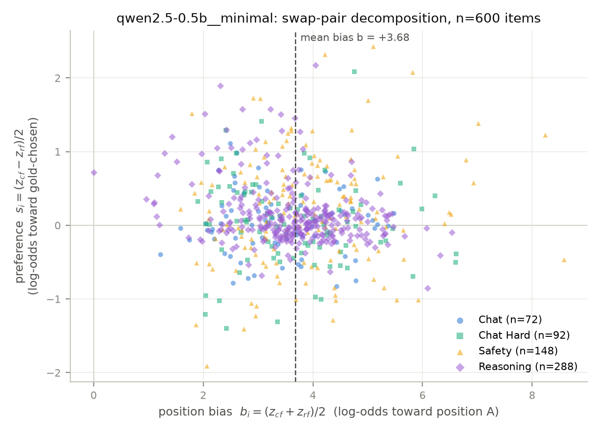

*Every item's swap pair, decomposed: position bias b_i (x) vs order-invariant
preference s_i (y). The cloud sits ~3.7 log-odds right of zero — bias toward
position A on 99.8% of items — while content preference hugs zero (median
|s| = 0.24). A judge with no position bias and real discrimination would
concentrate around b = 0 with |s| large.*

**Symmetrization rescues a real but weak signal** (finding 4): swap-averaged
accuracy is 0.568 [0.528, 0.608], significantly above random, always-A, and
the longer-response floor — which is itself *below chance* (0.425) on
RewardBench, whose adversarial subsets punish verbosity-picking. Per
category, the debiased judge is best on Safety (0.608) and has no signal at
all on easy Chat (0.500).

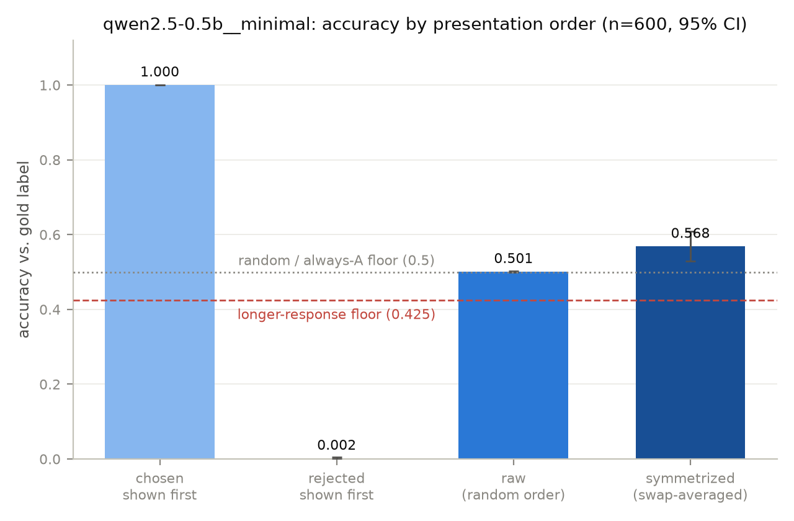

*Accuracy by presentation order against the floors. The 1.000 / 0.002 split
between orders collapses to chance under random order assignment; only the
swap-averaged verdict carries signal.*

## Cross-family contrast — Llama-3.2-1B on the identical sample

Same 600 items, same orders, same rubric:

| metric | Qwen2.5-0.5B | Llama-3.2-1B |
|---|---|---|
| argmax compliance (both orders) | 1.000 | 0.512 |
| per-judgment mass on {A, B}, quartiles | ≈1.0 | 0.10 / 0.67 / 0.94 |
| position bias b: median (share > 0) | +3.65 (99.8%) | −0.34 (27.5%) |
| raw accuracy cf / rf | 1.000 / 0.002 | 0.312 / 0.728 |
| raw accuracy, random order | 0.501 [0.500, 0.502] | 0.520 [0.502, 0.537] |
| positional flip rate | 0.002 | 0.183 |
| items with \|b\| > \|s\| | 99.8% | 81.7% |
| symmetrized accuracy | 0.568 [0.528, 0.608] | 0.555 [0.517, 0.595] |
| paired gain from symmetrization | +0.068 [+0.027, +0.107] | +0.035 [−0.001, +0.072] |

Three results (findings 5–7, `research/NOTES.md`):

- **Verdict-format compliance is a family property.** Llama-3.2-1B's
  unconstrained argmax is a verdict letter in only 56% of judgments (it
  prefers to open with "Response…"), so its single-token readout measures a
  renormalized sub-distribution — every Llama number here carries that
  qualification, and the audit records exactly how much (mass quartiles
  above).
- **The flip-rate ranking inverts the true bias ranking.** Llama-1B flips
  under swap 90x more often than Qwen-0.5B (0.183 vs 0.002) — a black-box
  consistency audit would call it far less reliable — while its positional
  bias is ~7x *smaller* (median |b| 0.49 vs 3.65). Flip rate measures bias
  saturation, not bias.
- **Bias direction is family- and category-dependent.** Llama leans toward
  B overall, but its Reasoning items pull toward A (+0.25 mean b) while
  Chat/Safety sit at −0.3 to −0.5 — early evidence against the
  additive-shift assumption implicit in swap-debiasing, ahead of the formal
  phase-3 test.

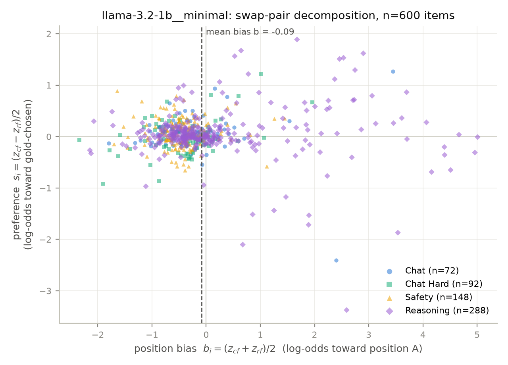

*Llama-3.2-1B's decomposition on the same axes: the cloud centers near
b ≈ −0.3 (mild B-lean) instead of +3.7, with a category-structured right
tail — Reasoning items are biased in the opposite direction from the rest.*

## Scaling within a family — Qwen2.5-1.5B, identical sample

Same 600 items, same orders, same rubric as both grids above. The readout is
fully valid at 1.5B (argmax compliance 1.000, median mass on {A, B} ≈ 1.00),
so everything below is judge behavior, not readout artifact.

| metric | Qwen2.5-0.5B | Qwen2.5-1.5B |
|---|---|---|
| raw accuracy cf / rf | 1.000 / 0.002 | 0.805 / 0.293 |
| raw accuracy, random order | 0.501 [0.500, 0.502] | 0.549 [0.527, 0.571] |
| positional flip rate | 0.002 | 0.298 |
| position bias b: median (share > 0) | +3.65 (99.8%) | +0.83 (74.5%) |
| preference signal: median \|s\| | 0.24 | 0.50 |
| symmetrized accuracy | 0.568 [0.528, 0.608] | 0.502 [0.462, 0.542] |
| paired Δ, symmetrized − raw | +0.068 [+0.027, +0.107] | **−0.048 [−0.081, −0.013]** |

- **Debiased judge quality scales *backwards* here** (finding 9). Everything
  a black-box audit tracks improves from 0.5B to 1.5B — bias magnitude falls
  (median |b| 3.65 → 1.09), the content signal doubles (median |s| 0.24 →
  0.50), raw random-order accuracy rises (0.501 → 0.549) — yet symmetrized
  accuracy *drops* to chance: 0.502 [0.462, 0.542], significantly below the
  0.5B judge on the same items (paired Δ +0.067 [+0.013, +0.118]). And
  symmetrization — the standard debiasing recipe — now *hurts* (−0.048
  [−0.081, −0.013]): on the 421 items where the verdict does not flip under
  swap, the debiased sign is wrong more often than chance (0.432
  [0.387, 0.480]), while on flipped items it is informative (0.665
  [0.598, 0.732]). The residual preference on bias-saturated items is
  anticorrelated with gold.
- **The anticorrelation is a Reasoning phenomenon that tracks length**
  (finding 10). Reasoning sym accuracy is 0.368 [0.312, 0.424] — almost
  exactly the Reasoning longer-response floor (0.370). The epicenter is
  math-prm (sym 0.167, n=90): there the *rejected* solution is the longer
  one on ~92% of pairs (longer floor 0.078), and the judge's preference
  sign matches the length sign on 75.6% of items. Across scale, overall
  sign(s)-vs-length agreement rises 0.491 → 0.571 — the 0.5B judge's weak
  signal was length-free, the 1.5B judge's stronger signal is substantially
  a verbosity preference, and on RewardBench Reasoning the longer answer is
  usually the wrong one. (Length is a strong correlate, not yet a proven
  mechanism — the phase-3 value-over-length regression separates length
  from style covariates.) The other three categories behave normally:
  symmetrization helps (+0.02 to +0.08) and sym accuracy sits at 0.52–0.67.
- **Bias direction is category-dependent *within* one family** (finding 11).
  Qwen2.5-1.5B leans toward A on Chat (+1.09 mean b) and Reasoning (+1.29)
  but toward B on Safety (−0.61) — so "this model is A-biased" is not even
  well-defined per model, let alone per family, and the additive-shift
  hypothesis fails again before its formal test. The three-model flip-rate
  ranking (0.002 / 0.183 / 0.298) tracks neither bias magnitude (median |b|
  3.65 / 0.49 / 1.09) nor debiased quality (0.568 / 0.555 / 0.502).

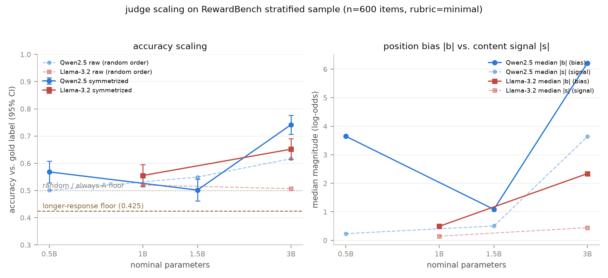

*Left: symmetrized (solid) vs raw random-order (dashed) accuracy across
scale (figure includes the later 3B point). The Qwen line crosses at 1.5B —
raw rises while debiased accuracy falls to chance — then rebounds sharply at
3B (the "3B reversal" section below). Right: median bias magnitude |b|
collapses toward 1.5B then explodes at 3B in the opposite direction, while
the content signal |s| grows — and none of it predicts the left panel.*

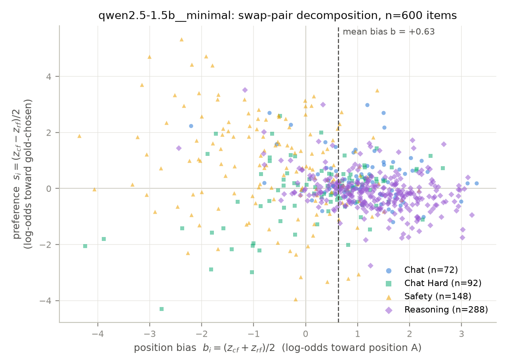

*Qwen2.5-1.5B's swap-pair decomposition: bias has shrunk to a moderate
A-lean (Safety, gold, leans B), but the Reasoning cloud (purple, n=288) sits
visibly below s = 0 at positive b — an order-invariant preference for the
wrong response, invisible to any flip-count audit.*

## Does the audit survive its own validity check?

Finding 5 left a hanging threat: at 1B, only 51.2% of items have a
verdict-letter argmax in both orders, and the probability mass on {A, B}
spans the whole unit interval — so for half the items, `z` is the preference
of a *renormalized sub-distribution*, not of the model's top choice. If that
sub-distribution preference were noise, every Llama-1B number above would
only be valid on the compliant half. The compliance-conditioned view
(`experiments/compliance_view.py`) tests this directly:

| Llama-3.2-1B stratum | n | sym acc (95% CI) | med b | med \|s\| | flip rate |
|---|---|---|---|---|---|
| all items | 600 | 0.555 [0.517, 0.595] | −0.34 | 0.14 | 0.183 |
| argmax-compliant, both orders | 307 | 0.534 [0.479, 0.590] | −0.42 | 0.13 | 0.173 |
| non-compliant in ≥1 order | 293 | 0.577 [0.519, 0.635] | −0.19 | 0.18 | 0.195 |

- **The readout survives** (finding 8). The symmetrized-accuracy gap between
  compliant and non-compliant strata is −0.043 [−0.122, +0.038] (unpaired
  bootstrap over disjoint strata): no measurable validity loss where the
  format contract breaks. The validity curve over mass bins is flat — items
  where {A, B} holds *less than a quarter* of the next-token mass (n=212)
  judge at 0.561 [0.495, 0.627], statistically indistinguishable from the
  ≥0.9-mass bin's 0.547 [0.467, 0.627]. The verdict-letter logits carry the
  judgment even when the model would rather say something else first.
- **But compliance is heavily category-structured.** Compliant fraction:
  Reasoning 22.6%, Chat 62.5%, Chat Hard 79.3%, Safety 83.8%. The standard
  black-box fallback — drop judgments that fail to parse — would silently
  discard ~3/4 of Reasoning while keeping most of Safety, *reweighting* the
  benchmark instead of sampling it. The white-box readout keeps every item
  at no measurable validity cost; this, not just extra precision, is its
  practical case.

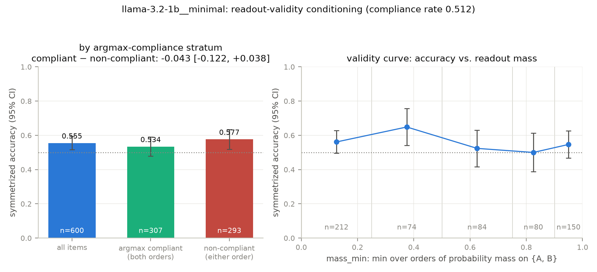

*Left: symmetrized accuracy is flat across compliance strata (per-stratum n
inside bars; gap CI in the title). Right: accuracy vs. the minimum probability
mass on {A, B} across orders — flat down to the <0.25 bin. Qwen2.5-0.5B's
companion view is trivial (compliance 1.000) and committed alongside.*

## Value over length: is there a judge inside the verbosity preference?

Finding 10 left the project's sharpest open question: the preference signal
that emerges with scale *tracks length*, and RewardBench Reasoning punishes
exactly that — so how much genuine judgment is left once length is controlled?
The probe (`src/length_probe.py`) is a Bradley–Terry / conditional-logit fit
on oriented pair differences: for each item, features are oriented
chosen − rejected — the judge's order-invariant preference `s` and the log
length ratio `log(len_chosen/len_rejected)` — and the gold-chosen response
"wins" with probability `sigmoid(β·x)`. There is deliberately no intercept
(relabeling chosen/rejected flips every feature's sign, so a constant is not
identified), features are SD-scaled but *not* centered (the origin "equal
lengths, indifferent judge" must map to P = 1/2), and nested specs turn the
question into coefficients: **β_s ≠ 0 in the joint spec means the judge
carries signal a length heuristic cannot explain.** CIs are a 10k-replicate
bootstrap over items with the full rescale+refit pipeline inside each
replicate. Accuracies are in-sample; with ≤2 parameters on n ≥ 72 strata the
optimism is negligible, and the paired spec deltas share it.

| joint spec, overall (n=600) | Qwen2.5-0.5B | Qwen2.5-1.5B | Llama-3.2-1B | Qwen2.5-3B |
|---|---|---|---|---|
| β_s (per SD, 95% CI) | **+0.545 [+0.369, +0.739]** | **+0.380 [+0.201, +0.572]** | **+0.319 [+0.138, +0.546]** | **+1.399 [+1.147, +1.714]** |
| β_len (per SD) | −0.275 [−0.449, −0.111] | −0.311 [−0.506, −0.138] | −0.260 [−0.440, −0.095] | −0.764 [−1.027, −0.548] |
| β_sign(s) (joint-sign spec) | +0.290 [+0.128, +0.446] | +0.040 [−0.124, +0.204] | +0.282 [+0.122, +0.451] | +1.021 [+0.892, +1.146] |
| judge sym accuracy | 0.568 | 0.502 | 0.555 | 0.742 |
| length-only accuracy (1 fitted param) | 0.575 | 0.575 | 0.575 | 0.575 |
| Δ acc, joint − length-only | −0.007 [−0.047, +0.048] | −0.020 [−0.055, +0.031] | −0.007 [−0.042, +0.047] | **+0.205 [+0.156, +0.261]** |

- **Finding 12 — every judge carries real signal beyond length, including
  the one that judges at chance; at 1.5B it is the *binary verdict* that
  destroys it.** β_s is significantly positive overall for all three
  models — most strikingly for Qwen2.5-1.5B, whose symmetrized accuracy is
  indistinguishable from a coin flip (0.502). The resolution of that
  apparent contradiction: thresholding. The continuous log-odds `s` has
  significant length-controlled signal (+0.380), while its *sign* — exactly
  what symmetrized majority voting uses — has none (+0.040 [−0.124, +0.204]).
  At 0.5B and 1B the sign retains most of the signal; at 1.5B the judge is
  right where it is confident and wrong-but-weak on a mass of items the sign
  treats as full votes. A deployment that averages verdict *probabilities*
  and one that majority-votes *verdicts* are measurably different judges
  here — a distinction only visible white-box.
- **Finding 13 — length mediates both of the audit's standing mysteries.**
  (a) The 1.5B Reasoning collapse (sym 0.368, below the length floor) is
  *entirely* length-mediated: judge-only, its Reasoning preference
  anti-predicts gold (β_s −0.329 [−0.629, −0.079]); controlling for length,
  nothing remains (−0.084 [−0.406, +0.183]) — the emergent verbosity
  preference explains all of the below-chance behavior, and there is no
  residual anti-signal. (b) Llama-1B's Chat advantage (finding 7: 0.653
  where Qwen-0.5B had zero signal) does *not* survive length control:
  Chat β_s = −0.046 [−0.812, +1.518], while Chat is the one category where
  longer actually is better (length-only accuracy 0.792 > the judge's
  0.653). Its "advantage" is a noisy proxy of the length heuristic.
  Meanwhile Qwen2.5-1.5B's Chat signal is genuine content signal
  (β_s +0.805 [+0.181, +1.811]) — scale bought real judgment on Chat and a
  toxic length preference on Reasoning, at the same time.
- **Finding 14 — against a deployable floor, these judges only pay for
  themselves on Safety.** A one-parameter length model *fitted to this
  sample* learns shorter-is-better (β_len < 0) and reaches 0.575 overall —
  above every judge's symmetrized accuracy. Adding the judge to it moves
  accuracy by ≈0 overall (table); at 1.5B the judge alone is significantly
  *worse* than length alone (−0.073 [−0.131, −0.009]). The exception is
  Safety, where length carries nothing (β_len ≈ 0, length-only 0.412) and
  every judge has strong signal (β_s +0.6 to +0.9): there the joint model
  beats length-only by +0.284 [+0.020, +0.338] at 1.5B, with same-signed
  point estimates at 0.5B/1B. The fitted direction is benchmark-specific
  (RewardBench's composition punishes verbosity), so the honest reading is
  not "use length heuristics" but: **below 3B, on three of four categories,
  these judges are not yet distinguishable from a one-parameter baseline
  that peeked at the answer key once.** (The 3B judge is the first to clear
  that bar — finding 18 below.)

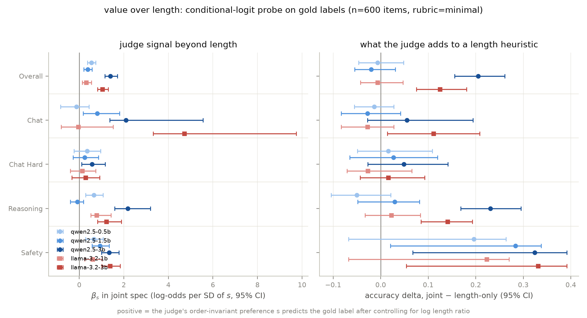

*Left: the judge's length-controlled signal about gold labels (β_s in the
joint spec), by category and model. Every model has real overall signal, but
Reasoning at 1.5B is null (the verbosity preference explains that collapse),
and Chat at 0.5B/1B is null (Llama's apparent Chat skill was length). Right:
what adding the judge to a fitted length heuristic is worth in accuracy
points — indistinguishable from zero everywhere except Safety for the three
judges below 3B; the 3B judge (dark blue) is the first to clear the length
baseline overall, on Reasoning, and on Safety.*

## Are the verdict probabilities calibrated?

The probe showed the 1.5B judge is right where it is confident; calibration
is the formal version of that claim. Each judgment folds into a
(confidence, correctness) point — **raw**: `sigmoid(|z|)`, the renormalized
probability on the winning verdict token, per judgment, which is what a
single-order deployment experiences; **sym**: `sigmoid(|s|)` per item, the
confidence of the swap-averaged verdict. ECE uses equal-mass bins that never
split tied confidences (a saturated judge piles float-identical mass at 1.0,
and splitting one tied run across bins with different accuracies would
manufacture ECE from the split), with item-level bootstrap CIs.

| view | Qwen2.5-0.5B | Llama-3.2-1B | Qwen2.5-1.5B | Qwen2.5-3B |
|---|---|---|---|---|
| raw: mean conf / acc | 0.956 / 0.501 | 0.652 / 0.520 | 0.770 / 0.549 | 0.971 / 0.617 |
| raw ECE | 0.455 [0.450, 0.459] | 0.141 [0.124, 0.162] | 0.221 [0.203, 0.246] | 0.355 [0.332, 0.378] |
| sym: mean conf / acc | 0.592 / 0.568 | 0.560 / 0.555 | 0.664 / 0.502 | 0.894 / 0.742 |
| sym ECE | **0.035 [0.036, 0.094]** | **0.052 [0.041, 0.104]** | **0.166 [0.134, 0.209]** | **0.153 [0.126, 0.190]** |

- **Finding 15 — symmetrization is also a calibration repair, except where
  the preference itself is broken.** Raw verdict probabilities are severely
  overconfident everywhere, and at 0.5B the miscalibration *is* the position
  bias wearing a confidence costume: |z| ≈ |b| ≈ huge, so the judge asserts
  0.956 mean confidence while performing at chance (ECE 0.455). Averaging
  the two orders repairs it almost completely at 0.5B and 1B — sym
  confidence–accuracy gaps of +0.024 and +0.005, ECE 0.035/0.052, reliability
  curves hugging the diagonal. So the *shape* of the debiased log-odds is
  approximately honest at these scales: `sigmoid(|s|)` can be read as a
  probability. At 1.5B it cannot — the judge stays overconfident after
  debiasing (gap +0.162, ECE 0.166), and its reliability curve is flat at
  ≈0.45 accuracy across the whole 0.5–0.85 confidence range, only rising in
  the top-confidence mass (0.94 → 0.75). That flat-then-jump shape is
  finding 12 drawn as a curve: the middle-confidence mass — where the
  length-following preference lives — carries no validity, while the
  high-|s| tail is real. A confidence-thresholded 1.5B judge would be
  usable; a confidence-trusting one is worse than its 0.5B sibling.
  (Methodological note: ECE is a nonnegative deviation statistic, so its
  bootstrap distribution sits slightly above the point estimate for
  near-calibrated judges — the 0.5B sym CI brackets resampling noise, not a
  smaller true ECE. The signed gap is the bias-free companion number.)

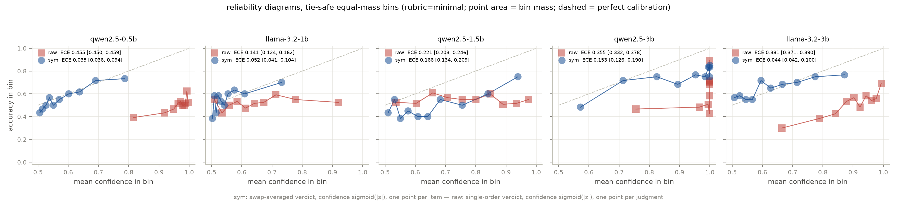

*Raw single-order verdicts (red) are overconfident for every judge — the
0.5B's cluster at confidence ≈ 1, accuracy ≈ 0.5 is position bias read as
certainty. Symmetrized verdicts (blue) are close to calibrated at 0.5B and
1B but not above: the 1.5B curve is flat below the diagonal until the
top-confidence bin, and the 3B curve rises with confidence but sits below
the diagonal throughout (overconfident while accurate — finding 18).*

## The 3B reversal — the scaling valley closes and the bias flips

Qwen2.5-3B, same 600 items, both orders, same rubric. Readout fully valid at
a third Qwen size (argmax compliance 1.000, median mass on {A, B} ≈ 1.00).

| metric | 0.5B | 1.5B | 3B |
|---|---|---|---|
| raw accuracy cf / rf | 1.000 / 0.002 | 0.805 / 0.293 | 0.368 / 0.865 |
| raw accuracy, random order | 0.501 | 0.549 | 0.617 [0.594, 0.639] |
| symmetrized accuracy | 0.568 | 0.502 | **0.742 [0.707, 0.777]** |
| paired Δ, symmetrized − raw | +0.068 | −0.048 | +0.125 [+0.095, +0.154] |
| position bias b: median (share > 0) | +3.65 (99.8%) | +0.83 (74.5%) | **−5.55 (19.2%)** |
| median \|b\| / median \|s\| | 3.65 / 0.24 | 1.09 / 0.50 | 6.21 / 3.64 |
| positional flip rate | 0.002 | 0.298 | 0.380 |

- **Finding 16 — the inverse scaling is a valley, not a trend.** Symmetrized
  accuracy leaps to 0.742 [0.707, 0.777]: paired deltas on identical items
  are +0.173 [+0.123, +0.223] over 0.5B, +0.240 [+0.192, +0.290] over 1.5B,
  +0.187 [+0.138, +0.235] over Llama-1B. Within one model family and one
  protocol, debiased judge quality is *non-monotone* in scale
  (0.568 → 0.502 → 0.742) — a scaling curve fit through any two of these
  points would confidently predict the wrong third. Per category: Chat
  0.861, Reasoning 0.771, Safety 0.730, Chat Hard 0.576 — the adversarial
  LLMBar-dominated category is now clearly the hardest, as its construction
  intends.
- **Finding 17 — the verbosity preference was a mid-scale transient, and
  the position bias that replaces it is the largest measured yet — in the
  opposite direction.** The 1.5B's length-following un-learns at 3B:
  sign(s)-vs-length agreement (tie-excluded, the finding-10 convention)
  falls back 0.571 → 0.547 overall, 0.628 → 0.538 on Reasoning, and
  0.756 → **0.433** on math-prm — the 3B judge now leans *anti*-length
  exactly where verbosity was fatal, and math-prm accuracy recovers
  0.167 → 0.600. Meanwhile position bias flips family direction: median b
  −5.55 toward position *B* (b > 0 on only 19.2% of items), magnitude
  larger than the 0.5B's always-A bias (median |b| 6.21 vs 3.65), and
  still category-heterogeneous *in direction* within the model (mean b:
  Chat +0.90 toward A, Reasoning −6.59 toward B). Four models in: the
  flip-rate ranking (0.002 / 0.183 / 0.298 / 0.380) is monotone in neither
  bias magnitude nor accuracy — the black-box consistency metric remains
  uninterpretable at every scale tried.
- **Finding 18 — the 3B judge is the first to earn its inference cost
  against the length floor, but its confidence still cannot be trusted.**
  Value-over-length (probe rerun over all four models, figure above):
  overall β_s = +1.399 [+1.147, +1.714], and joint − length-only accuracy
  is +0.205 [+0.156, +0.261] — significant for the first time, driven by
  Reasoning (+0.231 [+0.168, +0.295], β_s +2.184 where the 1.5B had
  nothing) and Safety (+0.324 [+0.068, +0.392]). The binary verdict now
  carries the signal too (joint-sign β +1.021 [+0.892, +1.146]) —
  majority-vote deployment is fine at 3B where it was fatal at 1.5B. But
  calibration does not come with accuracy: symmetrized mean confidence
  0.894 against accuracy 0.742 (ECE 0.153 [0.126, 0.190]) — better than
  the 1.5B's *flat* miscalibration (the 3B curve at least rises with
  confidence), yet finding 15's repair story stays limited to the sub-1B
  models. Across four judges, symmetrized verdicts are calibrated exactly
  where they are weakest.

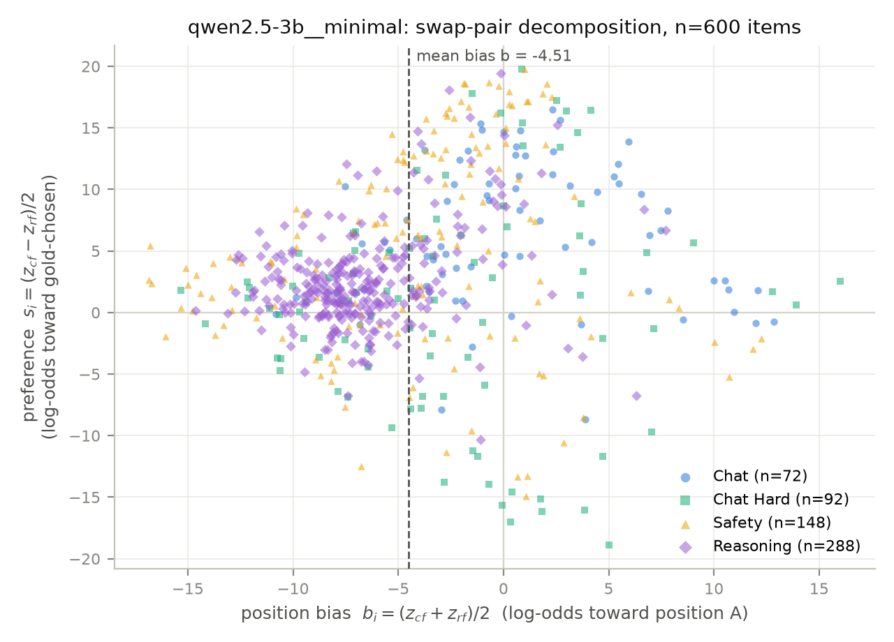

*Qwen2.5-3B's swap-pair decomposition: the mass sits left of b = 0 (a strong
B-lean, opposite to its 0.5B sibling) with the Reasoning cloud now clearly
above s = 0 — the order-invariant preference points at the gold answer where
at 1.5B it pointed at the longer one.*

## Is position bias a constant you can subtract?

Swap-averaging is exact but doubles inference cost. Every cheaper debiasing
scheme rests on the *additive-shift hypothesis*: that `b_i` is predictable
from what a deployment could know — nothing (a global constant), the item's
category or subset, or its length statistics. Because the verdict readout is
deterministic at temperature 0, `b_i` carries **no sampling noise**: all of
`Var(b)` is real item-level bias structure, so a variance decomposition
(nested predictors, refit inside every bootstrap replicate) cleanly separates
the share a correction could exploit from an irreducible residual.

The decomposition has a deployment-facing mirror. The oracle single-order
correction `sign(z − b_i)` *is* the symmetrized verdict (`z_cf − b_i = s_i`,
`z_rf − b_i = −s_i`), so a ladder of fitted corrections — each evaluated with
exact leave-one-out cross-fitting, no item corrected using its own bias —
interpolates between the raw single-order judge and full symmetrization at
half the inference cost:

| | Qwen-0.5B | Llama-1B | Qwen-1.5B | Llama-3B | Qwen-3B |
|---|---|---|---|---|---|
| SD of position bias b (log-odds) | 1.08 | 1.05 | 1.32 | 1.01 | **5.47** |
| R² category means | 0.020 [0.006, 0.053] | 0.096 | 0.372 | 0.099 | 0.205 |
| R² subset means | 0.141 | 0.329 | 0.448 | 0.229 | 0.260 |
| R² subset + length | 0.340 | 0.330 | **0.556** | 0.247 | 0.288 |
| residual SD after best spec | 0.88 | 0.86 | 0.88 | 0.88 | **4.61** |
| raw single-order accuracy | 0.501 | 0.520 | 0.549 | 0.507 | 0.617 |
| best one-call corrected | 0.547 (subset) | 0.532 (regression) | 0.549 (uncorrected) | 0.583 (regression) | 0.675 (category) |
| symmetrized, two calls | 0.568 | 0.555 | 0.502 | 0.652 | 0.742 |
| share of symmetrization gain recovered | 68% | n.s. | — (gain is negative) | 52% | 47% |

*(The Llama-3.2-3B column was added when its grid completed later the same
day — finding 21 discusses it; findings 19–20 below were established on the
first four judges and hold unchanged on the fifth.)*

- **Finding 19 — the additive-shift hypothesis is rejected at every scale,
  and bias *predictability* is anti-correlated with bias *magnitude*.**
  Subset structure alone explains a significant share of `Var(b)` for every
  judge (R² 0.141–0.448, all CIs well off zero), so no model's bias is a
  constant. But the structure changes character with scale. The 0.5B
  always-A machine is the *closest* to a true additive shift: category means
  are statistically distinct but practically identical (+3.40 to +3.91,
  category R² 0.020). At 1.5B the bias is the most predictable in the audit
  — category alone 0.372, subset + length 0.556, over half of `Var(b)` —
  matching finding 11's category-dependent signs (+1.29 Reasoning vs −0.61
  Safety). At 3B the bias is the *largest* (SD 5.47, category means spanning
  +0.90 Chat to −6.59 Reasoning) yet the *least* explainable: every
  covariate together leaves a residual SD of 4.61 log-odds — bigger than
  the model's own median content signal (|s| 3.64). Length covariates,
  which add +0.20 R² at 0.5B and +0.11 at 1.5B, add almost nothing at
  Llama-1B (+0.001) or 3B (+0.028): what makes an item bias-prone is
  family- and scale-specific, not a benchmark property.
- **Finding 20 — one call plus a fitted correction is enough to fix the
  0.5B judge, cannot be enough at 3B, and at 1.5B every correction makes
  the judge worse.** At 0.5B the LOO per-subset correction reaches 0.547
  [0.526, 0.567] — recovering 68% of the symmetrization gain and
  statistically indistinguishable from the two-call oracle (Δ −0.022
  [−0.056, +0.013]). At 3B the *category* correction is the best fitted
  rung (0.675 [0.647, 0.703]; subset and regression overfit their finer
  strata, 0.662) — a +0.058 gain over raw, with Reasoning alone jumping
  0.575 → 0.688 when its −6.59 shift is subtracted — but it recovers only
  47% of the oracle gain and stays significantly below it (Δ −0.067
  [−0.091, −0.042]): finding 19's unexplained 4.61-log-odds residual is
  exactly what the second call pays for. At 1.5B the ladder runs
  *backwards* — none 0.549 > global 0.532 > category 0.517 > subset 0.510 >
  oracle 0.502 — the corrections work as designed (subset recovers 82% of
  the oracle "gain"), but the debiased preference they converge to is
  anti-informative on Reasoning (finding 9), so every step toward it hurts.
  A bias correction inherits whatever the bias was masking.

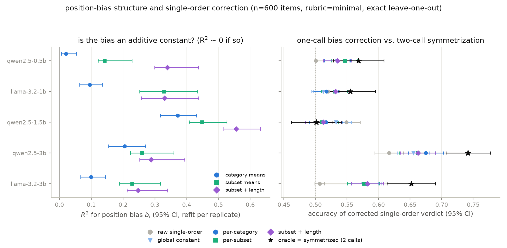

*Left: R² of nested bias predictors per judge — a pure additive shift would
put every marker at 0. Right: the single-order correction ladder from raw
(grey) to oracle (star = two-call symmetrization). The 0.5B subset marker
nearly reaches its star; the 3B markers stall less than halfway; the 1.5B
ladder runs right-to-left.*

## The cross-family point at 3B — Llama-3.2-3B

Same 600 items, both orders, same rubric — the fifth grid, closing the
2×2 of family × (small, 3B-class) scale.

| metric | Llama-1B | Llama-3B | Qwen-3B |
|---|---|---|---|
| raw accuracy cf / rf | 0.312 / 0.728 | 0.990 / 0.023 | 0.368 / 0.865 |
| raw accuracy, random order | 0.520 | 0.507 | 0.617 |
| symmetrized accuracy | 0.555 | **0.652 [0.613, 0.690]** | 0.742 |
| paired Δ, symmetrized − raw | +0.035 | **+0.145 [+0.108, +0.183]** | +0.125 |
| position bias b: median (share > 0) | −0.34 (27.5%) | **+2.34 (99.8%)** | −5.55 (19.2%) |
| positional flip rate | 0.183 | 0.033 | 0.380 |
| pair-level argmax compliance | 0.512 | 0.863 | 1.000 |

- **Finding 21 — both families reverse bias direction with scale, in
  opposite senses, and Llama-3.2-3B is a new always-A machine.** Scaling
  1B → 3B turns Llama's mild B-lean (median b −0.34, b > 0 on 27.5%) into
  a saturated A-lean: b > 0 on 99.8% of items, median +2.34, per-order
  accuracy 0.990 / 0.023 — while the same size step turns Qwen's A-lean
  into the audit's largest B-lean. Bias direction is not a family
  property, not a scale property, and (finding 11) not even a per-model
  property — except here: Llama-3B is the first judge since 0.5B whose
  bias is same-signed across all four categories (means +1.88 to +2.81).
  Its flip rate, 0.033, is the second-lowest in the audit — a black-box
  consistency audit would rank this saturated-bias judge second-best,
  finding 3's failure mode at a scale six times larger. Debiased, the
  family improves with scale: sym 0.652 [0.613, 0.690], paired +0.097
  [+0.047, +0.147] over Llama-1B — no valley between the two measured
  Llama points (no ~2B Llama-3.2 exists to test the Qwen-1.5B dip's
  counterpart, a family-geometry gap recorded in limitations). At matched
  3B scale Qwen leads by +0.090 [+0.048, +0.132]. Symmetrization's rescue
  here is the largest yet (+0.145), and the correction ladder repeats
  finding 20's ceiling: the global constant recovers 48% (0.576), the
  regression 52% (0.583), every rung significantly below the oracle
  (best Δ −0.069 [−0.098, −0.040]) — the bias is compact (SD 1.01) but
  the median content signal |s| = 0.44 is smaller still, so about half
  the items stay bias-dominated after any one-call correction.
- **Finding 22 — in the Llama family, scale buys Chat and deepens the
  adversarial hole; adversarial robustness at 3B is decided by family.**
  Chat: 0.653 → 0.889, paired +0.236 [+0.111, +0.361], with the largest
  length-controlled content coefficient in the audit (joint β_s +4.72
  [+3.32, +9.75]) — where the 1B's Chat advantage was pure
  length-following (finding 13), the 3B's is genuine content. Chat Hard:
  0.435 → 0.348 [0.250, 0.446], *below chance and below its own 1B
  sibling* (paired −0.087 [−0.207, +0.022]), with no length-controlled
  signal left (β_s +0.28 [−0.33, +0.91]): the LLMBar adversarial
  constructions fool the bigger Llama *harder*. Qwen-3B, on identical
  items, holds Chat Hard at 0.576 — a +0.228 [+0.120, +0.337] family gap
  at matched scale. Overall the judge does clear the fitted length floor
  (β_s +1.043 [+0.826, +1.300]; joint − length +0.125 [+0.075, +0.181]) —
  the second judge to do so — with an anti-length lean (β_len −0.669).
- **Finding 23 — post-debiasing calibration is a family property, and the
  format-breaking category migrates with scale.** Llama-3B's symmetrized
  confidence is essentially calibrated: ECE 0.044, signed gap −0.012 —
  slightly *under*confident — at 0.652 accuracy. That breaks the pattern
  finding 15/18 suggested ("calibrated exactly where weakest"): five
  judges in, both Llama sizes and Qwen-0.5B are calibrated after
  symmetrization while the two stronger Qwens are overconfident (ECE
  0.166 / 0.153). Compliance tells a matching family story with a twist:
  pair-level compliance rises 0.512 → 0.863, but the residual
  non-compliance relocates — at 1B it was Reasoning (23% compliant), at
  3B it is Safety (48%, vs 0.986–1.000 everywhere else; the argmax on
  refusal-laden items is prose, not a verdict letter). The readout again
  survives its own audit, in the same direction as finding 8:
  non-compliant items are judged *better* (0.829 vs 0.624 sym, gap
  +0.206 [+0.113, +0.296], Safety-concentrated) — but a parse-and-drop
  harness at 3B would now silently discard half of *Safety*, a different
  benchmark reweighting than at 1B. Which category a small Llama fails to
  format-follow is itself scale-dependent.

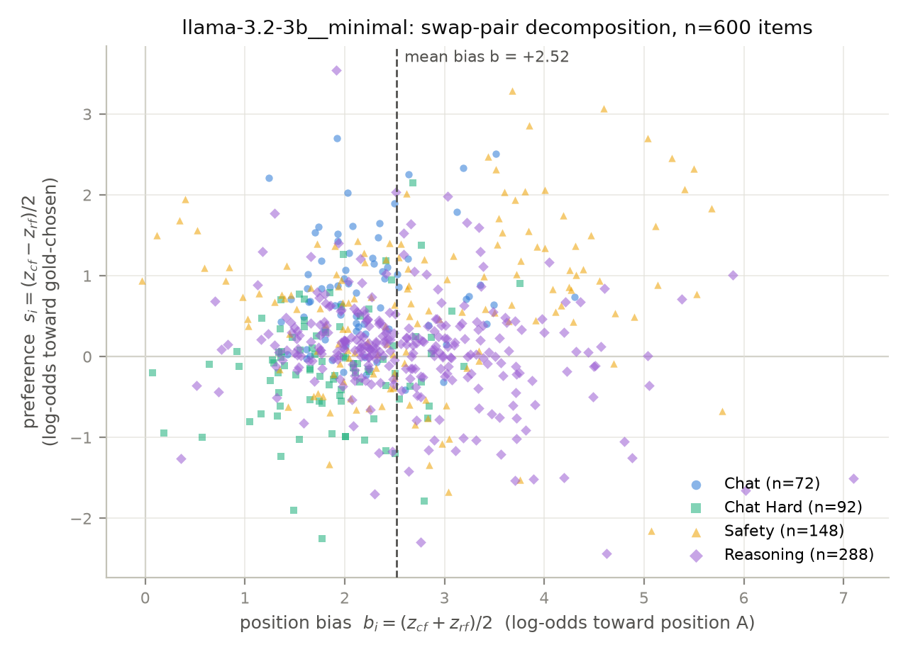

*Llama-3.2-3B's swap-pair decomposition: the entire cloud sits right of
b = 0 — a saturated A-lean opposite in sign to Qwen-3B's, with the Chat
cloud well above s = 0 and the Chat Hard cloud straddling it.*

## Planned experiments

1. **Scaling grid** — Qwen2.5-Instruct 0.5B/1.5B/3B/7B, Llama-3.2-Instruct
   1B/3B, and peers (Q4_K_M GGUF), on a stratified sample in both orders;
   trivial floors (always-A, longer-response, random) alongside.
   *(Qwen2.5-0.5B/1.5B/3B and Llama-3.2-1B/3B done above; the 7B tier
   next.)*
2. **Bias anatomy** — dispersion and covariates of `b_i`; test of the
   additive-shift hypothesis; accuracy recovered by symmetrization. *(Done
   above — findings 19–20; reruns automatically as new grids complete.)*
3. **Calibration** — reliability diagrams and ECE of `P(correct)` from
   verdict probabilities, raw vs. symmetrized. *(Done above — finding 15;
   reruns automatically as new grids complete.)*
4. **Value over length** — conditional-logit probe of gold on judge log-odds
   vs. log length ratio. *(Done above — findings 12–14; reruns automatically
   as new grids complete.)*
5. **Prompt sensitivity** — minimal vs. detailed rubric as a paired
   comparison in log-odds space.

## Feasibility pilot (2026-07-17, real measurements, anecdote scale)

Qwen2.5-0.5B-Instruct (Q4_K_M) on 4 CPU threads, three real RewardBench
items: "A"/"B" tokenize as single tokens; the unconstrained argmax at the
verdict position was the letter itself in all cases; prefill throughput
153–207 tok/s (197-token prompt: 1.0 s; 2,768-token worst-case: 18 s). On
three items spanning the length distribution, the swap-pair decomposition
gave position bias `b_i` of **+4.1 to +4.8** log-odds toward position A
against preference magnitudes `|s_i|` of **0.02–0.37** — the 0.5B judge's
position bias exceeded its content signal by an order of magnitude on every
item tried. This is a pilot observation on n=3 with no confidence intervals;
the phase-2 grid will measure it properly.

## Repository layout

```
src/data.py       pinned RewardBench download, validation, stratified sampling
src/prompts.py    rubric templates, order swap, single-token verdict design
src/judge.py      llama.cpp runner: chat templates, pinned GGUFs, logit
                  readout, resumable JSONL result stores
src/analysis.py   swap-pair assembly, s/b decomposition, paired bootstrap
src/baselines.py  always-A / longer-response / random floors
src/length_probe.py  conditional-logit value-over-length probe (nested
                  specs, batched bootstrap refits)
src/calibration.py   folded confidence views, tie-safe equal-mass bins, ECE
src/bias_model.py    variance decomposition of b_i + exact-LOO single-order
                  correction ladder (additive-shift test)
experiments/      run_grid, summarize, make_figures, compliance_view,
                  scaling_curve, length_probe, calibration, bias_model
results/raw/      one JSONL store per (model, rubric) + provenance sidecar
results/summary/  quick-look JSON per store (+ __compliance, length_probe,
                  calibration, bias_model)
results/figures/  committed PNGs, regenerable from raw stores
tests/            83 tests (schema, templates, readout arithmetic, store
                  resume, decomposition, bootstrap, floors, compliance
                  view, length probe, calibration, bias model, model smoke)
research/NOTES.md living research log
```

## Reproducing (current state)

```bash
uv sync                      # analysis deps (numpy, pyarrow, matplotlib)
uv run python -m src.data    # fetch pinned parquet, print composition
uv run --group dev pytest    # 83 tests
uv sync --group judge        # llama-cpp-python (compiles ~5 min on 4 cores)
# download the pinned GGUF named in src/judge.py MODELS into models/, then:
uv run python -m experiments.run_grid --model qwen2.5-0.5b --rubric minimal --n 600 --seed 0
uv run python -m experiments.summarize   # tables in results/summary/
uv run python -m experiments.make_figures
uv run python -m experiments.compliance_view   # readout-validity conditioning
uv run python -m experiments.scaling_curve     # cross-model figure (>=2 stores)
uv run python -m experiments.length_probe      # value-over-length probe + forest plot
uv run python -m experiments.calibration       # reliability diagrams + ECE
uv run python -m experiments.bias_model        # additive-shift test + correction ladder
```

## References

- Lianmin Zheng, Wei-Lin Chiang, Ying Sheng, Siyuan Zhuang, Zhanghao Wu,
  Yonghao Zhuang, Zi Lin, Zhuohan Li, Dacheng Li, Eric P. Xing, Hao Zhang,
  Joseph E. Gonzalez, Ion Stoica. *Judging LLM-as-a-Judge with MT-Bench and
  Chatbot Arena.* NeurIPS 2023. [arXiv:2306.05685](https://arxiv.org/abs/2306.05685)
- Nathan Lambert, Valentina Pyatkin, Jacob Morrison, LJ Miranda, Bill Yuchen
  Lin, Khyathi Chandu, Nouha Dziri, Sachin Kumar, Tom Zick, Yejin Choi, Noah
  A. Smith, Hannaneh Hajishirzi. *RewardBench: Evaluating Reward Models for
  Language Modeling.* [arXiv:2403.13787](https://arxiv.org/abs/2403.13787)
- Zhiyuan Zeng, Jiatong Yu, Tianyu Gao, Yu Meng, Tanya Goyal, Danqi Chen.
  *Evaluating Large Language Models at Evaluating Instruction Following.*
  ICLR 2024. [arXiv:2310.07641](https://arxiv.org/abs/2310.07641)
- Lin Shi, Chiyu Ma, Wenhua Liang, Xingjian Diao, Weicheng Ma, Soroush
  Vosoughi. *Judging the Judges: A Systematic Study of Position Bias in
  LLM-as-a-Judge.* AACL-IJCNLP 2025.
  [arXiv:2406.07791](https://arxiv.org/abs/2406.07791)
- Justin D. Norman, Michael U. Rivera, D. Alex Hughes. *Reliability without
  Validity: A Systematic, Large-Scale Evaluation of LLM-as-a-Judge Models
  Across Agreement, Consistency, and Bias.*
  [arXiv:2606.19544](https://arxiv.org/abs/2606.19544) — closest neighbor:
  21 judges, black-box; this project is the white-box, small-model
  counterpart.
- *Self-Preference Bias in LLM-as-a-Judge.*
  [arXiv:2410.21819](https://arxiv.org/abs/2410.21819)
- *JudgeBench: A Benchmark for Evaluating LLM-based Judges.* ICLR 2025.
  [arXiv:2410.12784](https://arxiv.org/abs/2410.12784)
- *Thinking Small Models are Efficient LLM Judges.*
  [arXiv:2509.13332](https://arxiv.org/abs/2509.13332)
- *JudgeBoard: Benchmarking and Enhancing Small Language Models for Reasoning
  Evaluation.* [arXiv:2511.15958](https://arxiv.org/abs/2511.15958)
- *SLMJury: Can Small Language Models Judge as Well as Large Ones?*
  [arXiv:2606.07810](https://arxiv.org/abs/2606.07810)
