# slm-judge-audit

**A white-box reliability audit of small open-weight LLMs as pairwise judges:
position bias measured in log-odds, calibration, and value over trivial
baselines, with paired bootstrap confidence intervals.**

*Status: **data collection is complete** — the scaling grid (phase 2,
closed 2026-08-26) and the rubric-sensitivity axis (phase 3, closed
2026-08-31 with the pre-registered Llama-8B out-of-sample test) are both
done; findings 36–49 landed 2026-08-27/31, alongside the
results-narrative restructure ([The scaling arc](#the-scaling-arc)).
Harness: runner, analysis core, floors, value-over-length probe, calibration,
bias-structure test, per-subset view, cross-judge table, coverage-balanced
scheduler, paired rubric analysis with a fragility model; 133 tests. Seven
full grids on the same 600-item stratified sample × both orders (Qwen2.5
0.5B/1.5B/3B/7B and Llama-3 1B/3B/8B) plus seven `detailed`-rubric grids —
findings 1–49 below, cross-cut in
[Results at a glance](#results-at-a-glance). Headlines:
debiased judge quality is non-monotone in scale (0.568 → 0.502 → 0.742 →
0.837 within the Qwen family — a 1.5B valley where the emergent preference is
a verbosity preference that RewardBench punishes, then a monotone climb;
Llama runs 0.555 → 0.652 → 0.723 with no valley), and at the top tier
**family beats scale**: Llama-3.1-8B is statistically indistinguishable from
Qwen2.5-3B at 2.7x the parameters and significantly below Qwen2.5-7B; the two
judges whose content signal dominates their position bias (Qwen-7B at 26.8%
|b| > |s|, Llama-8B at 33.5%) post the audit's two *highest* flip rates
(0.732, 0.665), completing the demolition of flip-rate "consistency" — its
extremes now belong to the worst-biased judges and the best ones; both
families reverse bias *direction* with scale; four judges beat a fitted
one-parameter length baseline (both 3Bs, 8B, and 7B by the largest margin —
the only one significant in every category including adversarial Chat Hard,
where Llama's hole persists to 8B: below chance at 3B, back to chance and
no further at 8B); the additive-shift
hypothesis behind cheap debiasing is rejected at every scale, and the share
of the symmetrization gain a fitted one-call correction can recover *falls*
as judges improve (68% at 0.5B → 47% at 3B → ~25% at 7B and 8B); and
post-debiasing calibration remains a family property (Qwen overconfident at
every size above 0.5B; Llama at worst mildly so at 8B). And on the new
rubric axis, now closed at seven judges: at the two smallest scales,
30–43% of symmetrized verdicts flip when only the rubric text changes —
the prompt is a noise source of the same order as the content signal — at
1B the rubric reverses the judge's bias direction and length orientation
outright, and the fitted signal-to-perturbation ratio λ·med\|s\|/σ orders
all seven observed flip rates strictly (0.432 → 0.068), surviving a
pre-registered out-of-sample test at Llama-8B where every simpler
regularity — raw \|s\| ordering, a λ plateau, \|s\|-scaled σ — fails
cross-family; prompt-side debiasing peaks at Qwen-3B (Δ\|b\| −1.80,
buying raw accuracy but no symmetrized gain), stops paying at 7B (it
re-signs a balanced bias while everything else sits still), and at
Llama-8B turns *harmful* for the first time: the rubric contracts signal
faster than bias and costs a one-call deployment 4.5 points of raw
accuracy while the two-call symmetrized verdict doesn't move.
Phase 4 is in progress: the coherence pass is done (2026-09-01 — every
inline number in this report verified against the committed summaries, and
the quoted-but-uncommitted sign(s)-vs-length join promoted into the
per-store summary); next is the clean-environment reproduction audit.*

## Abstract

Small open-weight models (0.5B–8B) are widely used as cheap judges: filtering
synthetic data, scoring RLAIF candidates, running large eval sweeps where a
frontier-judge call per comparison is unaffordable. Existing reliability
audits treat judges as API black boxes — they sample a verdict and count flips
under order swap. Local open-weight judges permit strictly more: the full
next-token distribution. This project audits small judges *white-box*: each
pairwise judgment is read out as the renormalized probability over the verdict
tokens {A, B} at a single position, giving a verdict **log-odds** per
(item, order). For every item the swap pair (z_chosen-first, z_rejected-first)
then decomposes *exactly* into an order-invariant preference component and a
position-bias component. On top of this decomposition the audit measures:
(1) how large position bias is relative to the preference signal across model
scale; (2) whether position bias behaves as an additive shift (a hypothesis
prior work assumes implicitly when it "debiases by swapping" — here it is
tested); (3) how much accuracy symmetrization actually recovers;
(4) whether verdict probabilities are calibrated; (5) whether small
judges add signal beyond a pick-the-longer-response heuristic; and
(6) how stable the measurement itself is under the evaluation prompt — the
same judgments re-collected under a second rubric and paired per item in
log-odds. All comparisons use gold human-verified labels and paired
bootstrap confidence intervals. The completed audit covers seven judges
from two families (Qwen2.5 0.5B–7B, Llama-3 1B–8B) on the same 600
stratified RewardBench items, both orders × both rubrics — 16,800
judgments. Headlines: debiased judge quality is non-monotone in scale and
family beats scale at the top tier; flip-rate "consistency" is
anti-correlated with the truth at both of its extremes; the additive-shift
hypothesis behind one-call debiasing fails at every scale, and the share
of the symmetrization gain a fitted correction recovers *falls* as judges
improve; and verdict fragility under rubric change follows a fitted
signal-to-perturbation ratio λ·med\|s\|/σ that strictly orders all seven
judges — confirmed out of sample on a pre-registered grid — but predicts
none of them: the law ranks judges without forecasting any one.

## Motivation

The judge-reliability literature is active but almost entirely black-box:
verdicts are sampled, and reliability is quantified by agreement and flip
rates. That conflates two different failure modes — a judge that is *noisy*
(unstable near 50/50) and a judge that is *biased* (systematically shifted
toward a position) — which have different remedies and different scaling
behavior. Reading probabilities instead of samples separates them, at zero
extra compute cost. And because a single-token readout is a prefill-only
forward pass, an audit of exactly the model class people deploy for cheap
judging (≤8B, quantized, CPU-servable) is feasible end-to-end on commodity
hardware — which this repo demonstrates by running everything on 4 CPU cores.

## Method

For item *i* with gold pair (chosen, rejected) and judge *j*:

- Build the identical judge prompt in both presentation orders:
  `chosen_first` (gold-preferred response shown as A) and `rejected_first`
  (shown as B). Prompts never reveal the gold label.
- At the first assistant token, read full-vocabulary logits and take
  `z = logit("A") − logit("B")` — the verdict log-odds toward position A.
  Greedy verdicts, format compliance of the unconstrained argmax, and the
  probability mass on {A, B} are recorded alongside.
- Exact per-item decomposition of the swap pair:
  - **preference** `s_i = (z_cf − z_rf) / 2` — order-invariant log-odds in
    favor of the gold-chosen response; `sign(s_i)` is the symmetrized
    (debiased) verdict.
  - **position bias** `b_i = (z_cf + z_rf) / 2` — log-odds pushed toward
    whatever occupies position A, regardless of content.

  The decomposition is an identity, not a model. The *additive-shift
  hypothesis* — `b_i ≈ b` constant across items — is what any single-order
  debiasing scheme must assume, and the audit tests it directly (variance
  decomposition of `b_i` over category/subset/length structure, and the
  accuracy a cross-fitted one-call correction recovers — findings 19–20).

## Data

Single pinned artifact: the **RewardBench** filtered evaluation set (2,985
human-verified chosen/rejected pairs, 23 subsets, 4 categories) at repository
revision `168d848`, SHA256-verified at fetch, per-subset composition verified
at load. The `llmbar-*` subsets are the complete **LLMBar** meta-evaluation
benchmark (419 instances with objective gold preferences), so the adversarial
instruction-following axis is embedded in the same artifact — LLMBar is
deliberately *not* loaded separately, which would double-count it. Stratified
subsampling (largest-remainder by subset, seeded) preserves composition for
budget-limited grids, and the grid's *execution* order preserves it again at
every prefix, so a grid read before it finishes is still a sample of the
benchmark ([the schedule, not the guard](#the-schedule-not-the-guard)).

## Results at a glance

Every completed grid in one place. The per-grid sections below were written as
each grid finished, so each compares its new judge against whichever judges
existed at the time; this table is the cross-cut, regenerated from the raw
records by `python -m experiments.master_table` (source of truth:
`results/summary/master_table__minimal.{json,md}`).

| judge | params | compliant | acc A-first | acc B-first | flip rate | median b | b > 0 | median \|s\| | bias > signal | raw acc | sym acc (95% CI) | Δ sym−raw | Δ sym−longer |
|---|---|---|---|---|---|---|---|---|---|---|---|---|---|
| qwen2.5-0.5b | 0.5B | 1.000 | 1.000 | 0.002 | 0.002 | +3.65 | 0.998 | 0.24 | 0.998 | 0.501 | 0.568 [0.528, 0.608] | +0.068 [+0.027, +0.107] | +0.143 [+0.088, +0.198] |
| qwen2.5-1.5b | 1.5B | 1.000 | 0.805 | 0.293 | 0.298 | +0.83 | 0.745 | 0.50 | 0.702 | 0.549 | 0.502 [0.462, 0.542] | -0.048 [-0.081, -0.013] | +0.077 [+0.026, +0.129] |
| qwen2.5-3b | 3B | 1.000 | 0.368 | 0.865 | 0.380 | -5.55 | 0.192 | 3.64 | 0.620 | 0.617 | 0.742 [0.707, 0.777] | +0.125 [+0.095, +0.154] | +0.317 [+0.269, +0.361] |
| qwen2.5-7b | 7B | 1.000 | 0.762 | 0.800 | 0.732 | +0.23 | 0.520 | 9.08 | 0.268 | 0.781 | 0.837 [0.807, 0.867] | +0.056 [+0.035, +0.076] | +0.412 [+0.367, +0.457] |
| llama-3.2-1b | 1B | 0.512 | 0.312 | 0.728 | 0.183 | -0.34 | 0.275 | 0.14 | 0.817 | 0.520 | 0.555 [0.517, 0.595] | +0.035 [-0.001, +0.072] | +0.130 [+0.084, +0.177] |
| llama-3.2-3b | 3B | 0.863 | 0.990 | 0.023 | 0.033 | +2.34 | 0.998 | 0.44 | 0.967 | 0.507 | 0.652 [0.613, 0.690] | +0.145 [+0.107, +0.182] | +0.227 [+0.181, +0.273] |
| llama-3.1-8b | 8B | 0.910 | 0.613 | 0.752 | 0.665 | -0.59 | 0.290 | 1.17 | 0.335 | 0.682 | 0.723 [0.688, 0.758] | +0.041 [+0.018, +0.064] | +0.298 [+0.258, +0.339] |
| *random floor* |  |  |  |  |  |  |  |  |  | 0.500 |  |  |  |
| *always-A floor* |  |  |  |  |  |  |  |  |  | 0.500 |  |  |  |
| *longer-response floor* |  |  |  |  |  |  |  |  |  |  | 0.425 |  |  |

Every completed grid for rubric `minimal`, same 600 stratified RewardBench
items, both presentation orders. `b` is position-bias log-odds toward whatever
sits in position A; `s` is the order-invariant preference log-odds for the
gold-chosen response. Raw accuracy assigns each item's presentation order
uniformly at random; symmetrized accuracy is `sign(s)`. Intervals are 95%
paired bootstrap over items (10,000 resamples, seed 0). The always-A floor
sits at exactly 0.5 over the exhaustive order pair by construction.

`Δ sym−longer` compares each judge against the *fixed*
pick-the-longer-response rule, which scores 0.425 here — below chance, because
RewardBench's composition punishes verbosity. Clearing a below-chance floor is
a weak test, and this column is not the length-baseline verdict: the real
opponent is the *fitted* one-parameter length model, which is free to learn
the anti-verbosity direction and scores 0.575 on these items. Of the seven
judges, only `llama-3.1-8b`, `llama-3.2-3b`, `qwen2.5-3b` and `qwen2.5-7b`
beat that one (findings 13–14, 18, 22, 30, 34) — the caption in the generated
table computes this list from the probe summary rather than hardcoding it.

**How to read it.** Four columns carry most of the audit's message:

- **`acc A-first` / `acc B-first`** is the fastest bias test in the table. A
  judge at 1.000/0.002 (Qwen2.5-0.5B) or 0.990/0.023 (Llama-3.2-3B) is
  answering with a position, not a verdict; 0.805/0.293 is a lean;
  0.762/0.800 (Qwen2.5-7B) and 0.613/0.752 (Llama-3.1-8B) are the only
  near-symmetric pairs in the audit.
- **`flip rate`** is the only one of these a black-box audit can measure — and
  it is anti-correlated with the truth at both ends. The two most saturated
  judges post the *lowest* flip rates in the table (0.002 and 0.033), because
  a bias large enough to never be overturned never produces a flip to count
  (findings 3, 6, 21) — and the audit's two *best* judges post the two
  *highest* (0.732 and 0.665), because a content-following verdict names a
  different position letter whenever the responses swap seats (finding 29).
- **`bias > signal`** is the fraction of items where position bias exceeds the
  content signal in magnitude. It is above 0.6 for five of the seven judges,
  above 0.96 for two of them — and below 0.5 only at Qwen2.5-7B (0.268) and
  Llama-3.1-8B (0.335), the audit's two signal-dominant judges (findings 28,
  32).
- **`sym acc`** is judge quality after the bias is removed by symmetrization,
  and it is **not monotone in scale**: within Qwen2.5 it runs
  0.568 → 0.502 → 0.742 → 0.837 from 0.5B to 7B (finding 16's valley, then
  finding 28's climb), while Llama-3 runs 0.555 → 0.652 → 0.723 with no
  valley — and the two lines never cross: at the top tier, family beats
  scale (finding 32).

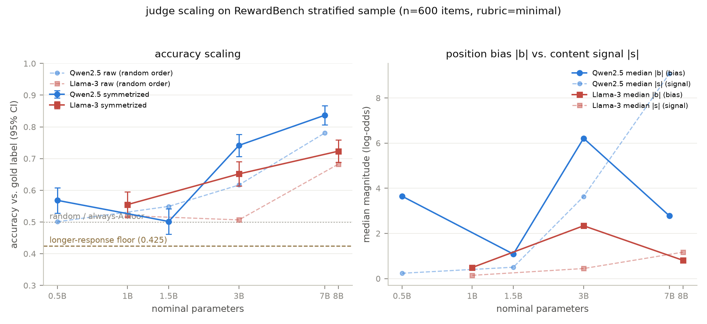

*Symmetrized and raw accuracy (left) and the bias-vs-signal race (right)
against nominal parameter count, both families, with the trivial floors. The
left panel is the valley; the right panel is why raw accuracy hides it.*

## The scaling arc

The per-grid sections in [the archival record](#the-per-grid-record) were
written in the order the grids finished, so each reads as a comparison
against whichever judges existed that day. With the scaling grid complete,
the same 35 findings organize better by theme. This section is that
reorganization — every number below is established in an archival section or
in `research/NOTES.md`, and the finding references point back to where.

### Accuracy: a valley, a climb, and two lines that never cross

Debiased judge quality is **not monotone in scale**. Within Qwen2.5 it runs
0.568 → 0.502 → 0.742 → 0.837 from 0.5B to 7B: a 1.5B *valley*, where the
preference signal that scale bought is substantially a verbosity preference
that RewardBench's composition punishes (findings 9–10), then a steep climb
once that transient un-learns (findings 16–17, 28). Llama-3 runs
0.555 → 0.652 → 0.723 with no valley (findings 21, 32) — but the two family
arcs never cross: Llama-3.1-8B is statistically indistinguishable from
Qwen2.5-3B, a judge 2.7x smaller (−0.018 [−0.055, +0.018] on identical
items), and significantly below Qwen2.5-7B (−0.113 [−0.150, −0.078]). Two
practical corollaries. First, **family beats scale at the top tier**:
choosing the right family buys more than doubling the parameters within the
wrong one (finding 32). Second, a scaling law fitted through any two Qwen
points confidently mispredicts the third (finding 16) — judge quality at
these sizes is not smooth enough to interpolate.

### Position bias: direction is unstable, and it dissolves before it shrinks

Both families reverse the *direction* of their position bias with scale, in
opposite senses — Qwen from a saturated A-lean at 0.5B (median b +3.65,
b > 0 on 99.8% of items) through a moderate A-lean to the audit's largest
B-lean at 3B (−5.55), Llama from a mild B-lean at 1B to a saturated A-lean
at 3B (+2.34, b > 0 on 99.8%) and back at 8B (−0.59) — so "this model is
A-biased" is not a family property, not a scale property, and (finding 11)
not even a per-model property: bias direction differs by category *within*
a judge (findings 6, 11, 17, 21, 32). At the top of both arcs the bias does
not so much shrink as *lose its direction*: Qwen-7B's median b is +0.23
with b > 0 on 52.0% of items, yet the dispersion stays (sd 4.89) — per-item
idiosyncrasy rather than a lean (finding 29). The structural milestone is
**signal dominance**: only the two top-tier judges have |b| > |s| on a
minority of items (Qwen-7B 26.8%, Llama-8B 33.5%; every other judge sits
between 62.0% and 99.8%) — for five of seven judges, position bias
outweighs content signal on *most* items (findings 2, 28, 32).

### What a black-box audit would have concluded

Flip rate under order swap — the one consistency number a sampled-verdict
audit can measure — is anti-correlated with the truth at both ends of this
field. The two saturated always-A machines post the *lowest* flip rates
(Qwen-0.5B 0.002, Llama-3B 0.033): a bias large enough to never be
overturned never produces a flip to count (findings 3, 21). The audit's two
*best* judges post the *highest* (Qwen-7B 0.732, Llama-8B 0.665): a
content-following verdict names a different position letter whenever the
responses swap seats (finding 29). In between, the ranking tracks neither
bias magnitude nor debiased accuracy (findings 6, 17). A flip-rate
leaderboard over these seven judges would rank the worst judge most
"consistent" and the best judge least.

### Debiasing economics: the better the judge, the more the second call is worth

The additive-shift hypothesis — that position bias is a constant you could
subtract after one call — is rejected at all seven scales (findings 19, 31,
35): subset structure always explains a significant share of Var(b), and
what makes an item bias-prone is family- and scale-specific. The
deployment-facing version is the exact-LOO one-call correction ladder, and
its ceiling *falls* as judges improve: fitted corrections recover 68% of
the symmetrization gain at Qwen-0.5B, 47% at 3B, ~25% at 7B and 8B — and at
8B the finer rungs (category, subset) land *below* no-correction at all
(findings 20, 31, 35). At the 1.5B valley every correction actively hurts,
because the debiased preference it converges to is anti-informative
(finding 20). The two-call swap therefore buys the most exactly where the
judge is best — while the best judge's *uncorrected* single call (0.781)
already beats every other judge's two-call oracle (finding 31).

### Length: the confound that explains the mysteries, and the adversarial hole

A one-parameter length model fitted to this sample scores 0.575 — above
every sub-3B judge's debiased accuracy — so "does the judge beat a length
heuristic?" is the audit's deployability bar. Four judges clear it (both
3Bs, Qwen-7B by the largest margin +0.272 [+0.230, +0.327], Llama-8B), and
only Qwen-7B clears it significantly in every category, adversarial Chat
Hard included (findings 14, 18, 22, 30, 34). Length also mediates the
audit's standing puzzles: the 1.5B Reasoning collapse is entirely its
verbosity preference (finding 13), the 0.5B's best-in-audit math-prm score
is a blind anti-verbosity lean pointed where the subset rewards it
(finding 24), and Llama-8B's largest-in-audit length-controlled coefficient
(β_s +2.376) rides the audit's strongest length *lean* (sign agreement
0.633) and pays for it with below-chance math-prm (finding 34). The
adversarial axis splits by family: Llama never escapes its Chat Hard hole
(0.435 → 0.348 → 0.522, back to chance and no further, against Qwen-7B's
0.696 on identical items) while its Chat reaches the audit's best category
score, 0.958 — Llama scale buys easy pairs, never adversarial robustness
(findings 22, 33).

### Calibration and compliance: family signatures

After symmetrization, verdict confidence is calibrated for every Llama
judge and for Qwen-0.5B, and overconfident for every larger Qwen (sym ECE
0.166/0.153/0.121 at 1.5B/3B/7B against ≤0.052 at the calibrated end;
Llama-8B blurs the edge at +0.042 signed gap without crossing it) —
post-debiasing calibration is a **family property**, orthogonal to accuracy
(findings 15, 18, 23, 31, 35). Raw single-order confidence is severely
overconfident everywhere; at the saturated judges the miscalibration *is*
the position bias read as certainty (finding 15). Verdict-format
compliance is the other family signature: every Qwen grid is 1.000, while
Llama breaks format on between a tenth and half of its items (0.512 →
0.863 → 0.910 pair-level compliance) — and *which category* breaks
migrates with scale (Reasoning at 1B, Safety at 3B and 8B), with
the compliant Safety stratum judging significantly *worse* both times the
gap is measurable (findings 5, 23, 25, 35). The readout itself survives
non-compliance (finding 8), which is precisely why a parse-and-drop
black-box harness — which would silently discard the better-judged half and
reweight the benchmark — is the wrong fallback.

## Reading a grid that is still running

A 7B grid takes about seven hours on this hardware, so it spans sessions and
is read while incomplete more often than not. Until 2026-08-24
`stratified_sample` returned its items sorted by `item_id` and `run_grid`
walked them in that order, so a grid caught mid-run had finished an
**alphabetical prefix of the subsets**, not a random subsample. At low coverage
that prefix sits entirely inside one category, which makes any mid-run peek
compared against another judge's *overall* number a comparison between two
different benchmarks.

- **Finding 26 — mid-run peeks in this harness are compositionally confounded,
  and the audit already made that mistake once.** At 45/600 items the 7B
  prefix is 100% Chat (`alpacaeval-easy/hard/length`) against 12% Chat in the
  full sample; Chat Hard, Reasoning and Safety are absent entirely. On that
  prefix the *floor itself* inverts: pick-the-longer-response scores **0.978**,
  against **0.425** on the full sample — so on these items every judge in the
  audit, including the two that beat the fitted length model overall, loses to
  the trivial length heuristic. The day-6 log entry read the 7B prefix's median
  `|s|` of ~10 against Qwen2.5-3B's full-sample 3.64 and inferred "a heavily
  saturated preference readout at 7B". Recomputed on the identical 45 items,
  3B's median `|s|` is **8.68** and 7B's is **11.04** — a 1.3x gap, not the 3x
  the unmatched comparison suggested. Roughly seventy percent of that apparent
  effect was composition. The same restriction moves symmetrized accuracy by
  +0.169 at Qwen2.5-3B and +0.259 at Llama-3.2-3B.

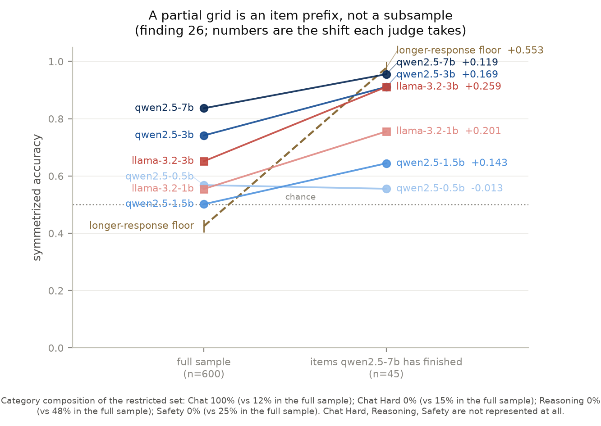

*Every judge's symmetrized accuracy on the full sample and on the 45 items the
in-flight 7B grid had finished, same items on both sides. The restriction is
not a uniform optimism: it moves Llama-3.2-3B by +0.259 and Qwen2.5-0.5B by
−0.013, reordering the field. The dashed line is the trivial
pick-the-longer-response floor, which swings further than any judge — from
0.425, far below chance, to 0.978 — where it outscores all six judges.
Qwen2.5-7B has only a right-hand point because, at the time of this snapshot,
its full-sample row did not exist yet (the grid completed 2026-08-26; its
full-sample numbers are in the table above).*

The first remedy was in the reading rather than the running:
`python -m experiments.master_table --restrict-to qwen2.5-7b` cuts every judge
down to the items the in-flight grid has finished, so the rows are matched by
construction, and stamps the output with the measured category skew and an
INTERIM banner. The committed
`results/summary/master_table__minimal__interim_qwen2.5-7b.{json,md}` is the
45-item snapshot finding 26 was computed on; re-running the command regenerates
it at whatever coverage the grid has reached, which is why those numbers are
not pasted into this report. None of them is a claim about the 7B judge.

Matching rows is the right guard, but it only ever recovers *comparability
between judges* — never representativeness of the benchmark. Restricted to an
all-Chat prefix, six matched judges are six judges measured on Chat. The
composition is a property of the schedule, so that is where it is now fixed.

### The schedule, not the guard

`src/schedule.py` chooses the next item to close the largest proportional
deficit `deficit_s = p_s * (D + 1) − d_s`, for stratum share `p_s`, items
finished in it `d_s`, and total finished `D` — largest-remainder apportionment
run incrementally, with ties broken by subset name and items inside a subset
kept in `item_id` order, so a schedule is reproducible from (sample, finished
set) with no RNG. Both presentation orders of an item still run consecutively,
because the swap pair is the unit every analysis consumes.

Because the deficits sum to exactly 1 at every step, the served stratum's
deficit is at most 1 and drops to at most 0 once served: in a grid started
under the scheduler, **no subset ever drifts more than one item from its
proportional share, at any prefix.** That is a bound on every realization,
which a seeded shuffle would only deliver in expectation — the distinction
that matters when the thing being read is one store, not an ensemble. A grid
that *inherits* a skew is the one case the bound does not cover on contact:
over-judged items cannot be un-judged, so the excess can only dilute, and the
scheduler recovers the bound exactly at `D > (d − 1) / p` for an inherited `d`
items at share `p` — the earliest arithmetic allows, asserted as a test.

- **Finding 27 — a partial grid is a scheduling choice, not a fact of the
  harness, and the objection that kept the old order was false.** Under the
  legacy order the store sits **0.497** in total-variation distance from the
  benchmark's subset composition at the halfway point (300/600 items) and
  first stays under 0.05 only at item **569** of 600 — the ordering is
  unusable for essentially the entire run. Deficit scheduling is under 0.05
  from item **55** onward and holds every subset within one item of
  proportional throughout; against a greedy rule that directly minimizes
  total-variation at each step it is not merely close but **identical at every
  step to floating-point noise** (max deviation 5.6e-16 on the audit sample,
  both from scratch and resuming the inherited prefix), so the apportionment
  rule gives up nothing to direct optimization of the quantity being read.
  The 2026-08-21 entry had recorded that reordering "would break
  resume-compatibility with the six stores already collected" and kept the
  alphabetical order on that basis.
  That was wrong and was never checked: `ResultStore` resumes on the *set* of
  `(model, rubric, order, item_id)` keys and `assemble_pairs` groups records
  in `item_id` order, so execution order is not observable by any analysis in
  this project. `--order sorted` still reproduces a historical run.

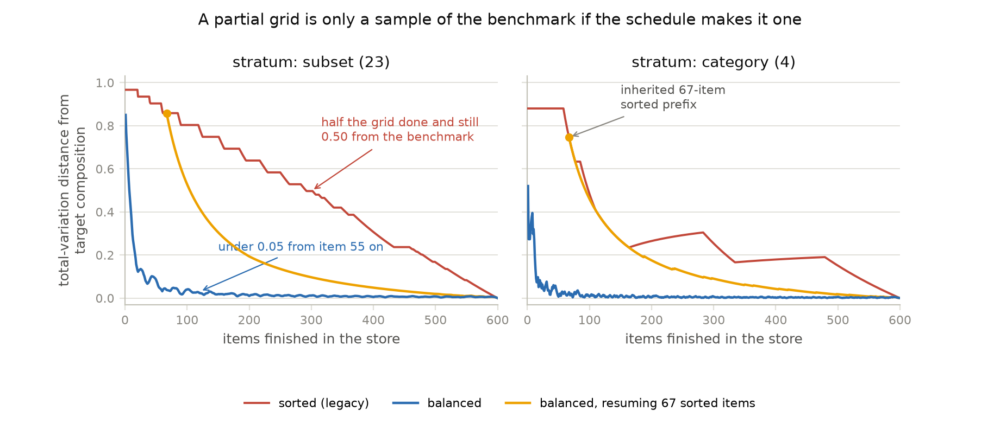

*Total-variation distance between a partial store's composition and the
composition it is meant to be sampling, after every item, at both stratum
levels. Red is the legacy `item_id` order — the staircase is whole subsets
being completed one at a time, and it is still 0.50 away at the halfway mark.
Blue is deficit scheduling from scratch: the first few items cannot be
proportional at all (one finished item is 100% of one subset), then the
distance collapses as fast as integrality permits. Yellow is the actual
Qwen2.5-7B store, which inherited 67 sorted-order items before the scheduler
existed; those cannot be un-judged, so its distance can only dilute as the
store grows — 0.746 at the handover, 0.090 at 300 items, 0 at completion.
Regenerated by `experiments/schedule_coverage.py`, which runs no judgments.*

The inherited prefix is why the 7B row is still not readable as a benchmark
number even now: the store is representative *in what it has added*, not in
what it holds. Interim reads continue to go through `master_table
--restrict-to`, and the honest statement of the 7B point remains "not yet".

## Findings index

Findings are numbered in the order they were established and are never
rewritten afterwards — a later finding that overturns an earlier one says so
rather than editing it (16 revises 9; 25 resolves the thread opened under 7).
Claims below are the log entries verbatim; `research/NOTES.md` carries each
one's evidence, dated.

| # | claim | section |
|---|---|---|
| 1 | The readout is valid at 0.5B. | [First results](#first-results--qwen25-05b-minimal-rubric-n600-both-orders) |
| 2 | The 0.5B judge is functionally an always-A machine. | [First results](#first-results--qwen25-05b-minimal-rubric-n600-both-orders) |
| 3 | Black-box flip counting cannot see this failure mode. | [First results](#first-results--qwen25-05b-minimal-rubric-n600-both-orders) |
| 4 | Symmetrization rescues a real but weak signal; the length floor is below chance here. | [First results](#first-results--qwen25-05b-minimal-rubric-n600-both-orders) |
| 5 | Verdict-format compliance is a per-family property, and the readout diagnostics are load-bearing. | [Cross-family contrast](#cross-family-contrast--llama-32-1b-on-the-identical-sample) |
| 6 | Bias direction, magnitude, and the flip-rate ranking all invert across families. | [Cross-family contrast](#cross-family-contrast--llama-32-1b-on-the-identical-sample) |
| 7 | After debiasing, the two judges are statistically indistinguishable overall but differ sharply by category. | [Cross-family contrast](#cross-family-contrast--llama-32-1b-on-the-identical-sample) |
| 8 | The logit readout survives its own validity check at 1B. | [Does the audit survive its own validity check?](#does-the-audit-survive-its-own-validity-check) |
| 9 | Debiased judge quality scales *backwards* within the Qwen family. | [Scaling within a family](#scaling-within-a-family--qwen25-15b-identical-sample) |
| 10 | The wrong-way preference is a Reasoning phenomenon that tracks length. | [Scaling within a family](#scaling-within-a-family--qwen25-15b-identical-sample) |
| 11 | Bias direction is category-dependent *within* one family. | [Scaling within a family](#scaling-within-a-family--qwen25-15b-identical-sample) |
| 12 | Every judge carries real signal beyond length, including the one that judges at chance; at 1.5B the binary verdict is what destroys it. | [Value over length](#value-over-length-is-there-a-judge-inside-the-verbosity-preference) |
| 13 | Length mediates both standing mysteries. | [Value over length](#value-over-length-is-there-a-judge-inside-the-verbosity-preference) |
| 14 | Against a deployable floor, these judges only pay on Safety. | [Value over length](#value-over-length-is-there-a-judge-inside-the-verbosity-preference) |
| 15 | Symmetrization is also a calibration repair, except where the preference itself is broken. | [Are the verdict probabilities calibrated?](#are-the-verdict-probabilities-calibrated) |
| 16 | The inverse scaling is a valley, not a trend. | [The 3B reversal](#the-3b-reversal--the-scaling-valley-closes-and-the-bias-flips) |
| 17 | The verbosity preference was a mid-scale transient; the position bias that replaces it is the largest yet, in the opposite direction. | [The 3B reversal](#the-3b-reversal--the-scaling-valley-closes-and-the-bias-flips) |
| 18 | First judge to beat the length floor; confidence still not trustworthy. | [The 3B reversal](#the-3b-reversal--the-scaling-valley-closes-and-the-bias-flips) |
| 19 | The additive-shift hypothesis is rejected at every scale, and bias predictability is anti-correlated with bias magnitude. | [Is position bias a constant you can subtract?](#is-position-bias-a-constant-you-can-subtract) |
| 20 | A fitted one-call correction fully substitutes for symmetrization at 0.5B, caps at half the gain at 3B, and actively hurts at 1.5B. | [Is position bias a constant you can subtract?](#is-position-bias-a-constant-you-can-subtract) |
| 21 | Both families reverse bias direction with scale, in opposite senses; Llama-3.2-3B is a new always-A machine. | [The cross-family point at 3B](#the-cross-family-point-at-3b--llama-32-3b) |
| 22 | Llama scale buys Chat, deepens the adversarial hole. | [The cross-family point at 3B](#the-cross-family-point-at-3b--llama-32-3b) |
| 23 | Post-debiasing calibration is a family property; the format-breaking category migrates with scale. | [The cross-family point at 3B](#the-cross-family-point-at-3b--llama-32-3b) |
| 24 | Subset accuracy ordering is the judge's local length-lean read through the subset's gold-length composition; the audit's weakest judge is its best formal-math judge. | [The per-subset view](#where-the-category-averages-hide-the-story--the-per-subset-view) |
| 25 | The compliant-stratum penalty is real but category-localized and family × scale-dependent. | [The per-subset view](#where-the-category-averages-hide-the-story--the-per-subset-view) |
| 26 | Mid-run peeks in this harness are compositionally confounded, and the audit already made that mistake once. | [Reading a grid that is still running](#reading-a-grid-that-is-still-running) |
| 27 | A partial grid is a scheduling choice, not a fact of the harness, and the objection that kept the old order was false. | [The schedule, not the guard](#the-schedule-not-the-guard) |
| 28 | The valley resolves into a climb, and 7B is the audit's first signal-dominant judge. | [The 7B tier](#the-7b-tier--the-audits-first-signal-dominant-judge) |
| 29 | At 7B the flip-rate inversion completes: the audit's best judge posts its highest flip rate. | [The 7B tier](#the-7b-tier--the-audits-first-signal-dominant-judge) |
| 30 | 7B beats the fitted length baseline by the audit's largest margin, in every category — the first judge with length-controlled signal on adversarial pairs. | [The 7B tier](#the-7b-tier--the-audits-first-signal-dominant-judge) |
| 31 | The one-call correction ceiling keeps falling as judges improve, and Qwen overconfidence survives to the top of the family. | [The 7B tier](#the-7b-tier--the-audits-first-signal-dominant-judge) |
| 32 | The two family arcs never cross: at the top tier, family beats scale. | [The 8B tier](#the-8b-tier--family-beats-scale-llama-31-8b) |
| 33 | The adversarial hole is a family property all the way up. | [The 8B tier](#the-8b-tier--family-beats-scale-llama-31-8b) |
| 34 | The audit's strongest length-controlled signal rides its strongest length lean, and pays for it on math-prm. | [The 8B tier](#the-8b-tier--family-beats-scale-llama-31-8b) |
| 35 | At 8B the one-call ceiling holds at ~25%, finer corrections actively hurt, and the Safety compliance migration replicates. | [The 8B tier](#the-8b-tier--family-beats-scale-llama-31-8b) |
| 36 | The symmetrized verdict is rubric-fragile at small scale: 30–43% of debiased verdicts change with the rubric text alone, an order of magnitude more churn than the net accuracy movement. | [The rubric axis](#the-rubric-axis--the-same-judges-under-a-different-prompt) |
| 37 | At 0.5B the detailed rubric contracts the whole log-odds distribution and touches nothing structural. | [The rubric axis](#the-rubric-axis--the-same-judges-under-a-different-prompt) |
| 38 | At 1B the rubric reverses both of the judge's directional properties, and the significant accuracy gain is a re-aimed length lean, not new judgment. | [The rubric axis](#the-rubric-axis--the-same-judges-under-a-different-prompt) |
| 39 | Rubric fragility is the signal-to-perturbation ratio, not a property of small judges, and a two-parameter perturbation model predicts where the flips are. | [The rubric axis](#the-rubric-axis--the-same-judges-under-a-different-prompt) |
| 40 | At 1.5B the detailed rubric contracts both components and halves the order asymmetry without touching the symmetrized verdict — and finding 38's direction reversal does not replicate where bias is sizable. | [The rubric axis](#the-rubric-axis--the-same-judges-under-a-different-prompt) |
| 41 | The valley is rubric-invariant: the 1.5B's defining pathologies survive a rubric that spells out what to judge. | [The rubric axis](#the-rubric-axis--the-same-judges-under-a-different-prompt) |
| 42 | The fragility arc extends to 3B on the model's own prediction, and the coherent-movement deviation grows with judge quality. | [The rubric axis](#the-rubric-axis--the-same-judges-under-a-different-prompt) |
| 43 | Prompt-side debiasing works hardest where the bias is largest, but it buys raw accuracy and order balance, never symmetrized quality — and it un-saturates the flip rate. | [The rubric axis](#the-rubric-axis--the-same-judges-under-a-different-prompt) |
| 44 | The fragility arc closes its fifth point on the model's prediction, and the coherent-movement deviation peaks at 3B rather than growing with judge quality. | [The rubric axis](#the-rubric-axis--the-same-judges-under-a-different-prompt) |
| 45 | At the family's top the prompt-side lever stops paying: it re-signs a balanced bias rather than shrinking a large one, and nothing else moves. | [The rubric axis](#the-rubric-axis--the-same-judges-under-a-different-prompt) |
| 46 | The \|s\|-ordering law bends exactly where the model says it should: fragility is λ\|s\|/σ, not \|s\| — and the fitted ratio orders all six judges strictly. | [The rubric axis](#the-rubric-axis--the-same-judges-under-a-different-prompt) |
| 47 | At Llama-3B the detailed rubric is a null lever with the family's fingerprints: no compliance collapse, shrinkage without reversal, and the only borderline purchase sits in the adversarial hole. | [The rubric axis](#the-rubric-axis--the-same-judges-under-a-different-prompt) |
| 48 | The rubric axis closes at seven judges: the λ\|s\|/σ ordering survives its pre-registered out-of-sample test, while every simpler regularity around it fails cross-family — the law orders judges but does not yet predict them. | [The rubric axis](#the-rubric-axis--the-same-judges-under-a-different-prompt) |
| 49 | At 8B the detailed rubric contracts signal faster than bias and its purchase turns negative for the first time: one-call accuracy falls 4.5 points while the symmetrized verdict doesn't move. | [The rubric axis](#the-rubric-axis--the-same-judges-under-a-different-prompt) |

## The per-grid record

Everything below this point is the audit's archival record: one section per
completed grid (plus the cross-cutting probe, calibration, bias-structure,
and per-subset analyses), written the day the results landed and never
rewritten afterwards. Each section compares its new judge against the field
*as it existed that day*. The thematic synthesis of all of it is [The
scaling arc](#the-scaling-arc) above; the tables and figures here are where
its numbers come from.

### First results — Qwen2.5-0.5B, minimal rubric, n=600, both orders

600 stratified RewardBench items (seed 0, composition-preserving), both
presentation orders = 1,200 judgments; 56.5 min on 4 CPU threads. All
intervals are 95% percentile bootstrap over items (10,000 resamples, paired
where the comparison is paired). Regenerate with the commands below; nothing
is hand-entered.

| metric | value |
|---|---|
| argmax compliance / median mass on {A, B} | 1.000 / ≈1.00 |
| raw accuracy, chosen shown first | 1.000 |
| raw accuracy, rejected shown first | 0.002 |
| raw accuracy, random order assignment | 0.501 [0.500, 0.502] |
| symmetrized (swap-averaged) accuracy | 0.568 [0.528, 0.608] |
| paired gain, symmetrized − raw | +0.068 [+0.027, +0.107] |
| positional flip rate under swap | 0.002 |
| position bias b: mean (sd), share > 0 | +3.68 (1.08), 99.8% |
| preference signal: median \|s\| | 0.24 |
| items where \|b\| > \|s\| | 99.8% |
| floors: random / always-A / longer-response | 0.500 / 0.500 / 0.425 |

**The 0.5B judge is functionally an always-A machine** (finding 2): position
bias exceeds the content signal on 99.8% of items (median ratio ~15x), so
raw accuracy is pure position-assignment noise. **A black-box flip-rate audit
cannot see this** (finding 3): the flip rate is 0.002, which reads as
near-perfect consistency — the bias saturates both orders. The white-box
decomposition shows that "consistency" *is* the bias:

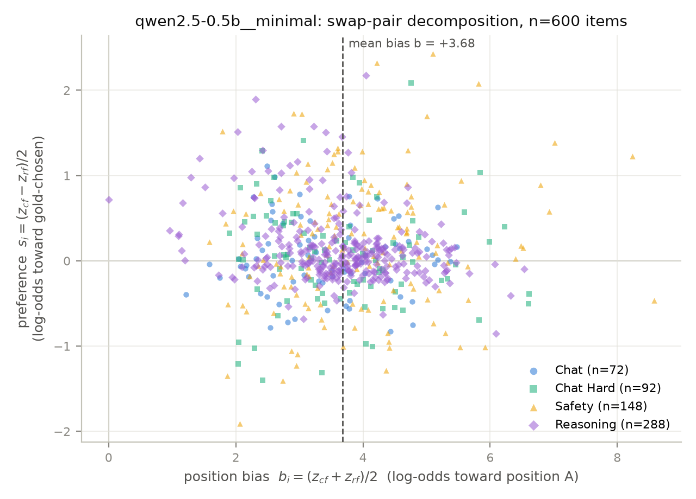

*Every item's swap pair, decomposed: position bias b_i (x) vs order-invariant
preference s_i (y). The cloud sits ~3.7 log-odds right of zero — bias toward
position A on 99.8% of items — while content preference hugs zero (median
|s| = 0.24). A judge with no position bias and real discrimination would
concentrate around b = 0 with |s| large.*

**Symmetrization rescues a real but weak signal** (finding 4): swap-averaged
accuracy is 0.568 [0.528, 0.608], significantly above random, always-A, and
the longer-response floor — which is itself *below chance* (0.425) on
RewardBench, whose adversarial subsets punish verbosity-picking. Per
category, the debiased judge is best on Safety (0.608) and has no signal at
all on easy Chat (0.500).

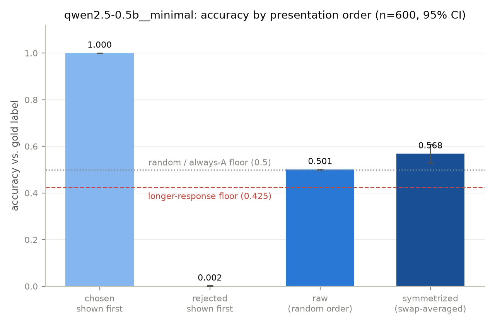

*Accuracy by presentation order against the floors. The 1.000 / 0.002 split
between orders collapses to chance under random order assignment; only the
swap-averaged verdict carries signal.*

### Cross-family contrast — Llama-3.2-1B on the identical sample

Same 600 items, same orders, same rubric:

| metric | Qwen2.5-0.5B | Llama-3.2-1B |
|---|---|---|
| argmax compliance (both orders) | 1.000 | 0.512 |
| per-judgment mass on {A, B}, quartiles | ≈1.0 | 0.10 / 0.67 / 0.94 |
| position bias b: median (share > 0) | +3.65 (99.8%) | −0.34 (27.5%) |
| raw accuracy cf / rf | 1.000 / 0.002 | 0.312 / 0.728 |
| raw accuracy, random order | 0.501 [0.500, 0.502] | 0.520 [0.502, 0.537] |
| positional flip rate | 0.002 | 0.183 |
| items with \|b\| > \|s\| | 99.8% | 81.7% |
| symmetrized accuracy | 0.568 [0.528, 0.608] | 0.555 [0.517, 0.595] |
| paired gain from symmetrization | +0.068 [+0.027, +0.107] | +0.035 [−0.001, +0.072] |

Three results (findings 5–7, `research/NOTES.md`):

- **Verdict-format compliance is a family property.** Llama-3.2-1B's
  unconstrained argmax is a verdict letter in only 56% of judgments (it
  prefers to open with "Response…"), so its single-token readout measures a
  renormalized sub-distribution — every Llama number here carries that
  qualification, and the audit records exactly how much (mass quartiles
  above).
- **The flip-rate ranking inverts the true bias ranking.** Llama-1B flips
  under swap 90x more often than Qwen-0.5B (0.183 vs 0.002) — a black-box
  consistency audit would call it far less reliable — while its positional
  bias is ~7x *smaller* (median |b| 0.49 vs 3.65). Flip rate measures bias
  saturation, not bias.
- **Bias direction is family- and category-dependent.** Llama leans toward
  B overall, but its Reasoning items pull toward A (+0.25 mean b) while
  Chat/Safety sit at −0.3 to −0.5 — early evidence against the
  additive-shift assumption implicit in swap-debiasing, ahead of the formal
  phase-3 test.

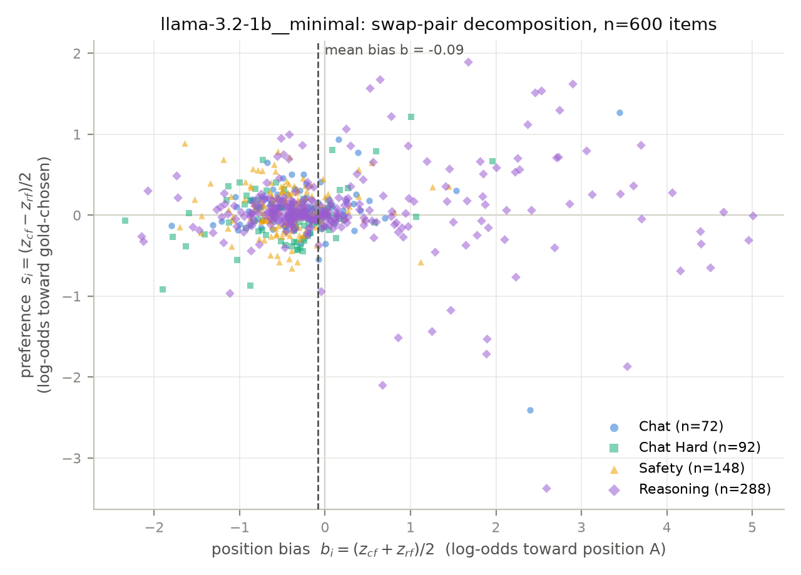

*Llama-3.2-1B's decomposition on the same axes: the cloud centers near
b ≈ −0.3 (mild B-lean) instead of +3.7, with a category-structured right
tail — Reasoning items are biased in the opposite direction from the rest.*

### Scaling within a family — Qwen2.5-1.5B, identical sample

Same 600 items, same orders, same rubric as both grids above. The readout is
fully valid at 1.5B (argmax compliance 1.000, median mass on {A, B} ≈ 1.00),
so everything below is judge behavior, not readout artifact.

| metric | Qwen2.5-0.5B | Qwen2.5-1.5B |
|---|---|---|
| raw accuracy cf / rf | 1.000 / 0.002 | 0.805 / 0.293 |
| raw accuracy, random order | 0.501 [0.500, 0.502] | 0.549 [0.527, 0.571] |
| positional flip rate | 0.002 | 0.298 |
| position bias b: median (share > 0) | +3.65 (99.8%) | +0.83 (74.5%) |
| preference signal: median \|s\| | 0.24 | 0.50 |
| symmetrized accuracy | 0.568 [0.528, 0.608] | 0.502 [0.462, 0.542] |
| paired Δ, symmetrized − raw | +0.068 [+0.027, +0.107] | **−0.048 [−0.081, −0.013]** |

- **Debiased judge quality scales *backwards* here** (finding 9). Everything
  a black-box audit tracks improves from 0.5B to 1.5B — bias magnitude falls
  (median |b| 3.65 → 1.09), the content signal doubles (median |s| 0.24 →
  0.50), raw random-order accuracy rises (0.501 → 0.549) — yet symmetrized
  accuracy *drops* to chance: 0.502 [0.462, 0.542], significantly below the
  0.5B judge on the same items (paired Δ +0.067 [+0.013, +0.118]). And
  symmetrization — the standard debiasing recipe — now *hurts* (−0.048
  [−0.081, −0.013]): on the 421 items where the verdict does not flip under
  swap, the debiased sign is wrong more often than chance (0.432
  [0.387, 0.480]), while on flipped items it is informative (0.665
  [0.598, 0.732]). The residual preference on bias-saturated items is
  anticorrelated with gold.
- **The anticorrelation is a Reasoning phenomenon that tracks length**
  (finding 10). Reasoning sym accuracy is 0.368 [0.312, 0.424] — almost
  exactly the Reasoning longer-response floor (0.370). The epicenter is
  math-prm (sym 0.167, n=90): there the *rejected* solution is the longer
  one on ~92% of pairs (longer floor 0.078), and the judge's preference
  sign matches the length sign on 75.6% of items. Across scale, overall
  sign(s)-vs-length agreement rises 0.491 → 0.571 — the 0.5B judge's weak
  signal was length-free, the 1.5B judge's stronger signal is substantially
  a verbosity preference, and on RewardBench Reasoning the longer answer is
  usually the wrong one. (Length is a strong correlate, not yet a proven
  mechanism — the phase-3 value-over-length regression separates length
  from style covariates.) The other three categories behave normally:
  symmetrization helps (+0.02 to +0.08) and sym accuracy sits at 0.52–0.67.
- **Bias direction is category-dependent *within* one family** (finding 11).
  Qwen2.5-1.5B leans toward A on Chat (+1.09 mean b) and Reasoning (+1.29)
  but toward B on Safety (−0.61) — so "this model is A-biased" is not even
  well-defined per model, let alone per family, and the additive-shift
  hypothesis fails again before its formal test. The three-model flip-rate
  ranking (0.002 / 0.183 / 0.298) tracks neither bias magnitude (median |b|
  3.65 / 0.49 / 1.09) nor debiased quality (0.568 / 0.555 / 0.502).


*Left: symmetrized (solid) vs raw random-order (dashed) accuracy across
scale (figure includes the later 3B point). The Qwen line crosses at 1.5B —
raw rises while debiased accuracy falls to chance — then rebounds sharply at
3B (the "3B reversal" section below). Right: median bias magnitude |b|
collapses toward 1.5B then explodes at 3B in the opposite direction, while
the content signal |s| grows — and none of it predicts the left panel.*

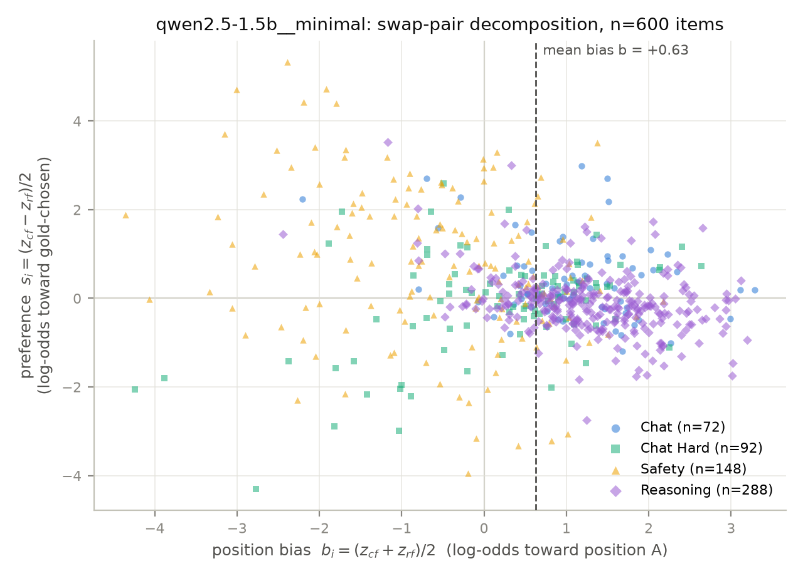

*Qwen2.5-1.5B's swap-pair decomposition: bias has shrunk to a moderate
A-lean (Safety, gold, leans B), but the Reasoning cloud (purple, n=288) sits
visibly below s = 0 at positive b — an order-invariant preference for the
wrong response, invisible to any flip-count audit.*

### Does the audit survive its own validity check?

Finding 5 left a hanging threat: at 1B, only 51.2% of items have a
verdict-letter argmax in both orders, and the probability mass on {A, B}
spans the whole unit interval — so for half the items, `z` is the preference
of a *renormalized sub-distribution*, not of the model's top choice. If that
sub-distribution preference were noise, every Llama-1B number above would
only be valid on the compliant half. The compliance-conditioned view
(`experiments/compliance_view.py`) tests this directly:

| Llama-3.2-1B stratum | n | sym acc (95% CI) | med b | med \|s\| | flip rate |
|---|---|---|---|---|---|
| all items | 600 | 0.555 [0.517, 0.595] | −0.34 | 0.14 | 0.183 |
| argmax-compliant, both orders | 307 | 0.534 [0.479, 0.590] | −0.42 | 0.13 | 0.173 |
| non-compliant in ≥1 order | 293 | 0.577 [0.519, 0.635] | −0.19 | 0.18 | 0.195 |

- **The readout survives** (finding 8). The symmetrized-accuracy gap between
  compliant and non-compliant strata is −0.043 [−0.122, +0.038] (unpaired
  bootstrap over disjoint strata): no measurable validity loss where the
  format contract breaks. The validity curve over mass bins is flat — items
  where {A, B} holds *less than a quarter* of the next-token mass (n=212)
  judge at 0.561 [0.495, 0.627], statistically indistinguishable from the
  ≥0.9-mass bin's 0.547 [0.467, 0.627]. The verdict-letter logits carry the
  judgment even when the model would rather say something else first.
- **But compliance is heavily category-structured.** Compliant fraction:
  Reasoning 22.6%, Chat 62.5%, Chat Hard 79.3%, Safety 83.8%. The standard
  black-box fallback — drop judgments that fail to parse — would silently
  discard ~3/4 of Reasoning while keeping most of Safety, *reweighting* the
  benchmark instead of sampling it. The white-box readout keeps every item
  at no measurable validity cost; this, not just extra precision, is its
  practical case.

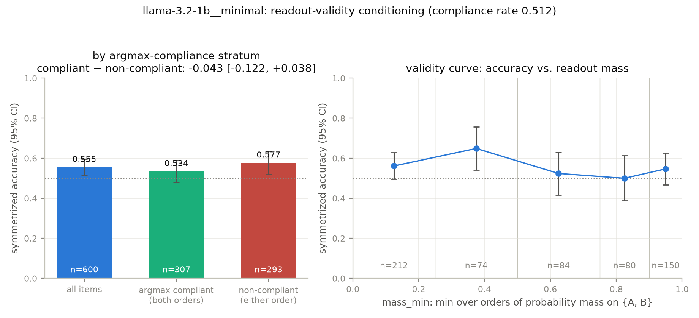

*Left: symmetrized accuracy is flat across compliance strata (per-stratum n
inside bars; gap CI in the title). Right: accuracy vs. the minimum probability
mass on {A, B} across orders — flat down to the <0.25 bin. Qwen2.5-0.5B's
companion view is trivial (compliance 1.000) and committed alongside.*

### Value over length: is there a judge inside the verbosity preference?

Finding 10 left the project's sharpest open question: the preference signal
that emerges with scale *tracks length*, and RewardBench Reasoning punishes
exactly that — so how much genuine judgment is left once length is controlled?
The probe (`src/length_probe.py`) is a Bradley–Terry / conditional-logit fit
on oriented pair differences: for each item, features are oriented
chosen − rejected — the judge's order-invariant preference `s` and the log
length ratio `log(len_chosen/len_rejected)` — and the gold-chosen response
"wins" with probability `sigmoid(β·x)`. There is deliberately no intercept
(relabeling chosen/rejected flips every feature's sign, so a constant is not
identified), features are SD-scaled but *not* centered (the origin "equal
lengths, indifferent judge" must map to P = 1/2), and nested specs turn the
question into coefficients: **β_s ≠ 0 in the joint spec means the judge
carries signal a length heuristic cannot explain.** CIs are a 10k-replicate
bootstrap over items with the full rescale+refit pipeline inside each
replicate. Accuracies are in-sample; with ≤2 parameters on n ≥ 72 strata the
optimism is negligible, and the paired spec deltas share it.

| joint spec, overall (n=600) | Qwen2.5-0.5B | Qwen2.5-1.5B | Llama-3.2-1B | Qwen2.5-3B |
|---|---|---|---|---|
| β_s (per SD, 95% CI) | **+0.545 [+0.369, +0.739]** | **+0.380 [+0.201, +0.572]** | **+0.319 [+0.138, +0.546]** | **+1.399 [+1.147, +1.714]** |
| β_len (per SD) | −0.275 [−0.449, −0.111] | −0.311 [−0.506, −0.138] | −0.260 [−0.440, −0.095] | −0.764 [−1.027, −0.548] |
| β_sign(s) (joint-sign spec) | +0.290 [+0.128, +0.446] | +0.040 [−0.124, +0.204] | +0.282 [+0.122, +0.451] | +1.021 [+0.892, +1.146] |
| judge sym accuracy | 0.568 | 0.502 | 0.555 | 0.742 |
| length-only accuracy (1 fitted param) | 0.575 | 0.575 | 0.575 | 0.575 |
| Δ acc, joint − length-only | −0.007 [−0.047, +0.048] | −0.020 [−0.055, +0.031] | −0.007 [−0.042, +0.047] | **+0.205 [+0.156, +0.261]** |

- **Finding 12 — every judge carries real signal beyond length, including
  the one that judges at chance; at 1.5B it is the *binary verdict* that
  destroys it.** β_s is significantly positive overall for all three
  models — most strikingly for Qwen2.5-1.5B, whose symmetrized accuracy is
  indistinguishable from a coin flip (0.502). The resolution of that
  apparent contradiction: thresholding. The continuous log-odds `s` has
  significant length-controlled signal (+0.380), while its *sign* — exactly
  what symmetrized majority voting uses — has none (+0.040 [−0.124, +0.204]).
  At 0.5B and 1B the sign retains most of the signal; at 1.5B the judge is
  right where it is confident and wrong-but-weak on a mass of items the sign
  treats as full votes. A deployment that averages verdict *probabilities*
  and one that majority-votes *verdicts* are measurably different judges
  here — a distinction only visible white-box.
- **Finding 13 — length mediates both of the audit's standing mysteries.**
  (a) The 1.5B Reasoning collapse (sym 0.368, below the length floor) is
  *entirely* length-mediated: judge-only, its Reasoning preference
  anti-predicts gold (β_s −0.329 [−0.629, −0.079]); controlling for length,
  nothing remains (−0.084 [−0.406, +0.183]) — the emergent verbosity
  preference explains all of the below-chance behavior, and there is no
  residual anti-signal. (b) Llama-1B's Chat advantage (finding 7: 0.653
  where Qwen-0.5B had zero signal) does *not* survive length control:
  Chat β_s = −0.046 [−0.812, +1.518], while Chat is the one category where
  longer actually is better (length-only accuracy 0.792 > the judge's
  0.653). Its "advantage" is a noisy proxy of the length heuristic.
  Meanwhile Qwen2.5-1.5B's Chat signal is genuine content signal
  (β_s +0.805 [+0.181, +1.811]) — scale bought real judgment on Chat and a
  toxic length preference on Reasoning, at the same time.
- **Finding 14 — against a deployable floor, these judges only pay for
  themselves on Safety.** A one-parameter length model *fitted to this
  sample* learns shorter-is-better (β_len < 0) and reaches 0.575 overall —
  above every judge's symmetrized accuracy. Adding the judge to it moves
  accuracy by ≈0 overall (table); at 1.5B the judge alone is significantly
  *worse* than length alone (−0.073 [−0.131, −0.009]). The exception is
  Safety, where length carries nothing (β_len ≈ 0, length-only 0.412) and
  every judge has strong signal (β_s +0.6 to +0.9): there the joint model
  beats length-only by +0.284 [+0.020, +0.338] at 1.5B, with same-signed
  point estimates at 0.5B/1B. The fitted direction is benchmark-specific
  (RewardBench's composition punishes verbosity), so the honest reading is
  not "use length heuristics" but: **below 3B, on three of four categories,
  these judges are not yet distinguishable from a one-parameter baseline
  that peeked at the answer key once.** (The 3B judge is the first to clear
  that bar — finding 18 below.)

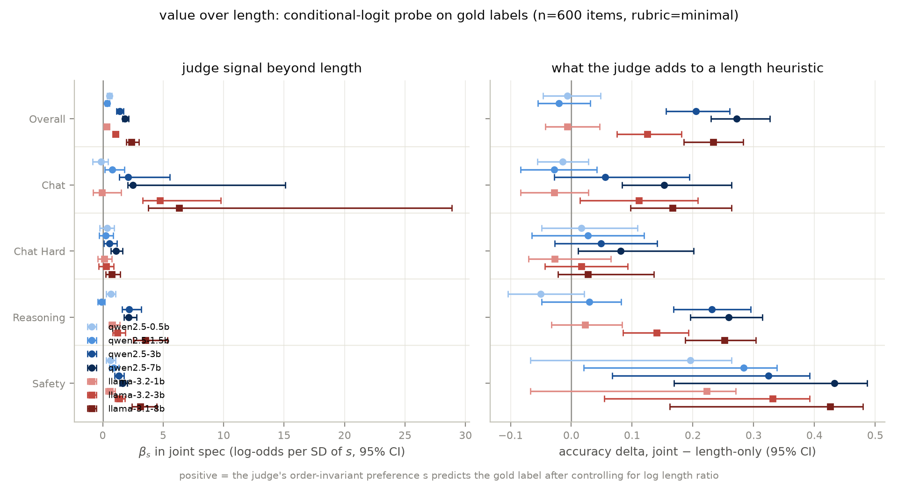

*Left: the judge's length-controlled signal about gold labels (β_s in the
joint spec), by category and model. Every model has real overall signal, but
Reasoning at 1.5B is null (the verbosity preference explains that collapse),
and Chat at 0.5B/1B is null (Llama's apparent Chat skill was length). Right:
what adding the judge to a fitted length heuristic is worth in accuracy
points — indistinguishable from zero everywhere except Safety for the three
judges below 3B; the 3B judge (dark blue) is the first to clear the length
baseline overall, on Reasoning, and on Safety.*

### Are the verdict probabilities calibrated?

The probe showed the 1.5B judge is right where it is confident; calibration
is the formal version of that claim. Each judgment folds into a
(confidence, correctness) point — **raw**: `sigmoid(|z|)`, the renormalized
probability on the winning verdict token, per judgment, which is what a
single-order deployment experiences; **sym**: `sigmoid(|s|)` per item, the
confidence of the swap-averaged verdict. ECE uses equal-mass bins that never
split tied confidences (a saturated judge piles float-identical mass at 1.0,
and splitting one tied run across bins with different accuracies would
manufacture ECE from the split), with item-level bootstrap CIs.

| view | Qwen2.5-0.5B | Llama-3.2-1B | Qwen2.5-1.5B | Qwen2.5-3B |
|---|---|---|---|---|
| raw: mean conf / acc | 0.956 / 0.501 | 0.652 / 0.520 | 0.770 / 0.549 | 0.971 / 0.617 |
| raw ECE | 0.455 [0.450, 0.459] | 0.141 [0.124, 0.162] | 0.221 [0.203, 0.246] | 0.355 [0.332, 0.378] |
| sym: mean conf / acc | 0.592 / 0.568 | 0.560 / 0.555 | 0.664 / 0.502 | 0.894 / 0.742 |
| sym ECE | **0.035 [0.036, 0.094]** | **0.052 [0.041, 0.104]** | **0.166 [0.134, 0.209]** | **0.153 [0.126, 0.190]** |

- **Finding 15 — symmetrization is also a calibration repair, except where
  the preference itself is broken.** Raw verdict probabilities are severely
  overconfident everywhere, and at 0.5B the miscalibration *is* the position
  bias wearing a confidence costume: |z| ≈ |b| ≈ huge, so the judge asserts
  0.956 mean confidence while performing at chance (ECE 0.455). Averaging
  the two orders repairs it almost completely at 0.5B and 1B — sym
  confidence–accuracy gaps of +0.024 and +0.005, ECE 0.035/0.052, reliability
  curves hugging the diagonal. So the *shape* of the debiased log-odds is
  approximately honest at these scales: `sigmoid(|s|)` can be read as a
  probability. At 1.5B it cannot — the judge stays overconfident after
  debiasing (gap +0.162, ECE 0.166), and its reliability curve is flat at
  ≈0.45 accuracy across the whole 0.5–0.85 confidence range, only rising in
  the top-confidence mass (0.94 → 0.75). That flat-then-jump shape is
  finding 12 drawn as a curve: the middle-confidence mass — where the
  length-following preference lives — carries no validity, while the
  high-|s| tail is real. A confidence-thresholded 1.5B judge would be
  usable; a confidence-trusting one is worse than its 0.5B sibling.
  (Methodological note: ECE is a nonnegative deviation statistic, so its
  bootstrap distribution sits slightly above the point estimate for
  near-calibrated judges — the 0.5B sym CI brackets resampling noise, not a
  smaller true ECE. The signed gap is the bias-free companion number.)

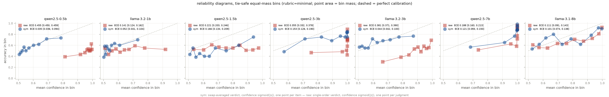

*Raw single-order verdicts (red) are overconfident for every judge — the
0.5B's cluster at confidence ≈ 1, accuracy ≈ 0.5 is position bias read as
certainty. Symmetrized verdicts (blue) are close to calibrated at 0.5B and
1B but not above: the 1.5B curve is flat below the diagonal until the
top-confidence bin, and the 3B curve rises with confidence but sits below
the diagonal throughout (overconfident while accurate — finding 18).*

### The 3B reversal — the scaling valley closes and the bias flips

Qwen2.5-3B, same 600 items, both orders, same rubric. Readout fully valid at
a third Qwen size (argmax compliance 1.000, median mass on {A, B} ≈ 1.00).

| metric | 0.5B | 1.5B | 3B |
|---|---|---|---|
| raw accuracy cf / rf | 1.000 / 0.002 | 0.805 / 0.293 | 0.368 / 0.865 |
| raw accuracy, random order | 0.501 | 0.549 | 0.617 [0.594, 0.639] |
| symmetrized accuracy | 0.568 | 0.502 | **0.742 [0.707, 0.777]** |
| paired Δ, symmetrized − raw | +0.068 | −0.048 | +0.125 [+0.095, +0.154] |
| position bias b: median (share > 0) | +3.65 (99.8%) | +0.83 (74.5%) | **−5.55 (19.2%)** |
| median \|b\| / median \|s\| | 3.65 / 0.24 | 1.09 / 0.50 | 6.21 / 3.64 |
| positional flip rate | 0.002 | 0.298 | 0.380 |

- **Finding 16 — the inverse scaling is a valley, not a trend.** Symmetrized
  accuracy leaps to 0.742 [0.707, 0.777]: paired deltas on identical items
  are +0.173 [+0.123, +0.223] over 0.5B, +0.240 [+0.192, +0.290] over 1.5B,
  +0.187 [+0.138, +0.235] over Llama-1B. Within one model family and one
  protocol, debiased judge quality is *non-monotone* in scale
  (0.568 → 0.502 → 0.742) — a scaling curve fit through any two of these
  points would confidently predict the wrong third. Per category: Chat
  0.861, Reasoning 0.771, Safety 0.730, Chat Hard 0.576 — the adversarial
  LLMBar-dominated category is now clearly the hardest, as its construction
  intends.
- **Finding 17 — the verbosity preference was a mid-scale transient, and
  the position bias that replaces it is the largest measured yet — in the
  opposite direction.** The 1.5B's length-following un-learns at 3B:
  sign(s)-vs-length agreement (tie-excluded, the finding-10 convention)
  falls back 0.571 → 0.547 overall, 0.628 → 0.538 on Reasoning, and
  0.756 → **0.433** on math-prm — the 3B judge now leans *anti*-length
  exactly where verbosity was fatal, and math-prm accuracy recovers
  0.167 → 0.600. Meanwhile position bias flips family direction: median b
  −5.55 toward position *B* (b > 0 on only 19.2% of items), magnitude
  larger than the 0.5B's always-A bias (median |b| 6.21 vs 3.65), and
  still category-heterogeneous *in direction* within the model (mean b:
  Chat +0.90 toward A, Reasoning −6.59 toward B). Four models in: the
  flip-rate ranking (0.002 / 0.183 / 0.298 / 0.380) is monotone in neither
  bias magnitude nor accuracy — the black-box consistency metric remains
  uninterpretable at every scale tried.
- **Finding 18 — the 3B judge is the first to earn its inference cost
  against the length floor, but its confidence still cannot be trusted.**
  Value-over-length (probe rerun over all four models, figure above):
  overall β_s = +1.399 [+1.147, +1.714], and joint − length-only accuracy
  is +0.205 [+0.156, +0.261] — significant for the first time, driven by
  Reasoning (+0.231 [+0.168, +0.295], β_s +2.184 where the 1.5B had
  nothing) and Safety (+0.324 [+0.068, +0.392]). The binary verdict now
  carries the signal too (joint-sign β +1.021 [+0.892, +1.146]) —
  majority-vote deployment is fine at 3B where it was fatal at 1.5B. But
  calibration does not come with accuracy: symmetrized mean confidence
  0.894 against accuracy 0.742 (ECE 0.153 [0.126, 0.190]) — better than
  the 1.5B's *flat* miscalibration (the 3B curve at least rises with
  confidence), yet finding 15's repair story stays limited to the sub-1B
  models. Across four judges, symmetrized verdicts are calibrated exactly
  where they are weakest.

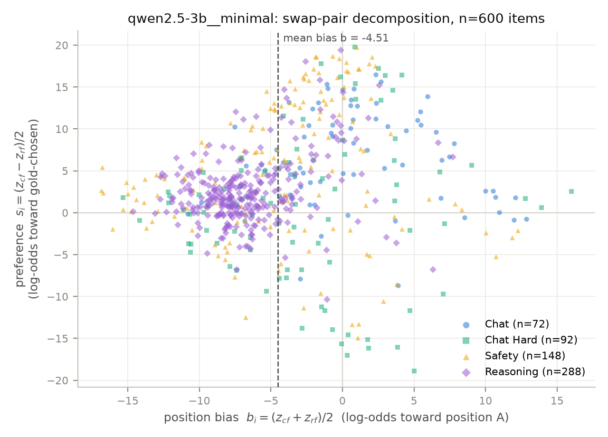

*Qwen2.5-3B's swap-pair decomposition: the mass sits left of b = 0 (a strong
B-lean, opposite to its 0.5B sibling) with the Reasoning cloud now clearly
above s = 0 — the order-invariant preference points at the gold answer where
at 1.5B it pointed at the longer one.*

### Is position bias a constant you can subtract?

Swap-averaging is exact but doubles inference cost. Every cheaper debiasing
scheme rests on the *additive-shift hypothesis*: that `b_i` is predictable
from what a deployment could know — nothing (a global constant), the item's
category or subset, or its length statistics. Because the verdict readout is
deterministic at temperature 0, `b_i` carries **no sampling noise**: all of
`Var(b)` is real item-level bias structure, so a variance decomposition
(nested predictors, refit inside every bootstrap replicate) cleanly separates
the share a correction could exploit from an irreducible residual.

The decomposition has a deployment-facing mirror. The oracle single-order
correction `sign(z − b_i)` *is* the symmetrized verdict (`z_cf − b_i = s_i`,
`z_rf − b_i = −s_i`), so a ladder of fitted corrections — each evaluated with
exact leave-one-out cross-fitting, no item corrected using its own bias —
interpolates between the raw single-order judge and full symmetrization at
half the inference cost:

| | Qwen-0.5B | Llama-1B | Qwen-1.5B | Llama-3B | Qwen-3B |
|---|---|---|---|---|---|
| SD of position bias b (log-odds) | 1.08 | 1.05 | 1.32 | 1.01 | **5.47** |
| R² category means | 0.020 [0.006, 0.053] | 0.096 | 0.372 | 0.099 | 0.205 |
| R² subset means | 0.141 | 0.329 | 0.448 | 0.229 | 0.260 |
| R² subset + length | 0.340 | 0.330 | **0.556** | 0.247 | 0.288 |
| residual SD after best spec | 0.88 | 0.86 | 0.88 | 0.88 | **4.61** |
| raw single-order accuracy | 0.501 | 0.520 | 0.549 | 0.507 | 0.617 |
| best one-call corrected | 0.547 (subset) | 0.532 (regression) | 0.549 (uncorrected) | 0.583 (regression) | 0.675 (category) |
| symmetrized, two calls | 0.568 | 0.555 | 0.502 | 0.652 | 0.742 |
| share of symmetrization gain recovered | 68% | n.s. | — (gain is negative) | 52% | 47% |

*(The Llama-3.2-3B column was added when its grid completed later the same
day — finding 21 discusses it; findings 19–20 below were established on the
first four judges and hold unchanged on the fifth.)*

- **Finding 19 — the additive-shift hypothesis is rejected at every scale,
  and bias *predictability* is anti-correlated with bias *magnitude*.**
  Subset structure alone explains a significant share of `Var(b)` for every
  judge (R² 0.141–0.448, all CIs well off zero), so no model's bias is a
  constant. But the structure changes character with scale. The 0.5B
  always-A machine is the *closest* to a true additive shift: category means
  are statistically distinct but practically identical (+3.40 to +3.91,
  category R² 0.020). At 1.5B the bias is the most predictable in the audit
  — category alone 0.372, subset + length 0.556, over half of `Var(b)` —
  matching finding 11's category-dependent signs (+1.29 Reasoning vs −0.61
  Safety). At 3B the bias is the *largest* (SD 5.47, category means spanning
  +0.90 Chat to −6.59 Reasoning) yet the *least* explainable: every
  covariate together leaves a residual SD of 4.61 log-odds — bigger than
  the model's own median content signal (|s| 3.64). Length covariates,
  which add +0.20 R² at 0.5B and +0.11 at 1.5B, add almost nothing at
  Llama-1B (+0.001) or 3B (+0.028): what makes an item bias-prone is
  family- and scale-specific, not a benchmark property.
- **Finding 20 — one call plus a fitted correction is enough to fix the
  0.5B judge, cannot be enough at 3B, and at 1.5B every correction makes
  the judge worse.** At 0.5B the LOO per-subset correction reaches 0.547
  [0.526, 0.567] — recovering 68% of the symmetrization gain and
  statistically indistinguishable from the two-call oracle (Δ −0.022
  [−0.056, +0.013]). At 3B the *category* correction is the best fitted
  rung (0.675 [0.647, 0.703]; subset and regression overfit their finer
  strata, 0.662) — a +0.058 gain over raw, with Reasoning alone jumping
  0.575 → 0.688 when its −6.59 shift is subtracted — but it recovers only
  47% of the oracle gain and stays significantly below it (Δ −0.067
  [−0.091, −0.042]): finding 19's unexplained 4.61-log-odds residual is
  exactly what the second call pays for. At 1.5B the ladder runs
  *backwards* — none 0.549 > global 0.532 > category 0.517 > subset 0.510 >
  oracle 0.502 — the corrections work as designed (subset recovers 82% of
  the oracle "gain"), but the debiased preference they converge to is
  anti-informative on Reasoning (finding 9), so every step toward it hurts.
  A bias correction inherits whatever the bias was masking.

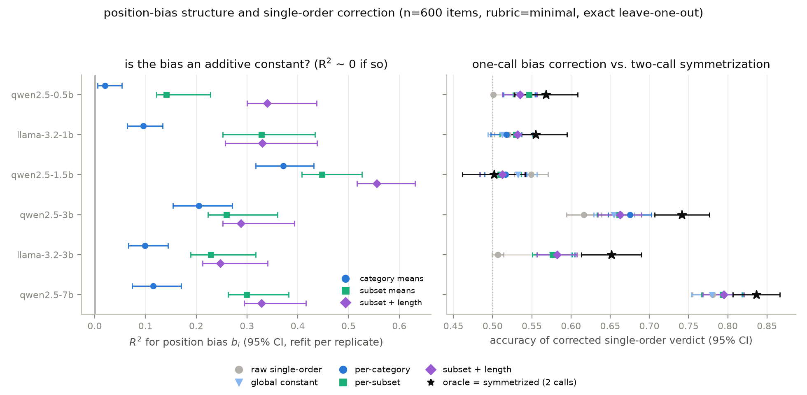

*Left: R² of nested bias predictors per judge — a pure additive shift would
put every marker at 0. Right: the single-order correction ladder from raw
(grey) to oracle (star = two-call symmetrization). The 0.5B subset marker
nearly reaches its star; the 3B markers stall less than halfway; the 1.5B
ladder runs right-to-left.*

### The cross-family point at 3B — Llama-3.2-3B

Same 600 items, both orders, same rubric — the fifth grid, closing the
2×2 of family × (small, 3B-class) scale.

| metric | Llama-1B | Llama-3B | Qwen-3B |
|---|---|---|---|
| raw accuracy cf / rf | 0.312 / 0.728 | 0.990 / 0.023 | 0.368 / 0.865 |
| raw accuracy, random order | 0.520 | 0.507 | 0.617 |
| symmetrized accuracy | 0.555 | **0.652 [0.613, 0.690]** | 0.742 |
| paired Δ, symmetrized − raw | +0.035 | **+0.145 [+0.108, +0.183]** | +0.125 |
| position bias b: median (share > 0) | −0.34 (27.5%) | **+2.34 (99.8%)** | −5.55 (19.2%) |
| positional flip rate | 0.183 | 0.033 | 0.380 |
| pair-level argmax compliance | 0.512 | 0.863 | 1.000 |

- **Finding 21 — both families reverse bias direction with scale, in
  opposite senses, and Llama-3.2-3B is a new always-A machine.** Scaling
  1B → 3B turns Llama's mild B-lean (median b −0.34, b > 0 on 27.5%) into
  a saturated A-lean: b > 0 on 99.8% of items, median +2.34, per-order
  accuracy 0.990 / 0.023 — while the same size step turns Qwen's A-lean
  into the audit's largest B-lean. Bias direction is not a family
  property, not a scale property, and (finding 11) not even a per-model
  property — except here: Llama-3B is the first judge since 0.5B whose
  bias is same-signed across all four categories (means +1.88 to +2.81).
  Its flip rate, 0.033, is the second-lowest in the audit — a black-box
  consistency audit would rank this saturated-bias judge second-best,
  finding 3's failure mode at a scale six times larger. Debiased, the
  family improves with scale: sym 0.652 [0.613, 0.690], paired +0.097
  [+0.047, +0.147] over Llama-1B — no valley between the two measured
  Llama points (no ~2B Llama-3.2 exists to test the Qwen-1.5B dip's
  counterpart, a family-geometry gap recorded in limitations). At matched
  3B scale Qwen leads by +0.090 [+0.048, +0.132]. Symmetrization's rescue
  here is the largest yet (+0.145), and the correction ladder repeats
  finding 20's ceiling: the global constant recovers 48% (0.576), the
  regression 52% (0.583), every rung significantly below the oracle
  (best Δ −0.069 [−0.098, −0.040]) — the bias is compact (SD 1.01) but
  the median content signal |s| = 0.44 is smaller still, so about half
  the items stay bias-dominated after any one-call correction.
- **Finding 22 — in the Llama family, scale buys Chat and deepens the
  adversarial hole; adversarial robustness at 3B is decided by family.**
  Chat: 0.653 → 0.889, paired +0.236 [+0.111, +0.361], with the largest
  length-controlled content coefficient in the audit (joint β_s +4.72
  [+3.32, +9.75]) — where the 1B's Chat advantage was pure
  length-following (finding 13), the 3B's is genuine content. Chat Hard:
  0.435 → 0.348 [0.250, 0.446], *below chance and below its own 1B
  sibling* (paired −0.087 [−0.207, +0.022]), with no length-controlled
  signal left (β_s +0.28 [−0.33, +0.91]): the LLMBar adversarial
  constructions fool the bigger Llama *harder*. Qwen-3B, on identical
  items, holds Chat Hard at 0.576 — a +0.228 [+0.120, +0.337] family gap
  at matched scale. Overall the judge does clear the fitted length floor
  (β_s +1.043 [+0.826, +1.300]; joint − length +0.125 [+0.075, +0.181]) —
  the second judge to do so — with an anti-length lean (β_len −0.669).
- **Finding 23 — post-debiasing calibration is a family property, and the
  format-breaking category migrates with scale.** Llama-3B's symmetrized
  confidence is essentially calibrated: ECE 0.044, signed gap −0.012 —
  slightly *under*confident — at 0.652 accuracy. That breaks the pattern
  finding 15/18 suggested ("calibrated exactly where weakest"): five
  judges in, both Llama sizes and Qwen-0.5B are calibrated after
  symmetrization while the two stronger Qwens are overconfident (ECE
  0.166 / 0.153). Compliance tells a matching family story with a twist:
  pair-level compliance rises 0.512 → 0.863, but the residual
  non-compliance relocates — at 1B it was Reasoning (23% compliant), at
  3B it is Safety (48%, vs 0.986–1.000 everywhere else; the argmax on
  refusal-laden items is prose, not a verdict letter). The readout again
  survives its own audit, in the same direction as finding 8:
  non-compliant items are judged *better* (0.829 vs 0.624 sym, gap
  +0.206 [+0.113, +0.296], Safety-concentrated) — but a parse-and-drop
  harness at 3B would now silently discard half of *Safety*, a different
  benchmark reweighting than at 1B. Which category a small Llama fails to
  format-follow is itself scale-dependent.

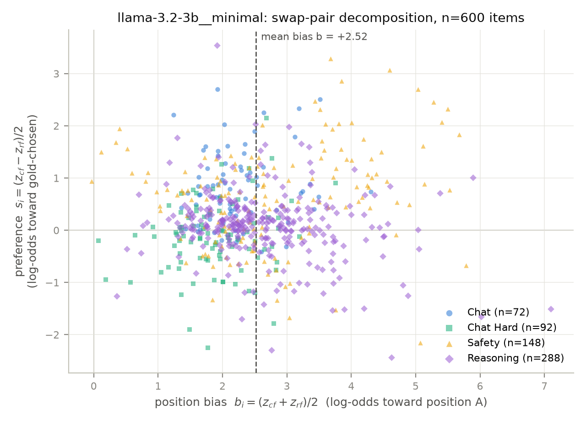

*Llama-3.2-3B's swap-pair decomposition: the entire cloud sits right of
b = 0 — a saturated A-lean opposite in sign to Qwen-3B's, with the Chat
cloud well above s = 0 and the Chat Hard cloud straddling it.*

### Where the category averages hide the story — the per-subset view

Every category number above averages subsets that repeatedly behave in
opposite ways (finding 10 first hit this: Reasoning 0.368 at 1.5B was
math-prm 0.167 against hep-cpp 0.606). The subset view
(`experiments/subset_view.py`) puts honest intervals at full resolution:
per-subset symmetrized accuracy with 95% bootstrap CIs for every judge, next
to each subset's own longer-response floor. Per-subset n is 6–90, so many
intervals are wide — that width is the point: it separates subsets where a
judge is *measurably* broken from subsets where this sample cannot say.

| subset (n, longer floor) | Qwen-0.5B | Qwen-1.5B | Qwen-3B | Qwen-7B | Llama-1B | Llama-3B | Llama-8B |
|---|---|---|---|---|---|---|---|
| math-prm (90, 0.10) | **0.844 [0.77, 0.91]** | 0.167 [0.10, 0.24] | 0.600 [0.50, 0.70] | 0.778 [0.69, 0.86] | 0.589 [0.49, 0.69] | 0.322 [0.23, 0.42] | 0.389 [0.29, 0.49] |
| llmbar-adver-GPTInst (19, 0.16) | **0.684 [0.47, 0.89]** | 0.421 [0.21, 0.63] | 0.421 [0.21, 0.63] | 0.579 [0.37, 0.79] | 0.421 [0.21, 0.63] | 0.211 [0.05, 0.42] | 0.421 [0.21, 0.63] |
| llmbar-adver-neighbor (27, 0.19) | 0.407 [0.22, 0.59] | 0.444 [0.26, 0.63] | 0.259 [0.11, 0.44] | 0.519 [0.33, 0.70] | 0.370 [0.19, 0.56] | 0.148 [0.04, 0.30] | 0.333 [0.15, 0.52] |
| refusals-offensive (20, 0.35) | 0.800 [0.60, 0.95] | 1.000 [1.00, 1.00] | 1.000 [1.00, 1.00] | 1.000 [1.00, 1.00] | 0.750 [0.55, 0.90] | 0.900 [0.75, 1.00] | 0.900 [0.75, 1.00] |
| hep-go (33, 0.56) | 0.424 [0.27, 0.61] | 0.364 [0.21, 0.52] | 0.939 [0.85, 1.00] | 0.909 [0.79, 1.00] | 0.545 [0.36, 0.70] | 0.697 [0.55, 0.85] | 0.909 [0.82, 1.00] |

*(The Qwen-7B and Llama-8B columns were added when their grids completed on
2026-08-26; findings 24–25 were established over the first five judges and
their claims are unchanged — the top-tier columns' own stories are told in
[the 7B section](#the-7b-tier--the-audits-first-signal-dominant-judge) and
[the 8B section](#the-8b-tier--family-beats-scale-llama-31-8b).)*

- **Finding 24 — subset-level accuracy ordering is the judge's local
  length-lean read through the subset's gold-length composition; the
  audit's weakest judge is its best formal-math judge.** On math-prm the
  gold solution is the shorter one on ~92% of pairs, and the three Qwen
  sizes finish 0.844 / 0.167 / 0.600 — a ranking that tracks nothing about
  general capability but exactly tracks each judge's *local* length-lean:
  sign(s) agrees with the longer response on 23.3% of math-prm items at
  0.5B (anti-length), 75.6% at 1.5B (pro-length), 43.3% at 3B
  (near-neutral). The 0.5B's best-in-audit 0.844 (its CI excludes every
  other judge's point estimate) is therefore *not* evidence of math skill —
  it is an anti-verbosity lean pointed in a direction this subset happens
  to reward, the mirror image of the 1.5B collapse. The same judge is also
  the only one above chance on llmbar-adver-GPTInst (0.684 vs ≤0.421 for
  everything larger) — LLMBar's adversarial items are built to punish
  superficial-quality preferences that only emerge with scale — while on
  llmbar-adver-neighbor every judge is at or below chance and Llama-3B
  reaches 0.148 [0.04, 0.30], the lowest subset accuracy in the audit.
  Deployment reading: at these scales, per-subset judge accuracy is
  dominated by where the judge's length/style lean points locally, so a
  benchmark-level average — even a category-level one — predicts almost
  nothing about a specific evaluation domain.
- **Finding 25 — the "compliant-stratum penalty" (day-3 thread) resolves:
  real, but category-localized and family × scale-dependent.** With proper
  unpaired CIs (and a guard: gaps are only computed when both strata have
  ≥5 items — a near-empty stratum bootstraps to an artifactually tight
  interval), the 1B Chat-Hard observation that started the thread does
  *not* reach significance (compliant − non-compliant = −0.182
  [−0.433, +0.070], n = 73/19). The one significant stratum gap in the
  audit is Llama-3B Safety: −0.223 [−0.361, −0.085] (n = 71/77) — on
  refusal-laden items, the model judges *worse* exactly where it manages
  to open with a verdict letter. Whatever induces format discipline on
  Safety co-occurs with worse judgment there; a parse-and-drop harness
  would keep precisely the worse-judged half.

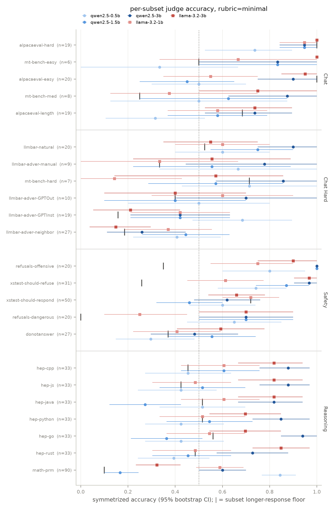

*Symmetrized accuracy per subset (rows, grouped by category and sorted
easiest-to-hardest within each) for all seven judges, with each subset's
longer-response floor as a grey tick. The math-prm row shows the audit's
sharpest inversion: the 0.5B (lightest blue) sits far right of every larger
judge except the Qwen-7B. In the Chat Hard block, accuracy drifts left as
models grow — until the Qwen-7B pulls it back; the Llama-8B stays in the
hole.*

### The 7B tier — the audit's first signal-dominant judge

Qwen2.5-7B, same 600 items, both orders, same rubric — the audit's first
multi-session grid: 1,200 judgments collected across four sessions
(2026-08-01 to 2026-08-26) on hosts prefilling between ~30 and ~55 tok/s,
held together by the resumable store and, from item 68 on, the
coverage-balanced scheduler ([the schedule, not the
guard](#the-schedule-not-the-guard)). The 67-item legacy prefix that made the
in-flight store unrepresentative is history now that the grid covers the full
sample — a finished grid's numbers do not depend on the order it was walked
in. Readout fully valid at a fourth Qwen size: argmax compliance 1.000 across
all 1,200 judgments, median mass on {A, B} ≈ 1.00.

| metric | 3B | 7B |
|---|---|---|
| raw accuracy cf / rf | 0.368 / 0.865 | 0.762 / 0.800 |
| raw accuracy, random order | 0.617 | 0.781 [0.755, 0.806] |
| symmetrized accuracy | 0.742 | **0.837 [0.807, 0.867]** |
| paired Δ, symmetrized − raw | +0.125 | +0.056 [+0.035, +0.076] |
| position bias b: median (share > 0) | −5.55 (19.2%) | **+0.23 (52.0%)** |
| position bias b: sd | 5.47 | 4.89 |
| median \|b\| / median \|s\| | 6.21 / 3.64 | **2.78 / 9.08** |
| items where \|b\| > \|s\| | 0.620 | **0.268** |
| positional flip rate | 0.380 | 0.732 |

- **Finding 28 — the valley resolves into a climb, and 7B is the audit's
  first signal-dominant judge.** Symmetrized accuracy 0.837 [0.807, 0.867]:
  paired deltas on identical items are +0.095 [+0.058, +0.132] over
  Qwen2.5-3B, +0.268 [+0.222, +0.317] over 0.5B, +0.335 [+0.290, +0.380]
  over the 1.5B valley floor, +0.185 [+0.145, +0.227] over Llama-3.2-3B.
  The Qwen arc is now 0.568 → 0.502 → 0.742 → 0.837 — non-monotone at the
  bottom, monotone from 1.5B up, and any pair of points still extrapolates
  the rest wrongly. More structurally: for the first time the content signal
  *dominates* the position bias — |b| > |s| on only 26.8% of items, against
  62.0–99.8% for every other judge; median |s| 9.08 is 3.3x median |b| 2.78,
  where even the best previous judge (3B) had bias 1.7x its signal. And the
  lead is uniform: Chat 0.944, Reasoning 0.854, Safety 0.838, Chat Hard
  0.696 are each the best in the audit — the first judge that holds the top
  spot in all four categories at once (finding 24's caution about
  category-average reads survives at smaller scales, where the lead
  reshuffles per subset).
- **Finding 29 — the flip-rate inversion completes: the audit's best judge
  posts its highest flip rate.** At 0.762 / 0.800 per-order accuracy —
  the first near-symmetric pair in the audit — the 7B's bias has lost its
  *direction* (median b +0.23, b > 0 on 52.0% of items) without losing its
  *dispersion* (sd 4.89, second only to the 3B's 5.47): position bias here
  is a per-item idiosyncrasy, not a lean. The consequence for black-box
  auditing is the sharpest yet: a content-following verdict names a
  different position letter whenever the responses swap seats, so the
  audit's most accurate judge posts its *largest* flip rate, 0.732 — while
  its two always-A machines still post the smallest (0.002, 0.033). Across
  six judges the flip-rate ranking correlates with neither bias magnitude
  nor accuracy at any point in the range; both of its extremes are now
  occupied by the metric's two worst possible readings.
- **Finding 30 — 7B beats the fitted length baseline by the audit's largest
  margin, and is the first judge whose advantage is significant in every
  category.** Value-over-length probe: overall β_s +1.853 [+1.652, +2.126],
  joint − length-only accuracy +0.272 [+0.230, +0.327] — past the 3B's
  +0.205 [+0.156, +0.261]. Per category, the accuracy advantage over the
  fitted floor is significant everywhere for the first time: Chat +0.153
  [+0.083, +0.264], Chat Hard +0.082 [+0.011, +0.201], Reasoning +0.259
  [+0.196, +0.314], Safety +0.432 [+0.169, +0.486] — no earlier judge had a
  significant Chat Hard delta (3B: +0.049 [−0.027, +0.141]). The judge is
  length-neutral overall (sign(s)-vs-length agreement 0.489, the closest to
  0.5 in the audit) and anti-length exactly where the benchmark rewards it:
  math-prm agreement 0.233 with subset accuracy 0.778 [0.69, 0.86] — the
  second-best math-prm score behind the 0.5B's 0.844, but where finding 24
  showed the 0.5B's score was a blind anti-verbosity lean, the 7B's comes
  with the audit's largest length-controlled Reasoning signal (β_s +2.132
  [+1.746, +2.816]).
- **Finding 31 — the one-call correction ceiling keeps falling as judges
  improve, and Qwen overconfidence survives to the top of the family.**
  The additive-shift hypothesis is rejected at a sixth scale (category R²
  0.115 [0.074, 0.170]; subset + length covariates reach only 0.328, leaving
  a 4.01-log-odds residual sd), and the exact-LOO correction ladder posts
  its weakest recovery yet: best fitted rung 0.795 [0.768, 0.821]
  (regression), significantly below the two-call oracle (Δ −0.042
  [−0.060, −0.022]) — about 25% of the symmetrization gain, continuing the
  finding-20 arc within Qwen: 68% at 0.5B, 47% at 3B, 25% at 7B. The
  better the judge, the more idiosyncratic the bias that remains, and the
  more the second call is worth. Note the deployment inversion, though:
  the 7B's *uncorrected* single-call accuracy (0.781) already beats every
  other judge's two-call oracle. Calibration keeps the family signature:
  symmetrized mean confidence 0.958 against accuracy 0.837, ECE 0.121
  [0.093, 0.150] — milder than the 3B's 0.153 but still overconfident,
  making finding 23's split exact at four sizes: every Qwen judge above
  0.5B is overconfident after debiasing, both Llama judges and the 0.5B
  are calibrated.

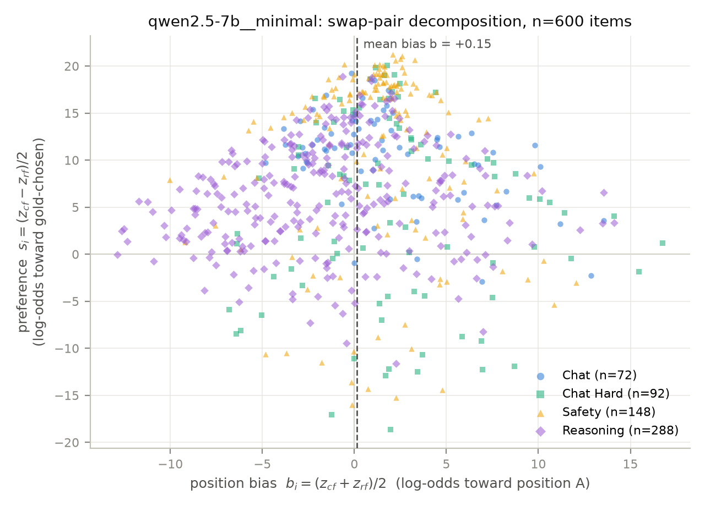

*Qwen2.5-7B's swap-pair decomposition: the cloud is centered on b = 0 —
neither the 0.5B's always-A wall nor the 3B's B-lean — and stretched along
the s axis, with most items far above or below s = 0. This is what a
signal-dominant judge looks like in the decomposition; no other judge in the
audit produces this shape.*

### The 8B tier — family beats scale (Llama-3.1-8B)

Llama-3.1-8B, same 600 items, both orders, same rubric — the scaling grid's
final planned point, and the first grid collected entirely under the
coverage-balanced scheduler: 1,200 judgments in one 190-minute session at
0.10 judg/s, with the partial store never further than 0.006 total-variation
from the benchmark's composition at any 100-judgment checkpoint. (Note the
release-version wrinkle: the 1B/3B points are Llama-*3.2*, the 8B is
Llama-*3.1* — Meta ships them as one herd, but the version difference is a
confound the family line absorbs; recorded in limitations.) Compliance is
the Llama signature again: 0.910 per-item, with every non-compliant item in
Safety (finding 35).

| metric | Llama-3B | Llama-8B | (Qwen-7B) |
|---|---|---|---|
| raw accuracy cf / rf | 0.990 / 0.023 | 0.613 / 0.752 | 0.762 / 0.800 |
| symmetrized accuracy | 0.652 | **0.723 [0.688, 0.758]** | 0.837 |
| position bias b: median (share > 0) | +2.34 (99.8%) | −0.59 (29.0%) | +0.23 (52.0%) |
| median \|b\| / median \|s\| | 2.34 / 0.44 | 0.81 / 1.17 | 2.78 / 9.08 |
| items where \|b\| > \|s\| | 0.967 | **0.335** | 0.268 |
| positional flip rate | 0.033 | 0.665 | 0.732 |
| sign(s)-vs-length agreement | 0.596 | **0.633** | 0.489 |

- **Finding 32 — the two family arcs never cross: at the top tier, family
  beats scale.** Llama's arc is monotone — 0.555 → 0.652 → 0.723, paired
  +0.072 [+0.032, +0.110] over its own 3B — with no valley (the ~2B gap
  caveat from finding 21 stands), and 8B is the audit's second
  signal-dominant judge: |b| > |s| on 33.5% of items, per-order accuracy
  0.613/0.752, bias direction flipped back from the 3B's saturated
  always-A to a mild B-lean (median −0.59 — Llama has now reversed bias
  direction *twice* within one family line). But on identical items
  Llama-3.1-8B is statistically indistinguishable from Qwen2.5-3B
  (−0.018 [−0.055, +0.018]) — a judge 2.7x smaller — and significantly
  below Qwen2.5-7B (−0.113 [−0.150, −0.078]). Choosing the right family
  buys more than doubling the parameters within the wrong one.
- **Finding 33 — the adversarial hole is a family property all the way
  up.** Chat Hard across Llama: 0.435 → 0.348 → 0.522 — the 8B climbs back
  to chance and stops there, −0.174 [−0.272, −0.076] behind Qwen2.5-7B on
  the identical 92 items, with llmbar-adver-neighbor at 0.333 and
  llmbar-adver-GPTInst at 0.421. Meanwhile Chat reaches **0.958** — the
  best single-category score in the audit, +0.014 [−0.028, +0.056] over
  Qwen-7B (a dead heat). Finding 22's diagnosis holds at the top tier:
  Llama scale keeps buying Chat and never buys adversarial robustness —
  a deployment chooses between a family that wins easy pairs and one that
  survives hard ones.
- **Finding 34 — the audit's strongest length-controlled signal rides its
  strongest length lean, and pays for it on math-prm.** Value-over-length:
  β_s +2.376 [+1.948, +2.998], the largest coefficient in the audit
  (Qwen-7B: +1.853); joint − length-only +0.233 [+0.185, +0.283], second
  only to Qwen-7B's +0.272 — the fourth judge over the fitted floor. Yet
  its raw preference follows length more than any judge measured:
  sign(s)-vs-length agreement 0.633 (Qwen-7B: 0.489), and the benchmark
  charges for it — math-prm lands at 0.389 [0.29, 0.49], *below chance*,
  where Qwen-7B holds 0.778 (finding 24's mechanism at the top tier: the
  subset's short-gold composition punishes exactly this lean). On Chat
  Hard the accuracy advantage over the length floor is null
  (+0.027 [−0.022, +0.136]) even though a weak coefficient exists
  (β_s +0.755 [+0.262, +1.467]) — signal too small to move accuracy where
  it matters most.
- **Finding 35 — at 8B the one-call ceiling holds at ~25%, finer
  corrections actively hurt, and the Safety compliance migration
  replicates.** Additive shift rejected at a seventh scale (category R²
  0.124 [0.082, 0.177]); subset+length reaches 0.492 — the second-most
  predictable bias in the audit (length covariates add +0.16 R², the
  family's length sensitivity showing up in its *bias* too). The
  exact-LOO ladder: best rung is *global* 0.692 [0.662, 0.721] — 24% of
  the symmetrization gain, matching the 7B's ~25% ceiling — while
  *category* (0.676) and *subset* (0.673) land *below* no-correction
  (0.682): the finer the fitted rung, the worse, a milder cousin of the
  1.5B's backwards ladder. Calibration: sym ECE 0.101 [0.074, 0.138],
  signed gap +0.042 — Llama's first mildly overconfident member
  (1B +0.005, 3B −0.012), still well under Qwen-7B's +0.121, so the
  family split survives with a blurred edge. And finding 25's stratum
  result replicates exactly: non-compliance is 100% Safety-concentrated
  (0.635 compliant there, 1.000 everywhere else), and Safety's compliant
  stratum judges *worse* (−0.179 [−0.306, −0.046]) — a parse-and-drop
  harness at 8B would again keep the worse-judged half.

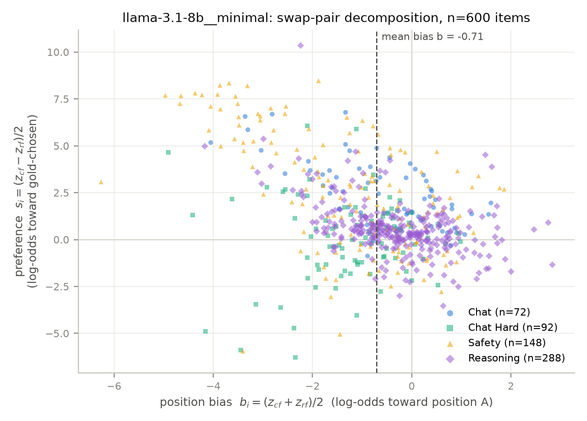

*Llama-3.1-8B's swap-pair decomposition: compact around a mild B-lean with
the signal axis stretched — signal-dominant like Qwen-7B, but at a fraction
of the |s| scale (median 1.17 vs 9.08), which is the geometric version of the
family gap.*

### The rubric axis — the same judges under a different prompt

Everything above holds the rubric fixed and swaps the *order*; this section
holds the order machinery fixed and swaps the *rubric*. The `detailed`
template (defined alongside `minimal` in `src/prompts.py` since day 1) asks
for the same one-letter verdict but spells out four explicit criteria —
adherence, accuracy, helpfulness, safety. Because both stores cover the same
600 items × both orders, the two rubrics compare exactly like the two
orders: paired per item, in log-odds (`src/rubric_pair.py`,
`experiments/rubric_view.py`). The first two grids were the audit's two
smallest judges — chosen first because their minimal-rubric pathologies
(the 0.5B's always-A saturation, the 1B's partial compliance) are the most
interesting to test for prompt dependence; the third is the 1.5B valley
judge, the first point where the reference preference is substantially
larger than the perturbation; the fourth is the 3B, the first
above-the-valley judge and the first with a large-magnitude bias to test
prompt-side debiasing against; the fifth is the 7B — the audit's best and
most signal-dominant judge, closing the Qwen line and asking whether any
of the rubric's effects survive where the content signal dwarfs the
perturbation; the sixth is the Llama-3B — the cross-family counterpart at
the 3B scale, an always-A machine under the minimal rubric (finding 21)
and the first test of whether the arc's ordering and the 1B's compliance
collapse are Llama properties or small-judge properties; the seventh and
last is the Llama-8B — the closing point, run as a pre-registered
out-of-sample test of the finding-46 ratio law (predictions committed the
morning of 2026-08-31, before the store held a single judgment). Deltas
read detailed − minimal; the
committed summary is
`results/summary/rubric_pair__minimal_vs_detailed.{json,md}`, and the
sign(s)-vs-length row is the tie-excluded join each store's summary now
carries (`sign_length_agreement` in
`results/summary/{model}__{rubric}.json` — overall, per category, and per
subset; findings 10/17/24/30/34 quote the same numbers).

| | Qwen2.5-0.5B | Llama-3.2-1B | Qwen2.5-1.5B | Llama-3.2-3B | Qwen2.5-3B | Qwen2.5-7B | Llama-3.1-8B |
|---|---|---|---|---|---|---|---|
| sym acc, minimal → detailed | 0.568 → 0.592 | 0.555 → 0.627 | 0.502 → 0.495 | 0.652 → 0.663 | 0.742 → 0.763 | 0.837 → 0.845 | 0.723 → 0.722 |
| paired Δ sym acc | +0.023 [−0.020, +0.067] | **+0.072 [+0.018, +0.123]** | −0.007 [−0.042, +0.028] | +0.012 [−0.022, +0.045] | +0.022 [−0.003, +0.047] | +0.008 [−0.013, +0.030] | −0.002 [−0.025, +0.022] |
| paired Δ raw acc | −0.001 [−0.003, +0.000] | +0.011 [−0.011, +0.033] | −0.018 [−0.039, +0.003] | +0.007 [−0.002, +0.017] | **+0.033 [+0.016, +0.050]** | +0.011 [−0.009, +0.030] | **−0.045 [−0.065, −0.025]** |
| **rubric flip rate** | **0.303 [0.268, 0.340]** | **0.432 [0.393, 0.472]** | **0.190 [0.160, 0.222]** | **0.172 [0.142, 0.202]** | **0.102 [0.078, 0.127]** | **0.068 [0.050, 0.090]** | **0.082 [0.060, 0.105]** |
| positional flip rate (detailed) | 0.000 | 0.168 | 0.298 | 0.068 | 0.438 | 0.750 | 0.545 |
| r(s) across rubrics | 0.610 [0.553, 0.663] | 0.257 [0.140, 0.379] | 0.834 [0.798, 0.863] | 0.857 [0.825, 0.886] | 0.912 [0.893, 0.928] | 0.916 [0.900, 0.929] | 0.941 [0.930, 0.951] |
| r(b) across rubrics | 0.735 [0.686, 0.778] | 0.527 [0.444, 0.600] | 0.879 [0.855, 0.898] | 0.720 [0.664, 0.767] | 0.845 [0.815, 0.870] | 0.702 [0.656, 0.743] | 0.813 [0.775, 0.848] |
| median b, minimal → detailed | +3.65 → +3.03 | −0.34 → **+0.62** | +0.83 → +0.23 | +2.34 → +1.96 | −5.55 → −3.51 | +0.23 → **−1.25** | −0.59 → −0.50 |
| paired Δ \|b\| | −0.63 [−0.69, −0.57] | +0.64 [+0.55, +0.73] | −0.36 [−0.41, −0.31] | −0.47 [−0.53, −0.41] | **−1.80 [−2.01, −1.59]** | −0.75 [−0.99, −0.51] | −0.27 [−0.32, −0.21] |
| paired Δ \|s\| | −0.165 [−0.194, −0.137] | +0.108 [+0.072, +0.146] | −0.294 [−0.341, −0.245] | −0.070 [−0.101, −0.040] | −0.868 [−1.070, −0.669] | −1.812 [−2.045, −1.580] | −0.728 [−0.803, −0.654] |
| sign(s)-vs-length agreement | 0.491 → 0.476 | 0.622 → **0.408** | 0.571 → 0.522 | 0.596 → 0.569 | 0.547 → 0.549 | 0.489 → 0.481 | 0.633 → **0.650** |
| compliance, minimal → detailed | 1.000 → 1.000 | 0.512 → **0.275** | 1.000 → 1.000 | 0.863 → 0.818 | 1.000 → 1.000 | 1.000 → 1.000 | 0.910 → 0.880 |

- **Finding 36 — the symmetrized verdict is rubric-fragile at small scale:
  30–43% of debiased verdicts change with the rubric text alone, an order
  of magnitude more churn than the net accuracy movement.** At 0.5B, 30.3%
  [26.8, 34.0] of items flip their symmetrized verdict between rubrics —
  against a positional flip rate of 0.000 — and the flips are symmetric
  noise: 84 right→wrong vs 98 wrong→right, netting the null +0.023. At 1B
  the rubric flip rate is 0.432 [0.393, 0.472] (259 items flipped, net +43)
  and cross-rubric r(s) is 0.257: the order-invariant preference under one
  rubric barely predicts the other. The flips sit
  exactly where the white-box account says they must — where the preference
  is weakest (0.5B flip rate by \|s\| quartile: 0.42 / 0.40 / 0.30 / 0.09;
  1B: 0.52 / 0.43 / 0.49 / 0.29): with median \|s\| ≈ 0.15–0.24 log-odds,
  any perturbation of comparable scale re-randomizes the sign. The
  order-swap consistency that "debiasing by symmetrization" buys is
  therefore not verdict *stability* at these scales — a judge can be
  perfectly order-consistent and still an unreliable measurement
  instrument, because the prompt wording is a noise source of the same
  order as the signal. Black-box rubric-consistency audits exist; what the
  log-odds view adds is the mechanism (flips concentrate at small \|s\|)
  and the decomposition of *what* moved (s, b, or both — below).
- **Finding 37 — at 0.5B the detailed rubric contracts the whole log-odds
  distribution and touches nothing structural.** Every summary shrinks
  toward zero — Δ\|b\| −0.63 [−0.69, −0.57] (median +3.65 → +3.03), but
  Δ\|s\| −0.165 [−0.194, −0.137] with it, proportionally *more* (−30% vs
  −17%), and mean Δs is slightly *away* from gold (−0.048
  [−0.083, −0.012]). Bias dominance rises to 100.0% of items, per-order
  accuracy stays exactly 1.000 / 0.000, flip rate falls to exactly 0: the
  judge remains a pure always-A machine that reads four explicit criteria,
  including "do not let the order influence you", and expresses them as a
  17% smaller push toward position A. Prompt-side instruction is not a
  debiasing lever here. And position bias is the more rubric-*stable*
  component (r(b) 0.735 vs r(s) 0.610): the judge's most reproducible
  property is its pathology.
- **Finding 38 — at 1B the rubric reverses both of the judge's directional
  properties, and the significant accuracy gain is a re-aimed length lean,
  not new judgment.** The detailed rubric flips the 1B's position bias from
  a B-lean to an A-lean (median b −0.34 → +0.62, mean −0.34 → +1.04,
  Δ\|b\| +0.64 [+0.55, +0.73]) — after findings 11, 21 and 32 showed bias
  direction is not a family, scale, or per-model property, it is now not
  even a property of a fixed (model, sample) pair: the rubric text alone
  reverses it. The length orientation reverses with it:
  sign(s)-vs-length agreement 0.622 → 0.408, from the family's
  characteristic length-following to anti-length. That single reversal
  explains the category pattern of the headline +0.072 [+0.018, +0.123]
  exactly: Reasoning — where the longer answer is usually wrong — gains
  +0.132 [+0.059, +0.205], while Chat — the one category where longer is
  usually right (finding 13) — *loses* −0.222 [−0.375, −0.069]. Finding
  24's mechanism (accuracy = the local length-lean read through the
  subset's gold-length composition), previously seen across judges, here
  operates *within one judge across prompts*. Meanwhile compliance
  collapses, 0.512 → 0.275 (Chat 0.625 → 0.125, Safety 0.838 → 0.351;
  Reasoning was already broken at 0.226 and stays there): the longer
  instruction makes the model *less* able to open with a verdict letter
  while judging *better* — the sharpest form yet of findings 8/25/35's
  warning, since a parse-and-drop harness under the detailed rubric would
  keep 165 of 600 items (27.5%) and they are the *worse*-judged stratum
  (0.570 vs 0.648, gap −0.079 [−0.167, +0.009]).
- **Finding 39 — rubric fragility is the signal-to-perturbation ratio, not
  a property of small judges, and a two-parameter perturbation model
  predicts where the flips are.** The 1.5B grid closes the flip-rate arc at
  0.303 / 0.432 / 0.190 (0.5B / 1B / 1.5B) — ordered exactly by the
  judges' median reference \|s\| (0.235 / 0.144 / 0.503): the *most*
  fragile judge is not the smallest model but the one with the weakest
  preference. The falsifiable version of finding 36's "flips live at small
  \|s\|" is the model s_detailed = λ·s_minimal + ε
  (`src/rubric_pair.fragility_fit`, `experiments/rubric_fragility.py`):
  fitted per judge (λ 0.345 / 0.374 / 0.522, σ 0.236 / 0.532 / 0.418), the
  implied flip probability Φ(−λ\|s\|/σ) reproduces the observed
  quartile profiles — at 0.5B nearly exactly (predicted 0.47 / 0.40 / 0.29 /
  0.10 against observed 0.42 / 0.40 / 0.30 / 0.09). At 1.5B the observed
  mid-quartiles fall *below* the prediction (0.26 vs 0.34, 0.11 vs 0.18):
  where cross-rubric r(s) is high (0.834), the rubric moves the preference
  *coherently*, so fewer signs flip than an equal-sized noise perturbation
  would produce. The model is a diagnostic, not a law — and its failure
  direction is itself informative.
- **Finding 40 — at 1.5B the detailed rubric contracts both components and
  halves the order asymmetry without touching the symmetrized verdict —
  and finding 38's direction reversal does not replicate where bias is
  sizable.** The contraction generalizes within the family: λ ≈ 0.52 on s,
  median \|b\| 1.09 → 0.67 (Δ\|b\| −0.36 [−0.41, −0.31]), median b
  +0.83 → +0.23 — shrunk 3.6-fold but the *same sign*, so the
  bias-direction reversal the rubric produced at 1B (median \|b\| ≈ 0.3,
  the perturbation's own scale) reads as a small-\|b\| phenomenon, not a
  general rubric power. The per-order split narrows from 0.805/0.293 to
  0.617/0.445 — the anti-order instruction buys real single-call order
  robustness (gap 0.512 → 0.172) — yet sym acc is exactly unmoved (−0.007
  [−0.042, +0.028]): prompt-side debiasing pays only if you were going to
  judge in one order anyway. And two aggregates freeze while their items
  churn: positional flip rate is 179/600 under *both* rubrics with only
  101 items shared between the two flip sets, bias dominance 421/600 under
  both with 343 shared — finding 36's lesson (aggregate stability is not
  item-level stability) illustrated by exact numerical coincidence.
- **Finding 41 — the valley is rubric-invariant: the 1.5B's defining
  pathologies survive a rubric that spells out what to judge.** Sym acc
  0.502 → 0.495 (null), below-chance Reasoning 0.368 → 0.375, length
  orientation weakened but not re-aimed (sign-agreement 0.571 → 0.522),
  compliance 1.000 → 1.000. Nothing about the valley — the wrong-way
  Reasoning preference (finding 10), the at-chance debiased accuracy
  (finding 9) — is a prompt artifact; it is a property of the model at
  this scale, now measured under two instructions. The family contrast
  sharpens too: where the detailed rubric collapsed the 1B Llama's
  compliance 0.512 → 0.275, both Qwen judges hold exactly 1.000 under
  both rubrics — format discipline under instruction change is a family
  property, like calibration (finding 23).
- **Finding 42 — the fragility arc extends to 3B on the model's own
  prediction, and the coherent-movement deviation grows with judge
  quality.** Flip rate 0.102 [0.078, 0.127] at median \|s\| 3.64 — the
  four-judge arc 0.303 / 0.432 / 0.190 / 0.102 stays ordered by \|s\|
  throughout, and cross-rubric r(s) reaches 0.912. The fit's parameters
  move with scale in an interpretable way: λ climbs 0.345 → 0.374 → 0.522
  → 0.767 (the contraction weakens — the detailed rubric compresses a 3B's
  preferences by only ~23% against ~65% at 0.5B) while σ grows with the
  judge's log-odds scale but slower than \|s\| does. And the one systematic
  miss deepens on schedule: observed flips in the weak-\|s\| quartiles fall
  ever further below the Gaussian prediction (Q1 0.287 vs 0.394, Q2 0.087
  vs 0.201) as r(s) rises — the better the judge, the more a rubric change
  moves its preferences *coherently* rather than noisily, which is exactly
  what the homoskedastic model cannot represent.
- **Finding 43 — prompt-side debiasing works hardest where the bias is
  largest, but it buys raw accuracy and order balance, never symmetrized
  quality — and it un-saturates the flip rate.** The 3B carries the
  audit's largest position bias (median b −5.55) and the detailed rubric
  produces the audit's largest prompt-side reduction: Δ\|b\| −1.80
  [−2.01, −1.59], median b to −3.51 — yet the direction survives here as
  at 1.5B, so across four judges the rubric has reversed bias direction
  only where \|b\| was at the perturbation's own scale (finding 40). What
  the shrink buys is concrete but bounded: raw accuracy +0.033
  [+0.016, +0.050] (chosen-first, the order the B-lean punishes, rises
  0.368 → 0.428) while sym acc moves +0.022 [−0.003, +0.047], null — the
  two-call verdict already had the bias subtracted, so the prompt can
  only re-balance the single calls. And the positional flip rate *rises*
  0.380 → 0.438 (Δ +0.058 [+0.027, +0.092]): a smaller \|b\| loses more
  arguments to the content signal, so the judge flips letters more often
  under order swap — finding 3's inversion driven within one judge by the
  prompt alone. Per category everything is quiet (all Δ sym null, flips
  0.09–0.12 everywhere): at 3B the rubric is a global geometry change,
  not a category treatment.
- **Finding 44 — the fragility arc closes its fifth point on the model's
  prediction, and the coherent-movement deviation peaks at 3B rather than
  growing with judge quality.** The 7B's rubric flip rate is 0.068
  [0.050, 0.090] at median \|s\| 9.08 — the five-judge arc
  0.303 / 0.432 / 0.190 / 0.102 / 0.068 stays ordered by the reference
  \|s\| (0.235 / 0.144 / 0.503 / 3.64 / 9.08) from end to end, and the
  day-11 registered prediction ("≈ 0.05 or lower") lands at the CI's edge:
  close, slightly conservative-optimistic, and the fitted model's own
  quartile aggregate (~0.079) is nearer the observation than the guess
  was. The fit's trajectory bends in an informative way: λ plateaus
  (0.522 → 0.767 → **0.777**) — past 3B the detailed rubric stops
  *proportionally* compressing preferences — while the absolute
  contraction is the audit's largest (Δ\|s\| −1.81 [−2.05, −1.58],
  median 9.08 → 7.00) because σ keeps pace (2.577). And finding 42's
  extrapolation breaks, honestly: with r(s) essentially tied
  (0.916 vs 0.912), the weak-\|s\| over-prediction *narrows* at 7B
  (Q1 observed 0.240 vs predicted 0.283, ratio 0.85, against 3B's
  0.287 vs 0.394, ratio 0.73; Q2 0.027 vs 0.033 against 0.087 vs 0.201).
  The coherent-movement residual is not a monotone function of judge
  quality — it peaks at 3B, and at the family's top the two-parameter
  Gaussian model very nearly suffices.
- **Finding 45 — at the family's top the prompt-side lever stops paying:
  it re-signs a balanced bias rather than shrinking a large one, and for
  the first time in the audit nothing else moves.** The 7B's
  minimal-rubric position bias is the audit's most *balanced* — mean b
  +0.15, median +0.23, 52.0% of items leaning A — though individual items
  still carry median \|b\| 2.78. The detailed rubric does not shrink that
  bias; it pushes it through zero into a B-lean: mean b → −1.30, median
  → −1.25, A-leaning items → 37.0% (Δb −1.45 [−1.73, −1.18], negative in
  all four categories), with only a modest magnitude contraction
  (Δ\|b\| −0.75 [−0.99, −0.51], median \|b\| 2.78 → 2.48). This
  replicates finding 40's boundary at the opposite end of the family:
  the rubric reverses net bias direction exactly where the net lean sits
  at the perturbation's own scale (1B median −0.34, 7B median +0.23; the
  3B's −5.55 merely shrinks). And where the 3B at least bought raw
  accuracy and order balance (finding 43), at 7B every purchase is null:
  raw +0.011 [−0.009, +0.030], sym +0.008 [−0.013, +0.030], positional
  flip rate 0.732 → 0.750 (Δ +0.018 [−0.020, +0.055]) — still the
  audit's highest, per finding 29's inversion — sign(s)-vs-length
  agreement 0.489 → 0.481, compliance 1.000 → 1.000 (fourth Qwen point).
  The only significant category movements cancel: Safety +0.047
  [+0.014, +0.088] against a borderline Chat Hard loss of −0.065
  [−0.130, 0.000] — and Chat Hard is also where the rubric flips most
  verdicts (0.109 vs 0.04–0.07 elsewhere), the adversarial category
  living at the smallest \|s\|. A practitioner reading this row gets the
  audit's bluntest verdict on prompt-side debiasing: by the time a judge
  is good enough to trust, the rubric text changes *which* bias you have,
  not *whether* you have one — and buys nothing the two-call symmetrized
  verdict didn't already own.
- **Finding 46 — the \|s\|-ordering law bends exactly where the model says
  it should: fragility is λ\|s\|/σ, not \|s\| — and the fitted ratio orders
  all six judges strictly.** Llama-3B flips 0.172 [0.142, 0.202] at
  reference median \|s\| 0.445 — *below* the 1.5B's 0.190 at \|s\| 0.503,
  the first adjacent pair out of order by reference preference strength
  (the CIs overlap, so the raw-\|s\| arc bends rather than breaks; this
  outcome sat outside the pre-registered [0.19, 0.30] band, logged in the
  morning's commit before the grid ran). The fragility model itself
  supplies the refinement: ordering the six judges by the fitted
  signal-to-perturbation ratio λ·med\|s\|/σ (0.101 / 0.344 / 0.628 /
  0.925 / 1.284 / 2.738) reproduces the observed flip-rate ordering
  exactly (0.432 / 0.303 / 0.190 / 0.172 / 0.102 / 0.068), and the model's
  own predicted overall flip rates are monotone in it too. Llama-3B is
  less fragile than its preference strength alone predicts because its
  λ = 0.781 is the audit's largest — above the Qwen plateau (0.767/0.777)
  that Qwen only reaches at 3B — while σ = 0.376 undercuts the
  \|s\|-matched Qwen-1.5B's 0.418, answering day 11's family question:
  the 1B's large σ is not a Llama property. Day 11's "ordered by median
  \|s\|" was the coarse shadow of Φ(−λ\|s\|/σ), legible only while λ/σ
  happened to be similar across the judges measured so far.
- **Finding 47 — at Llama-3B the detailed rubric is a null lever with the
  family's fingerprints: no compliance collapse, shrinkage without
  reversal, and the only (borderline) purchase sits in the adversarial
  hole.** Compliance 0.863 → 0.818 (Δ −0.045 [−0.063, −0.028]) — a real
  but modest decline concentrated where compliance was already broken
  (Safety 0.480 → 0.439, the finding-35 migration target; every other
  category ≥ 0.917) — so the 1B's halving (0.512 → 0.275) reads as a 1B
  phenomenon, not a Llama-under-long-rubric phenomenon. The always-A
  bias shrinks with its sign intact (median b +2.34 → +1.96, Δ\|b\| −0.47
  [−0.53, −0.41], b > 0 on 99.5% of items), exactly as the findings-40/45
  boundary predicts at \|b\| ≫ perturbation scale — pre-registered and
  confirmed. Both accuracies are null (Δ sym +0.012 [−0.022, +0.045],
  Δ raw +0.008 [−0.002, +0.017]): where Qwen-3B's prompt-side lever at
  least bought raw accuracy and un-saturated its flip rate (finding 43),
  the same lever at the same scale in Llama buys nothing — though the
  positional flip rate moves the same direction at a tenth the bias
  magnitude (0.033 → 0.068, Δ +0.035 [+0.017, +0.053]). Length
  orientation weakens without re-aiming (sign(s)-vs-length 0.596 → 0.569;
  the 1B's reversal stays unique). The one category movement is the
  interesting one: Chat Hard — the audit's only below-chance adversarial
  hole (finding 22) — improves 0.348 → 0.424 (Δ +0.076 [−0.011, +0.163],
  borderline), narrowing but not escaping below-chance under either
  rubric, and echoing Qwen-7B's finding-45 pattern of Chat Hard carrying
  the largest rubric sensitivity in both directions.
- **Finding 48 — the rubric axis closes at seven judges: the λ\|s\|/σ
  ordering survives its out-of-sample test, while every simpler
  regularity around it fails cross-family.** The Llama-8B grid was run as
  a pre-registered test (predictions committed 2026-08-31 before any
  results existed): the raw-\|s\| law predicted a flip rate in
  [0.102, 0.190]; the observed 0.082 [0.060, 0.105] falls below it —
  the second bend, and this time the 8B sits under *both* of its
  smaller-\|s\| neighbors. The registered structural form of finding 46
  passes instead: fitted after the fact, the 8B's ratio λ·med\|s\|/σ =
  1.370 slots between Qwen-3B (1.284) and Qwen-7B (2.738), and its
  observed flip rate lands exactly between theirs — the fitted ratios
  order all seven judges strictly
  (0.101/0.344/0.628/0.925/1.284/1.370/2.738 against
  0.432/0.303/0.190/0.172/0.102/0.082/0.068). Nothing weaker survives
  the family boundary: λ is not a top-scale plateau (0.583 at 8B, under
  the three ≥3B fits at 0.767–0.781), and σ is not \|s\|-scaled (Llama
  holds 0.38–0.53 across 1B → 8B while Qwen grows 0.24 → 2.58 alongside
  its \|s\|). The model's *calibration* also degrades even as its
  ordering holds: predicted overall flip 0.151 vs observed 0.082, the
  audit's largest over-prediction, at the audit's highest cross-rubric
  coherence (r(s) 0.941 [0.930, 0.951]) — so the coherent-movement
  residual (findings 39/42/44) is family-shaped like the parameters, not
  a function of size or judge quality. The honest summary of the
  fragility model at seven judges: it orders them; it does not yet
  predict any one of them.
- **Finding 49 — at 8B the detailed rubric contracts signal faster than
  bias, and for the first time the lever's purchase is negative:
  one-call accuracy falls while the two-call verdict doesn't move.**
  λ = 0.583 means the rubric compresses the 8B's preferences by 42%
  (median \|s\| 1.169 → 0.682) while its bias barely narrows (median
  \|b\| 0.808 → 0.714, −12%; Δ\|b\| −0.27 [−0.32, −0.21]) —
  bias-dominance share rises 0.335 → 0.455 and the mean gold-ward
  preference halves (1.177 → 0.643). The bill lands entirely in the
  bias-opposed order: chosen-first raw accuracy falls 0.613 → 0.518
  while rejected-first holds (0.752 → 0.757), netting Δ raw −0.045
  [−0.065, −0.025] — the audit's first significantly harmful rubric
  effect — while Δ sym is exactly null (−0.002 [−0.025, +0.022]): the
  symmetrized verdict shrugs off a prompt change that costs a one-call
  deployment 4.5 points. The direction boundary tightens too: median b
  −0.59 → −0.50, shrinkage without reversal, so re-signing (observed at
  \|b\| 0.34 and 0.23) is now bracketed away below \|b\| ≈ 0.6. And two
  one-call metrics move against the Qwen pattern: the positional flip
  rate *falls* 0.665 → 0.545 (Δ −0.120 [−0.157, −0.082], where Qwen-3B
  and Llama-3B un-saturated upward), and the length orientation
  *strengthens* (sign(s)-vs-length 0.633 → 0.650, where every prior
  judge weakened or reversed) — finding 34's length lean survives the
  rubric that dampens everything else. Compliance replicates the
  Llama-3B pattern, not the 1B collapse: 0.910 → 0.880, paid where
  Safety already bled (0.635 → 0.601) plus a small new Reasoning leak
  (1.000 → 0.955); the finding-35 Safety hole stays open at 8B under
  both rubrics. Chat Hard again posts the highest rubric flip rate
  (0.109) — adversarial items live at small \|s\| for every judge in the
  audit, including its most rubric-coherent one.

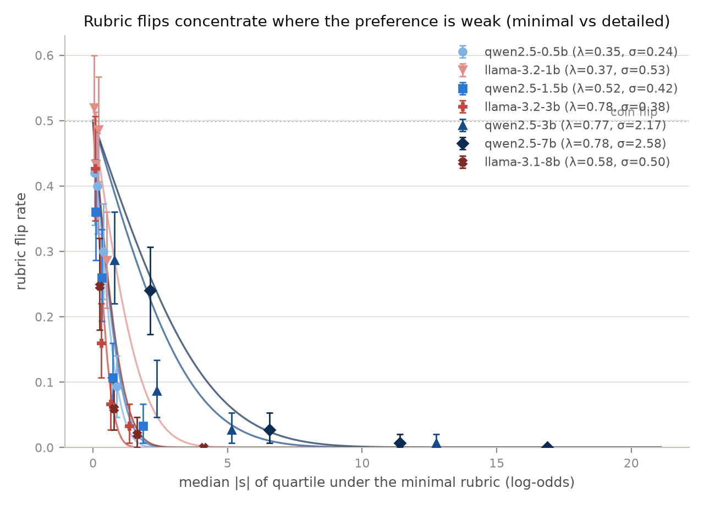

*Observed rubric flip rate per quartile of the minimal-rubric \|s\| (points,
95% bootstrap CIs) against each judge's fitted Φ(−λ\|s\|/σ) curve (lines) —
findings 39, 42, 44, 46 and 48 drawn directly. All seven judges decay from
near coin-flip at weak preference toward zero; the small Qwen curves nearly
coincide despite a 3x parameter gap, while the 1B Llama's larger σ keeps it
fragile out to \|s\| ≈ 2 and the 3B and 7B Qwen curves stretch across their
much wider \|s\| ranges. The Llama-3B curve drops fastest of the small-\|s\|
judges, and the Llama-8B curve slots between the two big Qwens exactly
where its fitted ratio says it should — the out-of-sample confirmation of
finding 46's ordering (finding 48). The observed points sitting below
their own curves in the weak-\|s\| quartiles is the coherent-movement
residual described in findings 39 and 42 — deepest at Qwen-3B among the
Qwens (finding 44) but largest overall at Llama-8B (finding 48), so it
tracks neither size, nor r(s), nor family monotonically.*

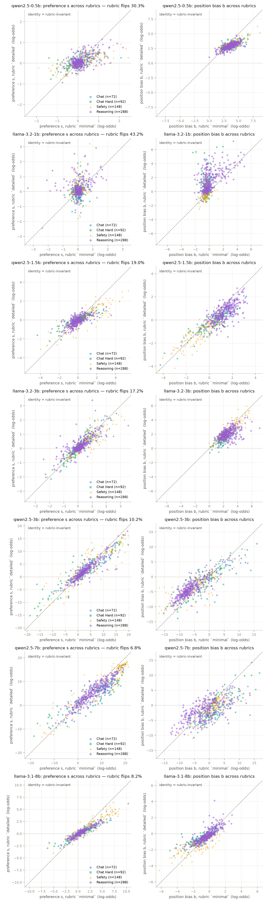

*Item-paired log-odds across rubrics (rows: Qwen-0.5B, Llama-1B, Qwen-1.5B,
Llama-3B, Qwen-3B, Qwen-7B, Llama-8B; left: preference s, right: position
bias b; dashed line = rubric-invariant). The
0.5B bias cloud sits uniformly below the identity in the far positive
region — contraction without structural change (finding 37) — while the 1B
bias cloud crosses zero upward: the rubric reverses the lean (finding 38).
The two small judges' preference panels are near-blobs around the origin —
finding 36 drawn directly — where the 1.5B's hugs a flattened identity
line: the contracted-but-coherent regime of findings 39–40. The Llama-3B
row is the near-identity version of that regime — the steepest small-\|s\|
λ in the audit (0.781, finding 46) beside an all-positive bias cloud that
shrinks without crossing zero (finding 47). The Qwen-3B row is the
contracted-but-coherent regime at full strength: a tight preference cloud
along the identity (r(s) 0.912) beside a bias cloud shifted bodily toward
zero from deep in the negative region (finding 43). The 7B row shows the
endpoint — the
tightest preference cloud yet, beside a balanced bias cloud pushed bodily
*through* zero into a B-lean rather than shrunk (finding 45). The Llama-8B
row closes the axis with the audit's most coherent preference panel
(r(s) 0.941) hugging a visibly flattened identity — the λ = 0.583 signal
contraction of finding 49 — beside a modest B-lean bias cloud that shrinks
without crossing zero, the shrinkage-without-reversal half of the
findings-40/45 boundary.*

## Planned experiments

1. **Scaling grid** — Qwen2.5-Instruct 0.5B/1.5B/3B/7B, Llama-3-Instruct
   1B/3B/8B (Q4_K_M GGUF), on a stratified sample in both orders; trivial
   floors (always-A, longer-response, random) alongside. *(Complete — all
   seven grids done above; the scaling axis closed 2026-08-26.)*
2. **Bias anatomy** — dispersion and covariates of `b_i`; test of the
   additive-shift hypothesis; accuracy recovered by symmetrization. *(Done
   above — findings 19–20; reruns automatically as new grids complete.)*
3. **Calibration** — reliability diagrams and ECE of `P(correct)` from
   verdict probabilities, raw vs. symmetrized. *(Done above — finding 15;
   reruns automatically as new grids complete.)*
4. **Value over length** — conditional-logit probe of gold on judge log-odds
   vs. log length ratio. *(Done above — findings 12–14; reruns automatically
   as new grids complete.)*
5. **Prompt sensitivity** — minimal vs. detailed rubric as a paired
   comparison in log-odds space. *(Complete — findings 36–49: all seven
   judges under both rubrics, closed 2026-08-31 with the pre-registered
   Llama-8B out-of-sample test of the fragility law.)*

## Feasibility pilot (2026-07-17, real measurements, anecdote scale)

Qwen2.5-0.5B-Instruct (Q4_K_M) on 4 CPU threads, three real RewardBench
items: "A"/"B" tokenize as single tokens; the unconstrained argmax at the
verdict position was the letter itself in all cases; prefill throughput
153–207 tok/s (197-token prompt: 1.0 s; 2,768-token worst-case: 18 s). On
three items spanning the length distribution, the swap-pair decomposition
gave position bias `b_i` of **+4.1 to +4.8** log-odds toward position A
against preference magnitudes `|s_i|` of **0.02–0.37** — the 0.5B judge's
position bias exceeded its content signal by an order of magnitude on every
item tried. This is a pilot observation on n=3 with no confidence intervals;
the phase-2 grid will measure it properly.

## Limitations

Recorded as they were hit, not reconstructed afterwards (dated entries in
`research/NOTES.md`):

- **One benchmark, one sample.** Everything rests on RewardBench's filtered
  set and gold labels, sampled once (n=600 stratified, seed 0) — chosen for
  comparability across grids, so sampling variability across *different*
  600-item draws is not measured here (the predecessor project's multi-seed
  check is the template if a claim ever hinges on it). The fitted length
  floor's *direction* is likewise benchmark-specific: RewardBench's
  composition punishes verbosity-picking; on a benchmark where longer answers
  win, the same one-parameter baseline would be a different opponent.
- **Q4_K_M quantization throughout.** Every judge is audited in the
  quantization people actually deploy at this scale, which is the point —
  but it means "Qwen2.5-3B" here is "Qwen2.5-3B at Q4_K_M", and
  quantization-induced bias shifts are not separated from model-scale ones.
- **Family geometry.** Qwen2.5 has a 1.5B model; Llama-3 jumps 1B → 3B.
  The Qwen valley (finding 16) has no testable Llama counterpart at ~2B —
  "no valley in Llama" is bounded by the family's own size gaps. The Llama
  line also mixes releases: 1B/3B are Llama-*3.2*, 8B is Llama-*3.1* — Meta
  ships them as one herd (the 3.2 small models derive from 3.1), but
  release-version effects are not separable from scale effects on that
  line.
- **In-sample probe accuracies.** The length-probe accuracies fit ≤2
  parameters on the evaluation items (optimism negligible at n=600, and
  paired spec deltas share it); the correction ladder is exact-LOO
  cross-fitted, but its bootstrap resamples fixed per-item LOO scores —
  correction-refit variance is not resampled (negligible at group-mean
  scale, noted in the module docstring).
- **Partial-grid reads were compositionally confounded until 2026-08-24.**
  Execution order is coverage-balanced since then (finding 27), so partial
  grids started under the scheduler are stratified samples at every prefix.
  All six completed grids are unaffected in their final numbers — a finished
  grid is the full sample whatever order it was walked in — but the
  Qwen2.5-7B store's *interim* reads during its four-session run carried a
  67-item legacy prefix judged in `item_id` order (findings 26–27 document
  what that did to mid-run peeks, including one this audit published in its
  own log and then retracted). Future in-flight grids are readable from
  item ~55 on; every cross-judge script still refuses to mix item sets.
- **Per-host throughput variance.** Identical container specs prefill up to
  ~3x apart across sessions (measured 2026-07-23: ~40 vs ~120 tok/s at 3B,
  same nominal 4-vCPU class). Timing numbers in this README are per-run
  facts, not hardware benchmarks.
- **Deterministic readout, two rubrics.** Temperature-0 single-token
  readout removes sampling noise by construction — reliability here means
  bias/validity structure, not decode variance. The rubric axis is measured
  at two rubrics × seven judges (findings 36–49); the raw "ordered by
  median \|s\|" arc broke at both cross-family tests (findings 46 and 48)
  and the surviving law is the fitted ratio λ·med\|s\|/σ — strictly
  monotone across all seven judges and confirmed out of sample at Llama-8B,
  but *ordering-only*: neither λ nor σ is predictable from size, family, or
  \|s\| (finding 48), so the law ranks judges without forecasting any one
  of them, and its overall flip-rate calibration is off by up to ~2x. The
  1B's compliance collapse and its large σ failed to replicate at both
  Llama-3B and Llama-8B, so they are 1B properties, not family properties.
  Two templates also cannot separate "rubric wording" from "prompt length"
  as the perturbation that matters. The fragility model itself is
  deliberately minimal — homoskedastic Gaussian ε — and its weak-\|s\|
  misses (deepest at Qwen-3B within Qwen, largest overall at Llama-8B)
  show where that assumption bends.

## Repository layout

```
src/data.py       pinned RewardBench download, validation, stratified sampling
src/prompts.py    rubric templates, order swap, single-token verdict design
src/judge.py      llama.cpp runner: chat templates, pinned GGUFs, logit
                  readout, resumable JSONL result stores
src/schedule.py   coverage-balanced execution order: a partial grid is a
                  stratified sample at every prefix, not an alphabetical one
src/analysis.py   swap-pair assembly, s/b decomposition, paired bootstrap
src/baselines.py  always-A / longer-response / random floors
src/length_probe.py  conditional-logit value-over-length probe (nested
                  specs, batched bootstrap refits)
src/calibration.py   folded confidence views, tie-safe equal-mass bins, ECE
src/bias_model.py    variance decomposition of b_i + exact-LOO single-order
                  correction ladder (additive-shift test)
src/rubric_pair.py   paired rubric-sensitivity analysis: per-item deltas,
                  rubric flip rate, cross-rubric correlations, and the
                  perturbation-model fragility fit
experiments/      run_grid, summarize, master_table, prefix_skew,
                  schedule_coverage, make_figures, compliance_view,
                  scaling_curve, length_probe, calibration, bias_model,
                  subset_view, rubric_view, rubric_fragility
results/raw/      one JSONL store per (model, rubric) + provenance sidecar
results/summary/  quick-look JSON per store (+ __compliance, length_probe,
                  calibration, bias_model, subset_view, rubric_pair,
                  rubric_fragility, master_table — the last three also
                  rendered as the markdown tables the README embeds)
results/figures/  committed PNGs, regenerable from raw stores
tests/            133 tests, 1 skipped without a pinned GGUF present
                  (schema, templates, readout arithmetic, store
                  resume, execution-order proportionality, decomposition,
                  bootstrap, floors, compliance view, length probe,
                  calibration, bias model, subset view, cross-judge table,
                  rubric pairing and fragility fit, figure layout,
                  model smoke)
research/NOTES.md living research log
```

## Reproducing (current state)

```bash
uv sync                      # analysis deps (numpy, pyarrow, matplotlib)
uv run python -m src.data    # fetch pinned parquet, print composition
uv run --group dev pytest    # 133 tests (1 skipped without a GGUF)
uv sync --group judge        # llama-cpp-python (compiles ~5 min on 4 cores)
# download the pinned GGUF named in src/judge.py MODELS into models/, then:
uv run python -m experiments.run_grid --model qwen2.5-0.5b --rubric minimal --n 600 --seed 0
uv run python -m experiments.summarize   # per-store tables in results/summary/
uv run python -m experiments.master_table      # cross-judge headline table (>=1 store)
uv run python -m experiments.master_table --restrict-to qwen2.5-7b   # matched interim read on an in-flight grid
uv run python -m experiments.prefix_skew --interim-for qwen2.5-7b    # what that prefix does to every judge
uv run python -m experiments.schedule_coverage                       # representativeness of a partial grid, per execution order
uv run python -m experiments.make_figures
uv run python -m experiments.compliance_view   # readout-validity conditioning
uv run python -m experiments.scaling_curve     # cross-model figure (>=2 stores)
uv run python -m experiments.length_probe      # value-over-length probe + forest plot
uv run python -m experiments.calibration       # reliability diagrams + ECE
uv run python -m experiments.bias_model        # additive-shift test + correction ladder
uv run python -m experiments.subset_view       # per-subset heterogeneity forest
uv run python -m experiments.rubric_view       # paired rubric-sensitivity view (needs both rubrics)
uv run python -m experiments.rubric_fragility  # perturbation-model fit + fragility figure
```

## References

- Lianmin Zheng, Wei-Lin Chiang, Ying Sheng, Siyuan Zhuang, Zhanghao Wu,
  Yonghao Zhuang, Zi Lin, Zhuohan Li, Dacheng Li, Eric P. Xing, Hao Zhang,
  Joseph E. Gonzalez, Ion Stoica. *Judging LLM-as-a-Judge with MT-Bench and
  Chatbot Arena.* NeurIPS 2023. [arXiv:2306.05685](https://arxiv.org/abs/2306.05685)
- Nathan Lambert, Valentina Pyatkin, Jacob Morrison, LJ Miranda, Bill Yuchen
  Lin, Khyathi Chandu, Nouha Dziri, Sachin Kumar, Tom Zick, Yejin Choi, Noah
  A. Smith, Hannaneh Hajishirzi. *RewardBench: Evaluating Reward Models for
  Language Modeling.* [arXiv:2403.13787](https://arxiv.org/abs/2403.13787)
- Zhiyuan Zeng, Jiatong Yu, Tianyu Gao, Yu Meng, Tanya Goyal, Danqi Chen.
  *Evaluating Large Language Models at Evaluating Instruction Following.*
  ICLR 2024. [arXiv:2310.07641](https://arxiv.org/abs/2310.07641)
- Lin Shi, Chiyu Ma, Wenhua Liang, Xingjian Diao, Weicheng Ma, Soroush
  Vosoughi. *Judging the Judges: A Systematic Study of Position Bias in
  LLM-as-a-Judge.* AACL-IJCNLP 2025.
  [arXiv:2406.07791](https://arxiv.org/abs/2406.07791)
- Justin D. Norman, Michael U. Rivera, D. Alex Hughes. *Reliability without
  Validity: A Systematic, Large-Scale Evaluation of LLM-as-a-Judge Models
  Across Agreement, Consistency, and Bias.*
  [arXiv:2606.19544](https://arxiv.org/abs/2606.19544) — closest neighbor:
  21 judges, black-box; this project is the white-box, small-model
  counterpart.
- *Self-Preference Bias in LLM-as-a-Judge.*
  [arXiv:2410.21819](https://arxiv.org/abs/2410.21819)
- *JudgeBench: A Benchmark for Evaluating LLM-based Judges.* ICLR 2025.
  [arXiv:2410.12784](https://arxiv.org/abs/2410.12784)
- *Thinking Small Models are Efficient LLM Judges.*
  [arXiv:2509.13332](https://arxiv.org/abs/2509.13332)
- *JudgeBoard: Benchmarking and Enhancing Small Language Models for Reasoning
  Evaluation.* [arXiv:2511.15958](https://arxiv.org/abs/2511.15958)
- *SLMJury: Can Small Language Models Judge as Well as Large Ones?*
  [arXiv:2606.07810](https://arxiv.org/abs/2606.07810)
